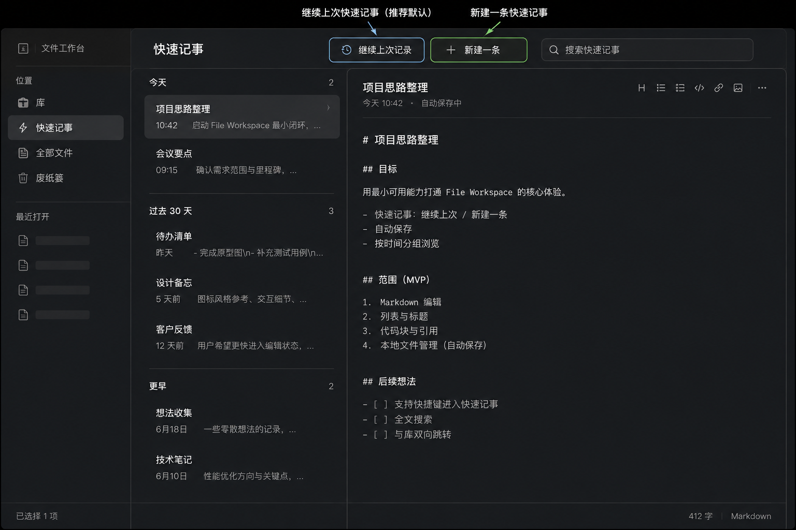
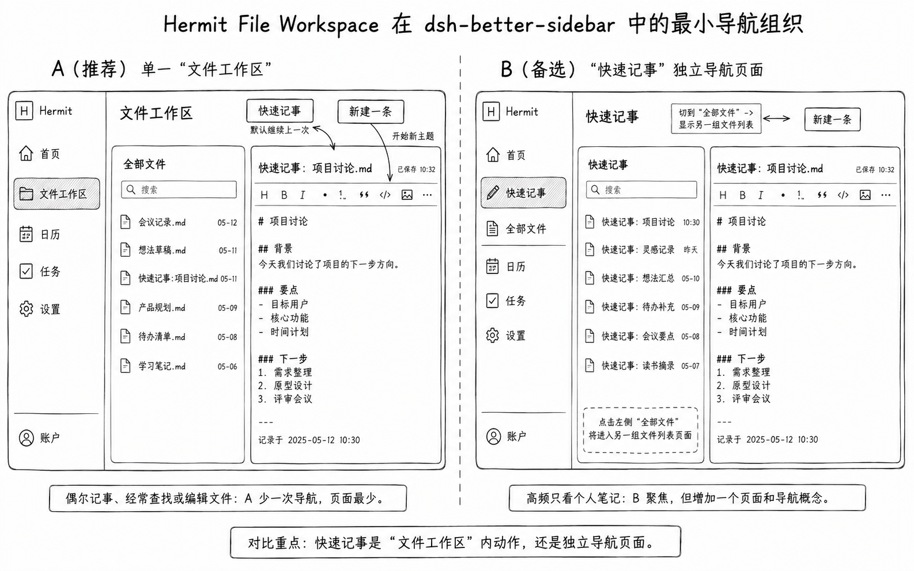
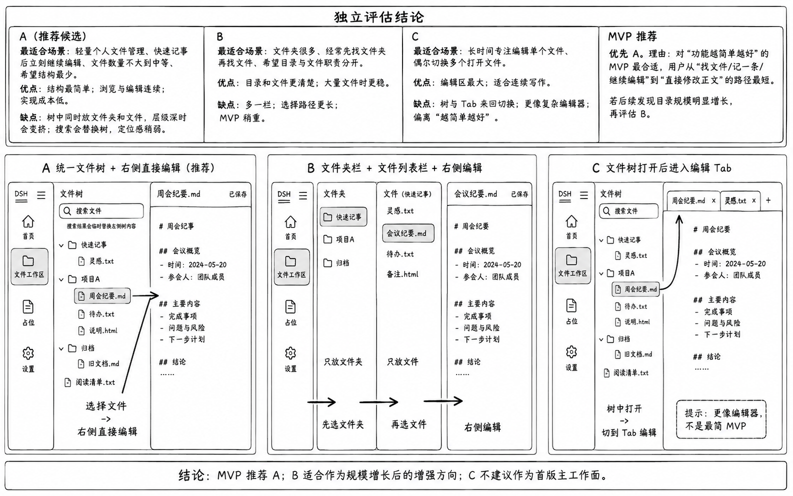
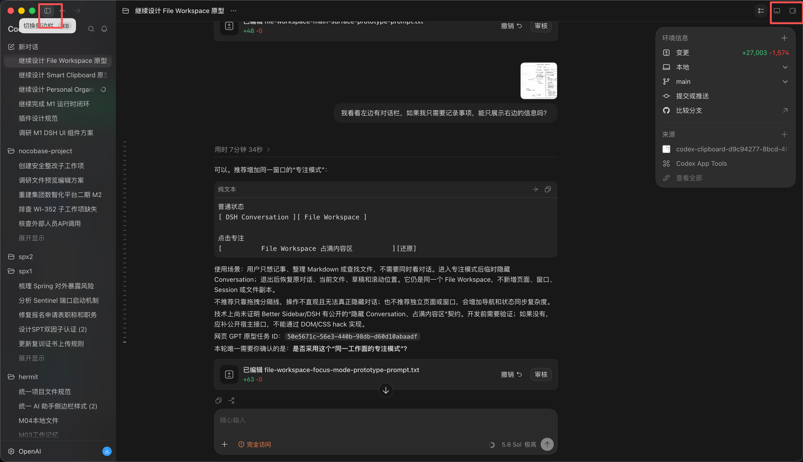
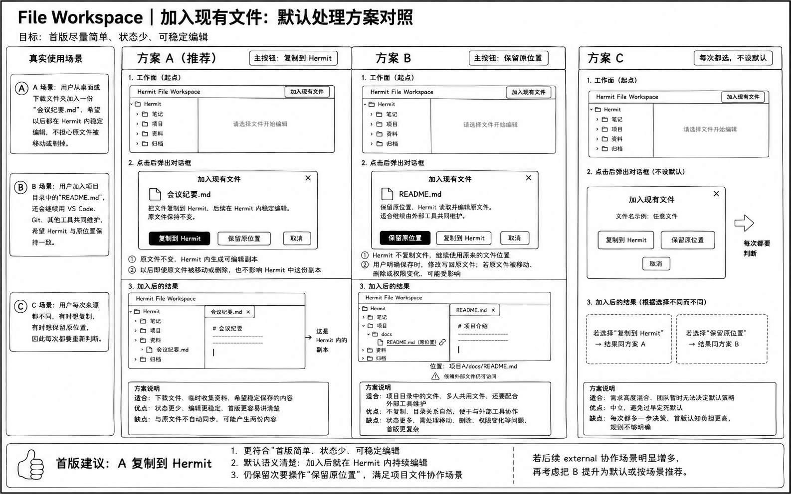
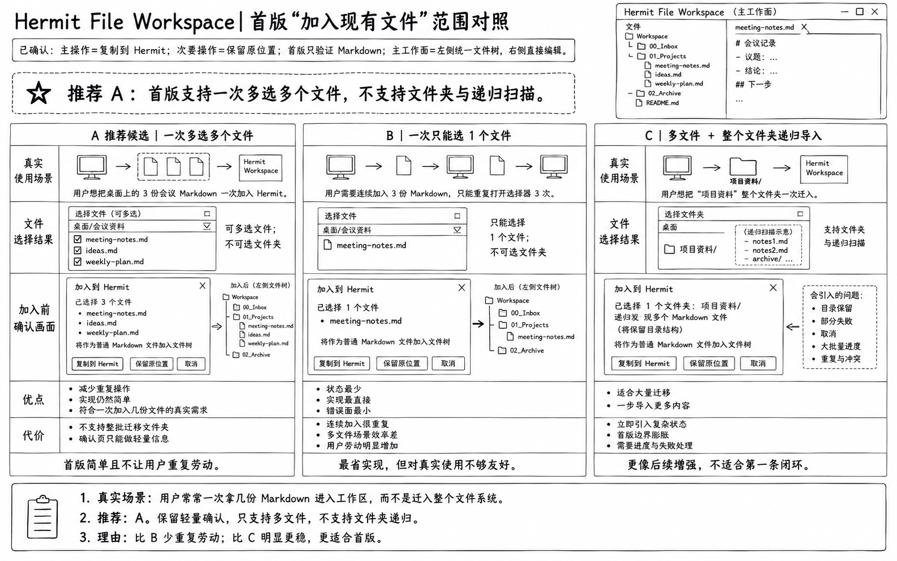
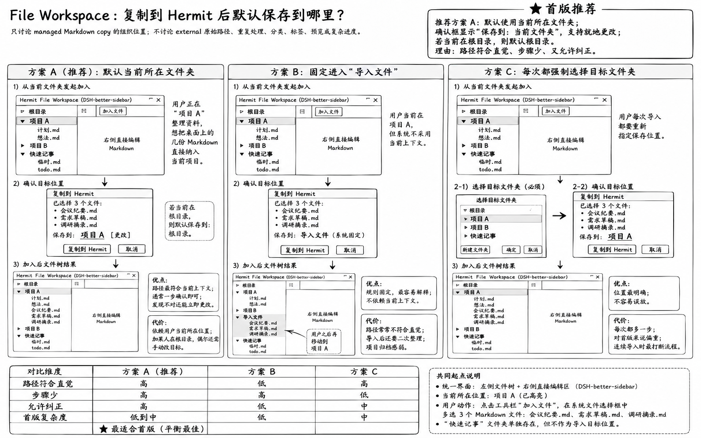

# File Workspace 插件设计

状态：`SLICE_1_2_IMPLEMENTED`

更新时间：2026-09-01

本文是 File Workspace 当前功能、信息架构、交互流程和低保真原型的权威来源。设计范围、业务规则
与验收仍以[核心需求 6.3](../../specs/2026-08-24-hermit-dsh-vnext/core-requirements.md#63-file-workspace)
为准；共同开发和 UI 规则见父级[文档入口](../README.md)。

## 开发者快速入口

- 插件共用规则：[Product Plugin 开发规范](../development-guidelines.md)。
- DSH/桌面能力边界：[Desktop Core 开发规范](../../docs/development/desktop-core-development.md)。
- 本插件优先使用 DSH `storage`、`fs`、Connection RPC 和 Product Surface，不声明 Desktop Core capability。
- 本文只看 FileRecord、revision、managed 内容、文件夹、Trash、编辑和导入导出；平台文件选择器或
  系统快捷键只有真的需要时才另行声明。

当前功能和交互设计已经完成确认，Slice 1（任意普通文件 managed 生命周期）和 Slice 2
（managed Markdown 编辑）已经实现并通过领域测试、桌面 Product Surface 端到端资格验证。
Slice 3 的安全 projection 与对话引用仍等待公开 Composer/FileRecord projection 契约，不能
用私有接口替代。File Workspace 只注册一个 DSH Product Surface 中央工作台；现有 Product
Surface v1 已满足工作面挂载和打开/关闭要求，本阶段不为文件格式继续修改 DSH Web，也不
保留辅助栏 fallback、双宿主 adapter、私有 Router、DOM/CSS hack 或复制 DSH shell。

## 产品理念

File Workspace 是 DSH Product Surface 中的轻量文件工作台，不建设另一套文件库壳、文件
详情页或预览系统。用户在统一文件树中添加和管理任意普通文件；Markdown 可以直接编辑，
其他格式在没有经过资格验证的 Viewer 或 Editor 时显示通用文件信息。“快速记事”用于立即
继续或创建 managed Markdown，是文件工作面里的动作，不是独立导航页面。

当前已确认：

- File Workspace 通过公开 `product.surface` slot 注册唯一中央工作台，并使用
  `ctx.layout.openProductSurface(id)` / `closeProductSurface()` 进入或退出，不维护第二份
  工作面状态。
- Product Surface 只负责工作面宿主和生命周期。File Workspace 拥有 logical FileRecord
  tree、当前文件、managed 内容、revision、导入、Trash 和 projection 状态；DSH 不取得文件
  领域所有权。
- 全局快捷键属于 Core/Desktop 的入口能力，File Workspace 不在网页中自行监听系统快捷键。
  快捷键只打开同一个 Product Surface；是否临时收起 DSH 其他区域属于后续独立的通用布局
  资格，不阻塞首版，也不引入工作面 promotion。
- 首版支持添加和管理任意普通文件。“支持文件”表示能够作为 opaque managed bytes 与可靠
  metadata 复制到 Hermit，并完成组织和生命周期管理；不等于能够预览、解析、编辑或用于 AI。
- 快速记事的正文从创建开始就是 File Workspace 拥有的 managed Markdown 文件。新建时正文
  必须是空字符串，不自动写入标题、模板、提示或示例文字；文件名是独立 metadata，不算正文。
  不建立第二份 Note 正文或独立笔记数据库。
- 快速记事和其他 File Workspace 文件都不属于任何 DSH Session。Session 只提供打开
  Product Surface 和使用 `@文件` 的对话上下文，不参与文件身份、存储、可见范围或生命周期。
- 进入工作面时恢复上次打开的 FileRecord；已有快速记事从统一文件树继续编辑。开始无关
  主题时，用户通过文件树局部工具栏的“+”创建新的 managed Markdown 文件。
- 首版支持用根层普通文件夹组织文件；文件夹是 File Workspace 的位置关系，不替代
  FileRecord 身份，也不把 external 原始路径和 managed 存储位置混成同一种数据。首版不做
  文件夹嵌套、文件夹移动或文件夹 Trash。
- 工作区文件夹只属于 Hermit 的组织层，不代表 external 文件在磁盘上的真实父目录；同一
  文件夹可以容纳 managed 和既有 external FileRecord。移动 external FileRecord 只改变
  工作区关系，不移动、删除或重命名磁盘原文件。
- 所有通过快速记事新建的文件都放入固定的“快速记事”默认文件夹，不提供更换默认目标
  的设置。用户可以把单个快速记事移动到其他普通文件夹；移动后仍是同一个 FileRecord，
  “继续上一次”也继续跟随该文件，而不是依赖原路径。
- File Workspace 始终只有一个位于根层级的固定“快速记事”文件夹。该文件夹本身不可
  重命名、移动、移到废纸篓或永久删除，即使为空也继续保留；选中它时不提供这些命令，
  也不通过锁图标、提示条或设置页解释。限制只作用于容器本身，其中的文件仍按普通文件
  规则编辑、移动、移到废纸篓、恢复或永久删除。它是快速新建的固定默认位置，
  不是专属文件类型或封闭区域；用户明确选择或拖入的普通文件也可以放入其中。
- 主工作面采用两栏关系：左侧统一文件树同时显示文件夹和文件，右侧直接编辑或查看当前
  文件。搜索结果临时占用左侧区域，不增加独立结果页、第二个文件列表栏或逐文件编辑 Tab。
- DSH Product Surface 负责显示当前工作面的导航身份和关闭入口。File Workspace 内部不再
  重复“文件工作区”总标题栏；左侧文件树局部工具栏只放文件名搜索、
  可见的“添加”、新建快速记事和更多文件功能，右侧当前文件区显示文件名、位置、保存状态、
  当前文件操作和收起/展开文件树入口。空间不足时搜索占一行，动作占下一行；不增加横跨
  整个工作面的总工具栏。
- 文件树“+”只有一个含义：新建 managed Markdown 快速记事。添加现有文件使用带上传图标
  和“添加”文字的可见按钮，不藏在更多菜单，也不把新建和添加混入同一个“+”菜单。
- 添加现有文件时，首版界面只提供“复制到 Hermit”，创建独立 managed 副本；不显示不可用
  的归属选择。`external` 和“保留原位置”继续作为长期产品语义保留，但只有可信路径、
  SecretLocator 和 external 写回契约通过资格验证后，才增加用户入口和相应状态。
- “添加现有文件”允许一次多选任意普通文件。同一批的归属策略在支持 external 后统一选择；
  首版不接受文件夹选择，也不递归扫描目录；不能为了批量导入提前扩展目录保留和迁移能力。
- “复制到 Hermit”默认保存到用户当前所在的 File Workspace 文件夹；当前在根目录时默认
  根目录。确认时清楚显示目标位置并允许就地更改，不创建固定“导入文件”目录，也不强制
  增加单独的目标文件夹选择步骤。当前选中普通或固定文件夹时使用该文件夹；当前选中文件
  时使用其父文件夹；没有选中项时使用根目录。拖到文件夹时使用该文件夹，拖到文件时使用
  其父文件夹，拖到文件树空白处时使用根目录。废纸篓和编辑区不是有效添加目标。
- 选择文件后立即在同一个添加确认框内自动预检源文件可读、必要 metadata、目标有效、真实
  容量约束和目标同名冲突；检查期间
  显示正在检查并暂不可开始，完成后原地显示摘要和“开始添加”。不增加必须由用户再点一次
  的“预检”按钮或独立预检页面，也不假装验证文件内容安全、格式真实性、可解析性或可预览性。
- 复制前检查目标文件夹中的同名文件。发现冲突时采用类似 Finder 的显式选择，不自动
  覆盖、跳过或改名。冲突只提供“替换”和“跳过”：选择“替换”后，在现有 FileRecord
  上写入新 revision，不通过删除旧记录再新建来伪造替换；选择“跳过”则保留现有文件，
  并继续处理同一批中的其他文件。首版不提供“保留两份”或自动生成带序号的文件名。
- 同一批存在多个同名冲突时逐个询问。用户也可以直接选择“全部跳过”，跳过本批当前和
  剩余的所有同名冲突；该操作不取消整批，没有冲突的文件仍继续添加。
- 用户在批量添加过程中取消时，只停止尚未处理的文件；已经复制成功或完成替换的结果
  保留。单个文件必须完整提交或不产生可见结果，取消不能留下半个文件、半个 ManagedBlob
  或半个 revision。结束后区分显示“已完成”和“未处理”。
- 用户确认添加后，原确认框在 File Workspace 内原地切换为进度窗口，显示目标文件夹、
  总数、已完成数、当前文件和“取消剩余文件”。该窗口暂时占用 File Workspace，但不阻塞
  DSH Conversation 或其他不依赖该工作面的功能；首版不建设后台任务中心。
- 批次结束后，进度窗口原地切换为结果摘要，分别统计已完成、已跳过、失败和未处理。
  默认只展开失败、跳过和未处理项，成功文件只显示数量；失败项显示可采取行动的原因，
  并允许只重试失败文件。关闭后不建设独立导入报告页面。
- 用户关闭结果摘要后，左侧统一文件树定位到目标文件夹，并高亮本批成功添加或替换的
  文件；无论本批只有一个还是多个文件，都不自动打开。右侧当前文件保持不变，避免添加
  操作擅自打断正在编辑的内容。
- Markdown 直接编辑真实原文，格式操作只帮助插入 Markdown 语法；首版不建设富文本副本
  或左右预览栏。其他文件统一显示文件名、扩展名或媒体类型、大小、managed 状态和可靠的
  时间信息，并明确说明当前不能在 Hermit 中预览或编辑；后续格式能力必须通过独立 Viewer、
  Editor 或 projection adapter 增加，不能反向改变通用 FileRecord/ManagedBlob 模型。
- 具备编辑能力的 managed 文件在用户输入后自动保存，并显示“正在保存 / 已保存 / 保存失败”；
  没有编辑能力的 managed 文件只显示“已存入 Hermit”，不出现保存状态。external 文件编辑
  后显示“未保存”，只在用户明确保存时写回原文件。自动保存与手动保存共享同一 revision
  校验和写入契约，不建立旁路。
- external 文件存在未保存修改时，切换文件或关闭 File Workspace 必须询问“保存 / 不保存 /
  取消”。保存成功后才继续原操作；不保存会丢弃本次编辑；取消则留在当前文件。保存失败
  或发现外部冲突时也留在当前文件，不把失败伪装成已经切换或关闭。
- managed 自动保存失败时，切换文件或关闭工作面也必须停止并询问“重试保存 / 留在这里 /
  放弃修改”。重试成功后继续原操作；留在这里保留当前编辑内容；放弃修改则恢复到最后
  一次成功保存的 revision。首版不把失败内容藏成离开后再恢复的草稿。
- external 保存前发现原文件已被其他程序修改时停止写回，只提供“重新加载原文件 / 留在
  这里 / 复制到 Hermit”。重新加载会放弃 Hermit 中未保存的修改；留在这里保留当前编辑
  内容但继续阻止写回；复制到 Hermit 会创建独立 managed FileRecord 和 ManagedBlob，
  外部文件保持不变。首版不提供强制覆盖或自动合并。
- “在对话中使用”只把可移除的 `@文件` 引用插入当前 DSH Composer，不自动发送，也不把
  完整正文粘贴进输入框。用户可以补充问题、添加其他文件后自行发送；该动作不改变文件
  全局归属，也不把文件身份或生命周期绑定到当前 Session。
- projection 成功时直接插入当前 Composer，并用短暂反馈说明“尚未发送”，不再要求用户在
  成功确认框中重复点击“插入”。projection 失败时不插入，才显示具体原因和关闭入口。
- 用户选择 `@文件` 时读取一次当时的安全 projection；引用插入后不在发送时或模型读取时
  自动重读最新文件。只有用户移除并重新指定文件，才生成新的 projection。系统可以记录
  projection 的来源 revision 用于追溯，但不向用户提供单独的“锁定 revision”功能。
- 指定 `@文件` 时如果编辑器存在未保存修改、正在自动保存或刚刚保存失败，不触发保存也
  不等待，直接使用最后一次成功保存的 revision；未保存内容不进入本次 projection，之后
  保存成功也不会自动更新既有引用。文件从未成功保存时没有可用 projection，不能插入。
- 当前 revision 无法生成安全 projection 时，不插入 `@文件`，并在发送前说明 password
  required、unsupported 或 parse failed 等具体原因。文件仍保留在 File Workspace，可继续
  管理或编辑；不能退化成空引用、仅文件名引用或绕过 projection 的原始文件直传。
- 文件树不长期显示 missing、permission denied、password required、unsupported、parse
  failed 或外部变化等状态标记，也不建设 Needs Attention 页面。只有用户执行打开、保存、
  “在对话中使用”等相关操作时才显示具体原因；再次执行会再次提示。已经确认的保存冲突
  选择框和导入结果摘要继续保留，因为它们属于当前操作流程，不是常驻状态入口。
- File Workspace 本地搜索只按文件夹名和文件名过滤当前统一文件树，不搜索正文，也不
  建设本地正文索引。文件正文和跨插件内容由 Core Federated Search 统一检索，避免两套
  索引、排序和结果语义。
- File Workspace 使用自己的轻量废纸篓，不接入操作系统废纸篓。废纸篓只作为统一文件树
  底部的特殊折叠节点，不新增导航或独立页面，也不是可以手工选择的普通目标文件夹。
- managed 文件使用“移到废纸篓”，操作本身不再确认，FileRecord、ManagedBlob、revision、
  原名称和原工作区父位置保留。普通文件夹不进入废纸篓；首版只允许直接删除空的普通
  根层文件夹，非空时要求先移动或处理其中的文件。
- 单个 external 文件不进入废纸篓，只提供“从工作区移除…”。确认信息必须明确磁盘原文件
  不会被修改或删除；确认后移除 Hermit 的 FileRecord、工作区关系和自有派生数据，之后
  再次添加按新的添加流程处理。
- 废纸篓文件恢复时，原工作区父文件夹仍存在则恢复到原位置；原父位置不存在则恢复到
  根目录。目标已有同名文件时不覆盖、不弹替换选择，而是为恢复项生成带“（已恢复）”的
  唯一名称；恢复保持原 FileRecord 身份。
- 废纸篓项目提供“永久删除…”，废纸篓节点提供“清空废纸篓…”，两者都必须明确确认。
  managed 永久删除 FileRecord、ManagedBlob、revision 和 Hermit 自有派生数据。
- 首版不做废纸篓自动清理、保留期限、后台清理任务、批量恢复、恢复位置选择、全局撤销或
  OS Trash 集成。
- `external` 与 `managed` 仍是长期数据语义，但不作为日常界面的分类信息反复展示。
- FileRecord、SecretLocator、ManagedBlob 和派生数据继续分开；中央 Product Surface 不把
  文件身份降级成 Session `cwd + path`。

## 首版能力矩阵

| 文件状态 | 添加/创建 | 组织、移动和文件级 Trash | 直接编辑 | `@文件` |
|---|---|---|---|---|
| 新建快速记事 Markdown | 是，正文为 0 字节 | 是 | 是 | 有安全 projection 时可用 |
| 可按受支持文本编码读取的 managed Markdown | 是 | 是 | 是 | 有安全 projection 时可用 |
| 其他普通 managed 文件 | 是 | 是 | 否，只显示通用文件信息 | 仅 projection 可用时可用 |
| 没有 projection 的 managed 文件 | 是 | 是 | 按格式能力决定 | 不可用并说明原因 |
| 既有 external FileRecord | 首版不能从 UI 新增 | 只改变工作区关系；单文件可移除 | 首版不新增承诺 | 按 projection 规则 |

“支持所有文件”是存储和管理能力，不是格式理解能力。添加成功、编辑器可用和 projection
可用是三个独立结果；File Workspace 不为让 opaque 文件可编辑或可用于 AI 而临时解析、
OCR、改写或暴露原始字节。

## 依赖和所有权

```text
DSH Web
|-- Conversation
|-- Product Surface -> File Workspace
|                       |-- FileRecord / SecretLocator
|                       |-- ManagedBlob / metadata
|                       |-- Markdown revision editor
|                       `-- 文件组织和生命周期
`-- Core -> resource / projection / capability
```

File Workspace 默认只依赖 DSH/Hermit 公共契约和 Core 能力，不再拥有跨 Product Plugin 的
依赖例外。系统文件选择、ManagedBlob I/O 和其他特权动作仍按 File Workspace 自己的 package
identity 经过 Capability Broker；Product Surface 不提供文件系统特权。

## 当前工作面

```text
[DSH Conversation]
       | 点击“文件工作区”或触发快捷键
       v
[File Workspace Product Surface]
|-- 统一文件树
`-- 当前文件编辑区或通用文件信息区
       | 关闭
       v
[返回 DSH Conversation]
```

这是功能关系，不冻结 Tab 名称、位置、编辑器控件或视觉样式。

文件工作区始终位于中央 Product Surface，并保持“统一文件树 + 当前文件内容区”的两栏关系。
每打开一个文件不创建新的编辑 Tab；宿主已经表达工作面身份，插件内部从文件树局部工具栏
直接开始，不再添加横跨两栏的“文件工作区”总标题栏。

当前不设计：

- 独立 Library、Dashboard、文件详情和“安全预览”产品页面；
- 自动分类、Categories、Collections、Tags、Favorite 和 Needs Attention；
- 与当前工作面并行的第二套文件树、编辑器页面、Viewer、逐文件 Tab 或分栏；
- 文件或文件夹重命名、文件夹嵌套、文件夹移动、文件夹 Trash/恢复；
- OCR、完整 Office 编辑、通用媒体预览、云盘、复杂文件管理、终端、Git 和侧边对话；任意文件可管理不把
  这些内容能力提前带入首版。
- 独立废纸篓页面、自动到期清理、恢复位置选择、批量恢复、全局撤销和 OS Trash 集成。

## 已确认的交互原型

以下图片用于保留已确认的功能关系，帮助后续原型设计理解使用场景；它们不冻结视觉
风格、颜色、尺寸、控件位置或未被正文明确确认的功能。后续经用户确认的原型图片应复制
到本目录的 `assets/`，并在本节说明采纳范围，不能只保留临时剪贴板路径。

### 快速记事历史场景参考



使用场景：用户需要区分“继续已有文件”和“开始无关主题”。该图是早期参考，不再确认
“快速记事 / 新建一条”两个顶部入口，也不确认独立快速记事导航、库、全部文件、工具栏或
具体布局。当前规则是：打开工作区恢复上次 FileRecord，已有文件从统一文件树打开；文件树
局部“+”创建一条正文为空的新快速记事。废纸篓是统一文件树底部的特殊折叠节点，但本图
不冻结其位置或样式。

### 单一文件工作面



使用场景：用户偶尔快速记录，同时经常查找或编辑普通文件。已采纳图中的方案 A：快速
记事是单一“文件工作区”里的动作，不增加独立页面。方案 B 未采纳。图片生成时尚未画出
后续确认的文件夹规则；实际设计必须在同一文件树中提供固定的“快速记事”默认文件夹，
不能因为图片缺失而省略。

### 统一文件树和直接编辑



使用场景：用户在普通文件夹或“快速记事”文件夹中找到一个文件，点击后立即在右侧进入
对应的编辑器或通用文件信息区，不需要先选文件夹、再去第二栏选文件，也不需要切换到新的
编辑 Tab。已采纳图中的方案 A；
方案 B 可在未来文件规模明显增长后重新评估，方案 C 不作为首版主工作面。搜索发生时，
结果临时替换左侧文件树内容，退出搜索后恢复原树。图中的产品外壳导航和具体视觉布局
 不属于本次确认范围。

### 中央唯一工作台



使用场景：用户从 DSH 产品入口或快捷键打开 File Workspace，进入的始终是同一个中央
Product Surface，不在右侧辅助栏再维护一份工作区。图片中“专门记事或整理文件时减少其他
栏干扰”的方向继续作为后续专注布局参考；首版只要求打开中央工作台和关闭后回到
Conversation，不把全局侧栏自动收起/恢复作为 File Workspace 自有能力。该图片不采纳 Codex
品牌、具体视觉样式、快捷键字符或现成组件。

Hermit Product Surface v1 已提供公开的打开、关闭和生命周期契约，File Workspace 只挂载
一个 surface content。它不注册辅助栏 Tab，不创建双宿主状态，也不通过 DOM 操作模拟专注
模式。

### 原型覆盖范围

当前交互原型按本文验证以下用户可见关系：

- 宿主可用空间变化时同一个工作面自动重排，不复制文件树、当前文件或编辑状态；
- 一个统一文件树，固定“快速记事”文件夹、普通文件夹、废纸篓节点和右侧当前文件区域；
- 文件树局部搜索、可见“添加”、“+”新建空白快速记事、创建根层普通文件夹、当前文件
  标题区收起/展开文件树、编辑自动保存、保存失败重试和移动到普通文件夹；
- 系统多选或从系统文件管理器拖入普通文件、按所选项推导默认目标、managed copy 同框自动
  预检、同名替换/跳过/全部跳过、进度/取消/结果摘要；
- Markdown 在右侧直接编辑；首版没有编辑能力的格式显示真实文件信息和能力边界，不显示
  假预览或只读原始字节；
- 当前缺少公开 projection 契约时不显示“在对话中使用”入口，以及废纸篓在文件树内展开、
  恢复位置确认和永久删除确认等最小状态演示；成功插入 @文件留待 Slice 3 契约资格通过后接入；
- 宿主宽度不足时只显示文件树或当前文件区域一个工作面；选择文件进入编辑器或通用文件
  信息区，通过“文件”返回文件树，不把两栏压成上下两个狭小区域。

原型使用内存数据和可替换的占位动作，只用于验证信息层级、流程顺序和状态文案；不代表
 FileRecord、revision、解析、索引、文件系统、Core transport、系统快捷键或 DSH 私有实现
 已经完成。external 未保存离开保护、外部变化、permission denied 和 missing 等复杂状态
 仍以本文流程定义为准，待对应纵切片时补充交互演示；原型未覆盖的复杂
 格式、OCR、云盘和完整 Office 不进入范围。

### DSH Web 视觉兼容基线

官方契约基线见
[DSH 集成契约](../../docs/contracts/dsh-integration.md#hermit-product-surface-v1)。File Workspace
的工作面应当像 DSH Web 中自然长出来的一块连续工作区，而不是另一个独立应用壳：

- DSH / Hermit Product Surface 拥有 shell、产品入口、打开/关闭、overlay 层级和宿主响应式
  行为；File Workspace 只拥有文件树、当前文件区域和文件操作内容，不复制宿主外壳；
- 统一文件树和当前文件编辑区使用连续 surface 与细分隔线，文件行、工具栏和搜索保持紧凑，
  选中态使用轻量平面填充，不使用厚描边、左侧装饰条或大阴影；
- 颜色、排版、滚动条和明暗偏好跟随宿主 DSH theme alias。原型可以用局部 fallback 验证层级，
  但不能把 fallback 数值写成 Hermit 产品 token，也不能自行建立全局 ThemeProvider；
- DSH public primitives（例如 Button、Input、Menu、Modal）只有在当前锁定制品完成
  `candidate -> qualified -> allowed` 后才能成为正式实现依赖。DSH 的 `src/*`、CSS class、
  private store、Router 和 DOM 结构永远不是契约；
- 添加文件、冲突和进度仍是当前工作面中的局部 overlay 或阶段反馈；`@文件` 成功使用短暂
  反馈、失败才显示原因，废纸篓直接在文件树内展开。它们都不升级成独立页面。原型开发的
  组件优先级、mock 边界和宿主承载方式见
  [原型开发说明](PROTOTYPE-DEVELOPMENT.md)；文件树、编辑器等领域组件仍只服务流程验证，
  不代表已经冻结正式业务组件契约。

官方当前可观察到的细节（紧凑工作台、约 34px 行级、约 32px 输入框、胶囊式 Button、平面
active fill、无 active underline/shadow）只作为原型密度参考；不把这些数字固化为业务规则或
公开 API。

### 添加现有文件的默认处理



使用场景：用户从桌面或下载目录添加一份文件，希望以后即使原文件被移动或删除，也能
继续在 Hermit 中稳定管理，并在格式具备编辑能力时直接编辑。已采纳图中的方案 A：
“复制到 Hermit”是首版唯一操作；原文件保持不变，添加后使用 managed 副本。图中的
“保留原位置”只说明长期 external 语义，当前入口不提供，适用于未来通过资格验证后继续由
VS Code、Git 或其他工具共同维护的场景。方案 C 未采纳。图中的具体对话框、
按钮样式、产品外壳和文件夹名称不属于本次确认范围。该图片确认长期产品语义；当前原型和
Slice 1 只展示 managed copy，不提前模拟尚未通过资格验证的 external 路径能力。

### 添加文件的选择范围



使用场景：用户从桌面或某个目录中一次选择几份普通文件添加 File Workspace，希望避免
重复打开文件选择器。已采纳图中的方案 A：一次可以多选文件，但不能选择文件夹，也不会
递归扫描目录；支持 external 后整批文件再统一选择“复制到 Hermit”或“保留原位置”。方案 B 对真实使用过于
重复，方案 C 会提前引入目录保留、大批量进度和部分失败等复杂状态，均不作为首版范围。
图中的 Inbox、Projects、Archive 等目录名称和具体确认框样式不是预置需求。

### 复制文件的默认目标



使用场景：用户正在“项目 A”文件夹整理资料，并从桌面添加几份文件。已采纳图中的
方案 A：managed copy 默认进入当前文件夹；确认框显示“保存到：项目 A”并允许就地更改。
用户在根目录发起时默认根目录。方案 B 会额外制造一个需要二次整理的系统目录，方案 C
会让每次添加都多一步，均不采用。后续确认补充：固定“快速记事”只是快速新建的默认容器，
用户明确选中或拖放到该文件夹时，普通文件也可以添加进去。图中的具体文件夹名称、控件布局
和视觉样式不属于本次确认范围。

## 核心交互

### 快速记事

```text
进入文件工作区
-> 恢复上次打开的 FileRecord；若它是快速记事则直接继续编辑，不受后来移动位置影响
-> 用户点击统一文件树局部工具栏的“+”
-> 在“快速记事”文件夹创建正文为空的 managed Markdown 和稳定 FileRecord，并立即打开
-> 系统可以生成文件名，但正文保持 0 字，不自动插入标题、模板、提示或示例文字
-> 文件属于 File Workspace，不记录或继承当前 Session
-> 在 DSH Product Surface 的 File Workspace 工作面中立即打开
-> 用户输入，managed Markdown 自动保存并显示当前保存状态
-> 用户可把该文件移动到其他普通文件夹；移动不创建新的 FileRecord 或重复 ManagedBlob
-> 从任何 Session 再次打开时仍是同一个 Markdown 文件
-> 可使用现有 @文件交互放入 DSH Composer
```

工作面顶部不重复放置“快速记事”和“新建一条”两个入口。已有快速记事从统一文件树打开；
新建只保留文件树局部工具栏的“+”，默认目标始终是固定“快速记事”文件夹。

恢复的是整个 File Workspace 上次打开的 FileRecord，不按 Session 保存另一份状态。打开后
必须在输入区域附近清楚显示当前文件标题，避免用户把新主题误写进旧文件；这里确认的是
信息和行为，不冻结标题位置或视觉样式。

“快速记事”文件夹只承担固定的默认存放位置，不提供更换默认目标的设置。它与其他文件
夹出现在同一文件树和搜索范围内，不生成独立列表页。用户移动单个快速记事只改变文件
位置，不改变 managed 归属、FileRecord 身份或正文；后续新建仍进入“快速记事”文件夹。

该文件夹是根层级的固定系统容器，不是普通可删除文件夹。它本身不可重命名、移动、移到
废纸篓或永久删除，空时也保留；上下文菜单直接不提供这些动作，结构拖拽也不能改变它的
父级。这里不增加确认框、锁图标、提示条或管理设置。文件夹中的文件没有额外保护，仍可
移入移出，并按普通 managed 文件规则进入废纸篓、恢复或永久删除。

恢复上次文件和新建快速记事都不等待模型、解析或分类。新建必须原子创建 FileRecord、空的
ManagedBlob 和首个成功 revision；失败时三者都不可见，不能留下半个文件。空正文是合法的
普通 Markdown 内容，不是 draft、untitled、needs content 或其他特殊状态；即使用户不输入
任何文字就离开，文件也正常存在并可移动或移到废纸篓。首次打开空文件不能因为编辑器初始化
再产生 revision，也不能把空字符串改写成换行或 BOM。用户以后删除全部正文并保存为空时，
走相同的普通 revision 流程。空的成功 revision 可以生成长度为 0 的安全 projection，不能
因为正文为空被误判为解析失败。

### 组织文件和文件夹

```text
从文件树更多菜单选择“新建文件夹”
-> 在 File Workspace 根层创建普通文件夹
-> 名称为空或与根层现有文件夹同名：不创建，并要求更换名称

选择文件并执行“移动到文件夹”
-> 目标只能是根目录、固定“快速记事”文件夹或普通根层文件夹
-> 移动只改变工作区父位置，保持 FileRecord、ManagedBlob 和 revision
-> 目标存在同名文件：不覆盖、不替换、不自动改名，文件留在原位置并说明冲突

删除普通文件夹
-> 只允许删除空的普通根层文件夹，不进入废纸篓
-> 文件夹非空：不执行，要求先移动或处理其中的文件
```

首版不提供文件或文件夹重命名，不允许普通文件夹嵌套或移动文件夹。固定“快速记事”文件夹
不能删除，普通文件可以移入或移出。既有 external FileRecord 的移动也只改变工作区父位置，
不会对磁盘路径执行任何操作。这里冻结行为，不冻结使用行级菜单、上下文菜单还是对话框。

### 打开和编辑文件

```text
从左侧统一文件树选择文件
-> 右侧当前文件区域按已有能力打开编辑器或文件信息
-> Markdown 直接编辑原文；格式操作只插入 Markdown 语法
-> 首版没有编辑能力的格式只显示名称、类型、大小、managed 状态、可靠时间和 projection 可用性
-> 明确说明该格式目前不能在 Hermit 中预览或编辑，不把原始字节当正文显示
-> 保存前由 File Workspace 核对文件归属和当前 revision
-> managed 在输入后自动写入 Hermit 文件内容，并显示正在保存 / 已保存 / 保存失败
-> external 编辑后显示未保存，只在用户明确保存且未发生外部冲突时写回原文件
-> external 未保存时切换或关闭：询问保存 / 不保存 / 取消
-> 保存成功或明确不保存后继续；取消、保存失败或外部冲突时留在当前文件
-> external 保存前发现外部变化：停止写回，选择重新加载 / 留在这里 / 复制到 Hermit
-> 重新加载会放弃未保存修改；复制到 Hermit 不改变外部文件
-> managed 自动保存失败时切换或关闭：询问重试保存 / 留在这里 / 放弃修改
-> 重试成功或明确放弃后继续；留在这里则保留当前内容并取消离开
```

Markdown 编辑不维护另一份富文本正文，也不在首版添加分栏预览。当前原型已验证紧凑格式
工具栏和纯文本编辑区的关系，但不冻结正式编辑器组件、控件集合或视觉样式；正式实现仍以
“真实原文是唯一可编辑正文”为约束。

managed 文件的编辑身份是稳定 `FileRecord.id`，不是 filesystem path。打开文件时，File
Workspace 读取该 FileRecord 当前成功 revision；保存时同时提交 FileRecord、编辑所基于的
revision 和新正文。成功保存必须在同一 FileRecord 下产生新的 immutable revision，并把它
设为后续编辑基线；旧 revision 保留。基线已过期或持久化失败时不能覆盖当前 revision，
也不能清除用户尚未保存的正文。

搜索输入和结果也留在左侧区域：输入后只按文件夹名和文件名过滤，结果临时替换文件树；
清空或退出搜索后恢复原树和展开状态。首版不搜索正文，不增加本地正文索引、搜索结果页
或第三栏。搜索框位于文件树局部工具栏，不放在横跨工作面的全局顶栏。按正文或跨插件查找
时使用 Core Federated Search，由 Core 统一查询、排序和聚合 File Workspace 结果。

File Workspace 自己渲染 logical FileRecord tree、文件信息和 managed Markdown 编辑工作面，
并通过自己的领域服务读写 revision；不调用 DSH 私有 API，不导入 `src/*`，不伪造 managed
filesystem path，也不使用 watcher 或轮询绕过保存契约。Product Surface 只保存轻量 UI
handle/state，不能保存 Canonical 字节、正文、ManagedBlob 或 revision 事实。正式 Markdown
编辑器、真实 Core transport 和持久化仍属于正式 vertical slice 的实现验收。

导入文件是否可以进入 Markdown 编辑器不能只相信扩展名。名称为 `.md` 但字节不能按受支持
文本编码无损读取时，文件仍作为 opaque managed bytes 成功添加，但只显示通用文件信息，
不能改写原字节。编辑能力判定、文件添加和安全 projection 始终是独立事实。

通用文件信息中的大小表示当前 ManagedBlob 的字节大小；创建时间表示 FileRecord 在 Hermit
中创建的时间；修改时间表示最近一次成功 managed revision 的时间。来源文件的 filesystem
mtime 若被记录，只能明确标为“来源时间”，不能冒充 managed 文件的修改时间。

### 在对话中使用

```text
从文件工作面选择“在对话中使用”
-> 从最后一次成功保存的 revision 生成一次安全 projection
-> 不保存或等待编辑器中的未保存修改；未保存内容不进入本次引用
-> 文件从未成功保存：不插入引用，并说明没有可用的已保存内容
-> projection 生成失败：不插入引用，说明 password required / unsupported / parse failed
-> projection 生成成功：直接在当前 DSH Composer 插入携带该 projection 的可移除 @文件引用
-> 短暂提示“已插入，尚未发送”，不再打开成功确认框
-> 不复制完整正文，不自动发送消息
-> 用户补充问题、添加或移除文件引用
-> 用户明确发送；发送时不重新读取最新文件
-> 只有移除并重新指定文件，才读取新的 revision 并生成新 projection
```

文件仍是全局 File Workspace 文件。Composer 只是本次消息的使用入口，不取得文件所有权，
也不把文件变成 Session 附件或 Session 生命周期内的数据。来源 revision 是 projection 的
追溯信息，不是需要用户操作的“锁定”状态。

### 添加现有文件

```text
从文件树局部工具栏选择可见的“添加”
-> 打开系统文件选择器
选择一个或多个文件，不接受文件夹
-> 显示本批文件数量和名称，不递归发现其他内容
或从系统文件管理器把一个或多个文件拖到文件树
-> 文件夹使用该文件夹；文件使用其父文件夹；树空白处使用根目录
-> 废纸篓拒绝拖入；编辑区不接收文件添加，也不能让浏览器接管拖入文件
-> “复制到 Hermit”默认目标是当前选中文件夹、当前文件的父文件夹或根目录
-> 确认框显示目标位置，并允许用户就地更改
-> 当前原型和 Slice 1 直接说明将复制到 Hermit，不显示归属选择
-> 确认框自动检查来源可读、普通文件身份、可靠元数据、目标有效性、真实容量约束和同名冲突；检查完成前不可开始
-> 预检不声称已经验证文件安全、格式有效、可解析或可预览
-> 文件夹、设备节点或其他非普通文件逐项拒绝并说明；同批普通文件仍可继续，不让整批失败
-> 检查结果在同一确认框原地显示，不要求用户再点“预检”或进入独立预检页
-> 用户选择复制：整批原文件不变，准备分别创建 managed FileRecord 和独立 ManagedBlob
-> 复制前发现同名文件：暂停该冲突并询问用户是否替换，不做静默决定
-> 用户选择替换：保留现有 FileRecord 身份，将导入内容写成新 revision
-> 用户选择跳过：现有文件保持不变，继续处理同一批中的其他文件
-> 存在多个冲突：逐个询问，可将当前选择应用到其余冲突
-> 用户选择全部跳过：跳过本批所有同名冲突，继续添加没有冲突的文件
-> 确认框原地切换为进度窗口：显示目标、已完成数 / 总数、当前文件和取消入口
-> 用户取消剩余文件：停止尚未处理的文件，保留已经完成的结果
-> 批次结束：区分已完成和未处理，不回滚已完成文件或 revision
-> 结果摘要：统计已完成 / 已跳过 / 失败 / 未处理，只展开需要关注的文件
-> 用户重试失败文件：只发起失败项的新尝试，不重复处理已完成文件
-> 用户关闭结果：左侧定位并高亮成功文件，右侧当前内容保持不变，不自动打开文件
-> external 契约通过资格验证后，用户才可明确选择保留原位置并创建 external FileRecord
-> 批次过程和结果都留在当前 DSH Product Surface
```

长期界面使用“复制到 Hermit / 保留原位置”，不向用户展示 managed、external、FileRecord
或 ManagedBlob 等内部术语。当前原型和 Slice 1 不显示尚不可用的“保留原位置”；
日常打开和编辑也不重复提示归属。涉及 external 写回、移除或 managed 数据删除时，再说明
真实影响。

### 删除、移除和恢复

```text
展开统一文件树底部的“废纸篓”节点
-> 在树内查看已删除项目，不跳转页面或打开废纸篓列表弹窗

选择 managed 文件
-> “移到废纸篓”
-> 不再确认；保留 FileRecord、ManagedBlob、revision 和原工作区位置
-> 从正常文件树、插件内文件名搜索和新的 @文件选择中移除
-> 在废纸篓中只能恢复或永久删除，恢复前不可继续编辑

选择单个 external 文件
-> “从工作区移除…”
-> 确认“磁盘上的原文件不会被修改或删除”
-> 移除 Hermit FileRecord、工作区关系和自有派生数据，不进入废纸篓

选择废纸篓项目并恢复
-> 废纸篓树项只显示名称和行级操作，不常驻显示原位置
-> 选择“恢复”后打开确认框，并显示本次实际恢复位置和最终名称
-> 原父文件夹存在：恢复到原位置
-> 原父文件夹不存在：恢复到 File Workspace 根目录
-> 目标同名：生成“名称（已恢复）”唯一名称，不覆盖或再次询问
-> 用户确认后执行恢复
-> 保持原 FileRecord；external 只恢复工作区关系

选择“永久删除…”或“清空废纸篓…”
-> 从废纸篓树项或节点动作打开确认框
-> 明确确认 managed 文件不可恢复
-> managed 原件和 Hermit 自有派生数据永久删除
```

工作区文件夹是 Hermit 的根层组织结构，可以包含 managed 与既有 external FileRecord。
文件夹本身不进入废纸篓；废纸篓是统一文件树底部的特殊折叠节点，不是独立页面、普通
文件夹或添加/移动目标。

如果当前打开的文件将被移除，先复用“打开和编辑文件”中已有的离开保护：
external 未保存修改、managed 自动保存失败或仍在保存的内容不能被静默丢弃。保护流程
完成后才执行移到废纸篓或从工作区移除；取消则维持当前文件和文件树不变。

恢复不会覆盖当前正常项目。第一次冲突追加“（已恢复）”，继续冲突时追加数字形成唯一
名称。导入时已经确认的“替换 / 跳过”只适用于添加文件，不复用到恢复；恢复也不增加目标
文件夹选择步骤。

首版不做文件夹 Trash、独立废纸篓页面、自动清理或保留期限、后台任务、批量恢复、全局
Undo 和 OS Trash 集成。managed 文件已可通过废纸篓恢复，external 原文件从未被删除，
不再为“撤销”建设第二套状态。

## 宿主生命周期

- File Workspace 只在 `productSurfaceContract === 1` 且 Product Surface capability 可用时激活。
- Product Surface 契约缺失或不兼容时，File Workspace 不激活并说明原因；不创建 Settings
  页面、辅助栏或私有 Router 作为替代入口。
- 停用或卸载 File Workspace 会撤下产品入口、surface 和 provider；除非用户明确选择删除
  数据，否则不删除 FileRecord、ManagedBlob 或 revision。
- File Workspace surface 失败不能拖垮 DSH Core、Conversation 或其他插件；重新打开时从
  Core 事实恢复同一个工作区，而不是从宿主 UI 状态恢复正文。

## 关键状态

文件级异常不作为文件树徽标或独立页面常驻展示，只在相关操作发生时出现；Empty、
Importing 等工作面或流程状态仍按各自规则显示：

- Empty：没有任何用户文件时，固定“快速记事”文件夹仍保留为空，文件树局部工具栏继续提供
  “添加”和“+”；不能为了表现空状态隐藏、删除或稍后重建该系统文件夹。
- Managed saving：具备编辑能力的 managed 文件自动保存时显示正在保存、已保存或保存失败，
  不要求用户通过手动保存维持内容；通用文件信息区不显示该状态。
- Managed save failed：离开当前文件前要求用户重试保存、留在这里或放弃修改；放弃修改
  恢复最后成功 revision，不创建隐藏恢复草稿。
- External unsaved：external 文件编辑后显示未保存；用户明确保存前不写回原文件。
- External leave guard：external 未保存时切换文件或关闭工作面，询问保存、不保存或取消；
  保存失败和 external changed 都阻止离开当前文件。
- External changed：停止保存，让用户在重新加载原文件、留在这里或复制到 Hermit 之间
  选择；不提供强制覆盖或自动合并。
- Projection unavailable：当前 revision 需要密码、格式不支持或解析失败时，文件仍可留在
  工作区，但“在对话中使用”不可用并显示具体原因。
- Generic file info：文件已经由 Hermit 管理，但首版没有该格式的预览或编辑能力；右侧只显示
  可靠文件信息和可用动作，不把“支持添加”误写成“支持打开”。
- Missing：对应 external 文件不能打开；其他文件和快速记事继续可用。
- Import preflight：选择文件后在添加确认框内自动检查；检查完成前不可开始，检查结果原地
  更新，不出现独立预检页。非普通文件逐项拒绝，同批普通文件仍可继续。
- Importing：添加确认框原地显示目标、当前文件和整体计数；File Workspace 暂不可操作，
  但 DSH Conversation 和其他工作面继续可用。
- Import cancelled：已完成的文件继续可用，尚未处理的文件显示为未处理，不回滚整批。
- Import result：原进度窗口显示批次计数；失败、跳过和未处理项展开，成功项折叠为数量；
  失败项提供原因和单批重试入口，不创建长期报告页面。关闭后只定位并高亮成功文件，
  不改变右侧当前文件。
- Trashed：managed 文件只出现在废纸篓节点，不参与正常文件树、插件内文件名搜索或新的
  `@文件` 选择；恢复前不可编辑。
- External removed：单个 external FileRecord 已从 Hermit 永久移除，不提供废纸篓恢复；
  磁盘原文件不变，用户以后需要时重新执行添加流程。
- Product Surface unavailable：File Workspace 不激活，说明公开 Product Surface 契约缺失或不兼容。

## 首版 vertical slices

```text
Slice 1：任意普通文件的 managed 生命周期
-> File Workspace 通过公开 Product Surface v1 注册单一中央工作面
-> 系统选择器或拖放一次添加一个或多个普通文件，不接受文件夹和递归扫描
-> managed copy 形成 FileRecord、ManagedBlob 和首个 revision
-> 文件树支持创建根层普通文件夹、文件名搜索、文件移动、文件级 Trash、恢复和永久删除
-> Markdown 之外的格式显示通用文件信息，不显示假预览

Slice 2：managed Markdown 编辑
-> 快速记事创建正文为空的 managed Markdown，不插入任何默认文字
-> 自有编辑工作面读取 FileRecord 当前 revision
-> 自动保存通过 File Workspace/Core revision-aware save 写入新 revision
-> 关闭并重新打开工作面后，重新读取同一 FileRecord 的新内容

Slice 3：安全 projection 与对话引用
-> 从最后一次成功保存的 revision 生成安全 projection
-> 成功时通过公开 Composer contract 插入 @文件
-> 不支持、需要密码或解析失败时不读取原始字节兜底
```

首版“支持所有文件”指任意普通文件都能进入 Slice 1 的 managed 生命周期，不代表所有格式
都具备编辑、预览、解析或 projection 能力。Markdown 直接编辑由 Slice 2 单独验收；Slice 1
不因编辑器未就绪而拒绝其他格式。当前只实现“复制到 Hermit”，不显示“保留原位置”；
external 长期数据语义继续保留，只有可信路径、SecretLocator 和写回契约通过资格验证后才
进入界面。

## 实现资格与剩余边界

- Hermit Product Surface v1 打开、关闭和生命周期：`PASS`，File Workspace 可使用公开
  `product.surface` capability 和 `openProductSurface` / `closeProductSurface` 契约。
- 工作面边界：`RESOLVED`，Product Surface 只承载中央工作面；File Workspace/Core 拥有
  logical tree、文件字节、编辑状态、FileRecord、ManagedBlob 和 revision save。
- 任意普通文件的 managed transport、持久化和单文件原子 journal：`PASS`，通过 DSH
  `ctx.storage.domain` 持久化 FileRecord、ManagedBlob、revision，并由领域测试覆盖创建、替换、
  Trash、恢复、永久删除和中断恢复。
- managed Markdown 正式编辑器、成功保存、旧 revision 冲突和关闭重开：`PASS`，通过领域测试
  和桌面 Product Surface 端到端资格验证；保存失败/离开保护仍需接入真实故障注入后补充资格。
- 任意普通文件的浏览器选择、多选、拖放、预检、冲突替换/跳过/全部跳过、进度取消、结果和
  失败重试：`PASS`，已在同一 Product Surface 中实现；真实系统文件句柄权限和超大文件容量
  约束仍由宿主/平台资格负责，不在插件中伪造。
- 安全 projection、`@文件` Composer 插入和发送时 revision 追溯：`PENDING_PUBLIC_CONTRACT`；
  当前锁定 DSH 制品没有公开 FileRecord projection 读取和 Composer 写入契约，因此界面不显示
  不可用入口，也不读取原始字节兜底。
- external 原位置、写回、外部变化和 permission denied/missing 的真实处理：`PENDING_EXTERNAL_QUALIFICATION`；
  首版只实现 managed copy，长期 external 语义保留在设计和数据模型中。
- 全局左右侧栏收起/恢复：`NOT REQUIRED FOR V1`。若以后要做，只能扩展公开 DSH/Hermit
  布局契约，不能由 File Workspace 操作私有 DOM 或维护第二个宿主。
