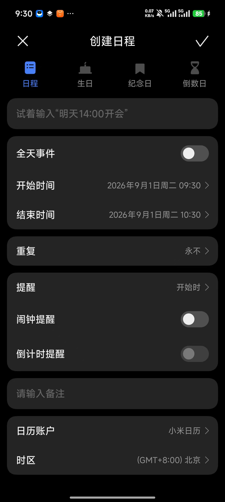
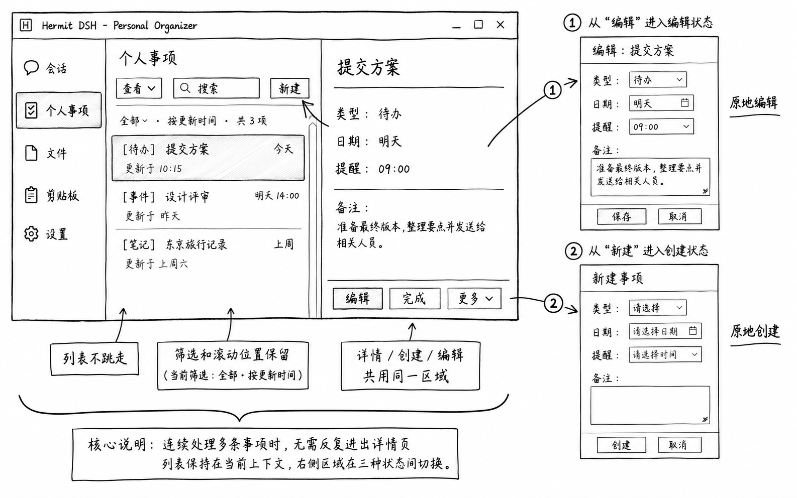

# Personal Organizer 插件设计

状态：`SLICE_2_IMPLEMENTED`

更新时间：2026-09-02

本文是 Personal Organizer 当前功能、信息架构、交互流程和低保真原型的权威来源。
业务规则与验收仍以[核心需求 6.2](../../specs/2026-08-24-hermit-dsh-vnext/core-requirements.md#62-personal-organizer)
为准；共同开发和 UI 规则见父级[文档入口](../README.md)。

## 开发者快速入口

- 插件共用规则：[Product Plugin 开发规范](../development-guidelines.md)。
- DSH/桌面能力边界：[Desktop Core 开发规范](../../docs/development/desktop-core-development.md)。
- 本插件的业务规则、Canonical 数据和 Reminder 调度仍由 Organizer 自己负责；后续 Reminder
  vertical slice 只通过公开的 `getDesktopDeadlineClient()` / `getDesktopNotificationClient()`
  使用 Desktop Core，不直接导入 Electron 或 IPC。当前已实现切片尚未接入系统通知调度。
- 本文只看产品范围、业务规则、页面流程和验收；不要在这里新增 Electron、DSH 内部 API 或通用 UI 规则。

当前实现进度：前两条 vertical slice 已接入正式 DSH Host/Client。唯一的
`personal-organizer` Skill 根据明确类型分别调用 `organizer_create_todo` 或
`organizer_create_note`，写入同一个 `personal_organizer` Canonical domain；同时提供
`organizer_list_today` 只读摘要 Tool，创建类 Tool 是否需要一次性 `ask` 由 DSH/Core 的
permission/Approval policy 决定，插件不强制普通创建逐次询问。Note 默认进入
active 状态和“最近便签”投影，用户可在同一个右侧单实例抽屉中把 active Note 草稿改为 Todo，
保留同一 `itemId`、正文、标签、提醒、来源和原始输入，置顶不带入并记录在类型历史中。两种
创建都使用 `callId` 幂等映射、`revision` 冲突检查和稳定 `itemId`；创建 Tool 已支持结构化
`todoStart`、`todoDue` 和绝对 `reminders`，因此“明天 8 点提醒我做 X”会在一次写入中形成
带 `todoStart` 和 Reminder 的 Todo。Product Surface 通过公开
`product.surface`、Core-owned Product Navigation、`ClientConnectionRpc` 和右侧单实例抽屉提供查看、
编辑、完成、类型纠正和重启恢复。插件已用同一 `.tgz` 通过 stock DSH capability 缺失检查以及
Hermit bundled DSH 的入口、Todo/Note 创建、Note -> Todo、详情读取和重启持久化资格测试。
Host 集成测试还直接验证了 `apply -> Skill/Tool 注册 -> Tool.execute -> Canonical`，以及摘要
投影和 DSH permission/Approval pipeline。模型凭据下的真实 Conversation 调用尚未纳入当前资格。当前 pinned DSH RC 的通用 Tool Card 没有
“打开 Product Surface 并定位 item”的公开动作契约，Tool Result 先返回稳定 `itemId` 和明确
的“打开：个人事项”提示；交互式打开仍是 DSH typed contract gate，当前不能宣称完整 P0 已完成。

## 产品责任

安装后提供一套不依赖 AI、File Workspace、网络或系统通知也能使用的本地个人事务工具。
用户能够记录、安排、完成、提醒、搜索、导出和删除自己的事务。

整体功能理念已经确认：Personal Organizer 不是把笔记、待办、日历和提醒拼在一起，
而是让同一件个人事务从“先记下来”开始，根据含义直接成为一种内容，再经过安排、提醒和
处理，最终能够完成、归档、找回、导出或删除的一套本地全生命周期闭环。

```text
记录 -> 直接成为 Note / Todo / Event -> 当前处理 / 提醒 -> 找回 / 复用
                                                        -> 归档 / Trash / 导出
            \_________________________________________________/
                       始终是同一个 Canonical item
```

当前已确认：

- Note、Todo、Event 是同一插件内的三种长期内容，不拆成三个 Product Plugin。
- Reminder 是附着在内容上的时间能力，不是第四份重复正文。
- 定时 Event 支持区间 Event 和只有开始时间的 start-only Event。开始时间必须明确；结束
  时间可以未指定，且 `end` 为空只表示“用户没有提供结束时间”，不能同时表示解析失败、
  尚未加载、全天或零时长。
- Event 的 Canonical 时间语义显式区分三种互斥形态：date-only、all-day、timed。
  date-only 只保存本地日历日期，表示“属于这一天，但时间未指定”；它没有开始/结束时刻，
  不是 all-day，也不能转换成当天 00:00。timed 再区分 interval 和 start-only。当前阶段
  只冻结这三个领域事实，不冻结数据库字段名。
- all-day 是明确的时间范围事实，不根据标题、类别或常见习惯推断。只有用户明确表达
  “全天、整天、一整天、整日”等全天语义，或导入来源明确标记 all-day 时，才创建
  all-day Event；“休假、出差、团建、节假日、培训”等内容词本身只能形成 date-only，
  不能触发追问或隐式升级。修改标题和详情也不能自动改变已有 Event 的时间形态。
- 一条复合指令中的 Event 和 Reminder 按各自已知事实处理。Event 信息完整、Reminder
  缺少可调度时刻时，先持久化 Event，再明确告诉用户“日程已添加，提醒尚未设置”，并在
  同一 Conversation 中追问提醒时刻；不能创建“待补全提醒”、套用默认时间或回滚已经
  成功的 Event。用户补充后，Reminder Rule 才附着到原 item ID。
- 对 date-only 或 all-day Event，“提前一天”“当天”“前两天”等表达只确定相对日历日期，
  没有同时提供具体钟点时仍不足以创建 Reminder Rule。系统不能补成 00:00、固定 09:00、
  用户未配置的偏好或由调度器自行选择时刻；继续使用上述部分成功与追问流程。
- 对具有明确 start 的 timed Event，用户未另行指定锚点时，“提前 X 提醒我”统一以 start
  为锚点。interval 和 start-only 使用同一规则，end 是否存在不能改变普通“提前 X”的
  含义。精确偏移能解析为未来可调度时刻时直接创建 Reminder Rule，不重复追问绝对时刻；
  解析结果已经过去时不创建、不立即补发，也不自动缩短偏移，Event 仍正常保留。
- Reminder 保留用户实际表达的时间语义：明确给出独立时刻的是 absolute Reminder，Event
  改期后保持固定；“提前 X”形成 start-relative Reminder，Canonical Rule 保留相对 start
  的关系并随 start 确定性重算，不能只保存首次计算出的绝对结果。Event 时间修改、所有
  受影响 Rule 的重算和未来 Occurrence 更新是一个原子业务修改。
- Today、Items、Calendar、Reminder Center 和 Search 都只是同一份 Canonical
  数据的不同工作投影，不能复制业务对象或各自维护一套状态。
- 当前行动优先于完整历史，但未来事项、无日期待办和长期笔记不能因不在 Today 而消失；
  完整内容通过 Items、Calendar 和 Search 到达。
- DSH 是唯一 AI 入口，Organizer 不创建自己的聊天、模型调用或审批服务；写入 Tool 只声明
  需要 DSH 审批的业务动作。
- AI 侧只提供一个 Personal Organizer Skill，不为 Note、Todo、Event 或 Reminder
  分别创建 Skill 或 Agent。它们都是同一件“个人事项”的不同结果或附着能力。
- Conversation 或被允许的其他 Agent 通过这个 Skill 表达记录、安排、完成或修改事项的
  意图。能够明确识别完成语义或时间占用时形成 Todo 或 Event；其余无法明确判断的内容
  一律形成 Note，不再保留无类型的临时状态或待整理队列。
- “是否需要存储”和“存成什么类型”是两个连续判断。用户说出“待办”“帮我记录”
  “记一下”“添加日程”或明确说“提醒我”且目标内容清楚时，Skill 才发起创建；普通讨论、
  分析、建议或提问不能因为提到了某件事就自动存储。“待办”同时确定类型为 Todo，“日程”
  同时确定类型为 Event；“帮我记录”“记一下”只确定需要存储，没有其他类型线索时形成 Note。
  “提醒我做 X”在 X 是可执行动作时形成 Todo，“提醒我记住/保存一条信息”形成 Note 并附加
  Reminder。这些词是明确语义的例子，不是由本地关键词表代替 Skill 理解用户意图。
- 创建 Todo 时，Skill 从原话中提炼简洁的主要行动作为标题，把用户明确说出的补充信息
  放入详情，并完整保留原始输入。只有一个短行动时详情可以为空。提炼可以删除“帮我记录”
  “创建待办”等对业务内容无用的指令词，但不能改写或遗漏用户事实，也不能凭空补充日期、
  Reminder、优先级、标签或执行步骤。
- Todo 的 start/due 角色必须由用户明确表达，不能根据标题、动词或“裸日期通常是截止”
  的习惯猜测。“开始/从……开始”映射 start，“截止/最晚/……前完成或提交”映射 due；
  但“在某时提醒我做 X”且 X 是可执行动作时，该时刻同时映射 Todo 的 `todoStart` 和
  Reminder。只有日期而没有角色时，先创建无日期 Todo 并在同一 Conversation 追问。自然语言
  日期值可以使用当前本地日期、locale 和 IANA 时区解析，但不能默认最近星期、工作时间或钟点。
- 创建多少条事项由用户明确表达决定。用户说“一个待办”或没有要求拆分时，只创建一条，
  其余行动保留在同一事项的详情中；只有用户明确说“分别记录”“创建三条待办”等拆分意图
  时，才创建对应数量的事项。Skill 不按标点或行动词数量擅自拆分，也不把多条静默合并。
- Checklist 也只由用户明确表达决定。用户说“清单”“步骤”“子任务”等并列出内容时，
  Skill 才按用户给出的顺序创建未完成 Checklist 项；没有这类明确结构化指令时，多个补充
  行动仍作为普通详情文本。Skill 不把说明文字自动拆成 Checklist，也不补充用户没说过的
  步骤。
- Checklist 项和父 Todo 的完成状态相互独立。勾完最后一个 Checklist 项只更新该项，不
  自动完成父 Todo，也不弹出确认；只有用户在界面执行“完成待办”或在 Conversation 中
  明确要求完成该 Todo，父 Todo 才从 planned 变为 completed。即使仍有未完成 Checklist
  项，用户也可以直接完成父 Todo；完成操作不自动勾选、删除或改写 Checklist，之后查看时
  仍显示各项的真实状态。
- 明确创建指令直接调用 Organizer Tool，不增加 Organizer 自己的预览确认。若 Core 当前
  Approval 策略要求审批，仍使用 DSH 通用审批；只有收到持久化成功结果后，Conversation
  才显示“已记录”、事项类型和内容摘要，并提供“打开”和“撤销”。失败、取消或结果未知时
  不能声称已经保存。
- 创建结果中的“撤销”把同一事项移入 Trash，不永久删除、不新建替代记录；结果原地变为
  “已撤销创建”并提供“恢复”。恢复清除 `deleted_at`，使事项回到创建时的业务状态和同一
  item ID。这是完整插件的创建结果语义；第一条切片不以撤销、恢复或 Trash 管理页面作为
  完成条件，相关语义在后续 Trash 切片中验收。
- 用户在新的 Conversation turn 中再次发出内容完全相同的明确创建指令时，视为新的用户
  意图并创建具有新 item ID 的事项；不做相似度查重、自动合并或静默更新。只有同一次
  Tool 调用因断线、重连或重放再次到达时，才通过同一个 `callId` 返回原提交结果，不能
  创建第二条事项。
- 只有 active Note 可由用户在右侧抽屉明确改为 Todo 或 Event；修改保留同一个 item ID、
  正文、标签、提醒、来源和类型变更历史，并要求用户补齐目标类型的必要字段。Skill 不
  静默改变已保存事项的类型；Todo 与 Event 之间暂不提供任意互转。具体入口位于 Note 的
  抽屉编辑状态：“类型”字段可以从 Note 选择 Todo 或 Event；Todo/Event 的该字段只读，
  不显示反向或相互转换选项。选择目标类型只切换当前编辑草稿和可编辑字段，不立即修改
  Canonical 记录；用户保存时才把类型纠正与字段修改作为一次原子提交，取消则原 Note
  完全不变。目标类型的必要字段未补齐时不能保存。Note → Todo 时标题直接映射到标题，
  正文直接映射到详情，标签、Reminder、来源和原始输入原样保留；Todo 状态初始化为
  planned，日期、优先级和 Checklist 不自动生成，也不调用 AI 改写内容。Note 的置顶
  状态不带入 Todo，也不映射为优先级；原置顶事实只保留在类型变更历史中，转换草稿明确
  提示这一变化。
- archived Note 必须先由用户显式恢复为 active，恢复 durable success 后才能单独进入
  Note → Todo 或 Note → Event；类型转换不能隐式解除归档，也不提供“恢复并转换”复合
  动作。恢复成功后，即使后续转换取消、校验失败、冲突或写入失败，Note 仍保持 active；
  需要再次归档时由用户另行明确执行。
- Note → Event 只允许从 active Note 发起；archived Note 必须先由用户显式恢复，恢复成功
  后再单独转换，不能在改类型时隐式解除归档。标题映射为 Event 标题，正文映射为详情，
  标签、来源、原始输入和已有 absolute Reminder 原样保留；置顶不映射到 Event 字段，只
  进入类型变更历史。用户必须明确选择 date-only/all-day/timed 并补齐目标形态的最低时间
  事实；手工转换不从 Note 正文解析日期、时间或全天语义。
- Skill 负责理解用户意图和编排已有 Organizer Tool；Tool 只是 DSH 要求的受控写入边界，
  不成为用户需要理解的第二套产品概念，也不能被 Skill 或 Agent 绕过直接写数据库。
- AI、网络、系统通知或其他插件不可用时，只隔离受影响能力，Organizer 的本地 CRUD、
  管理、搜索、应用内提醒事实、导出和删除仍然可用。
- DSH 全局入口固定显示为“个人事项”。进入插件后不得默认打开 Today；Today 只是用户主动
  选择的时间筛选，不复制业务对象，也不改写 Todo priority。
- “个人事项”默认打开精简工作面，不再增加“概览”一级页面。工作面依次承载近期 Event、
  全部未完成 Todo，以及默认收起的最近 Note。
- 精简工作面使用连续的事项列表分区，不展示统计卡片、数量仪表盘或欢迎页，避免随着
  状态和类型增加而膨胀成 Dashboard。
- Items、Today 和 Calendar 放在同一个查看入口中；Calendar 是同一批有日期事项的
  另一种查看方式。Reminder Center 只在需要处理提醒或通知异常时成为状态入口；
  Trash、导入和导出属于低频入口。上述能力都不常驻为一级页面。
- 桌面端从列表查看详情、新建或编辑事项时，统一使用右侧抽屉，不进入独立详情页面。
  抽屉是单实例容器；切换事项或操作状态时替换抽屉内容，不叠加新的抽屉。保存、取消或
  关闭后保留原列表的查看条件和浏览位置。
- Organizer 只维护当前抽屉中的一份未保存内存草稿，不为不同事项或工作面保存后台草稿。
  无修改时直接切换；有修改时，所有会销毁草稿的用户主动离开动作统一要求保存、放弃或
  继续编辑。未保存草稿不持久化，崩溃、强制退出或不可拦截终止后不承诺恢复。
- Today 固定展示逾期待办、今天待办、今天日程和今天提醒。普通 Note 不因“今天创建”
  自动进入 Today；只有 Note 的 Reminder Occurrence 在今天触发时，才出现在“今天提醒”。
- Today 不提供跨 Todo、Event 和 Reminder 的通用“推迟”。快捷动作必须直接说明真实副作用：
  Todo 使用完成/改日期，Event 使用改期/取消，Reminder Occurrence 使用稍后提醒/忽略；
  复杂日期和时间修改进入同一右侧抽屉。

当前设计会话暂不讨论 Quick Panel。它不作为本轮信息架构、主窗口流程和第一条
vertical slice 的前提；未来若增加快捷记录，也必须直接形成 Note、Todo 或 Event，不能
重新引入 Inbox 或无类型临时记录。

## 当前页面模型

| 工作面 | 主要任务 | 层级建议 |
| --- | --- | --- |
| 个人事项 | 展示近期 Event、全部未完成 Todo 和最近 Note | DSH“个人事项”入口对应的默认精简工作面；用户入口文案为“概览” |
| Today | 查看并处理逾期、今天待办、今天日程和今天提醒 | “查看”中的时间筛选，不是默认首屏 |
| Items | 按 Note、Todo、状态、日期和标签筛选全部内容 | “查看”中的全部事项视图 |
| Calendar | 查看 Event 和有日期事项的周/列表投影 | “查看”中的日历视图，不是独立业务页面 |
| Reminder Center | 处理待处理、即将到来、历史提醒和通知依赖状态 | 顶层常驻状态入口；用提醒图标和 attention 状态点表达 |
| Trash | 恢复或永久删除，保留原业务状态 | “更多”中的低频入口，用户文案为“回收站” |
| Data & Storage | 导入预览、JSON/CSV/ICS 导出 | 低频入口或插件设置 |

页面模型不等于最终导航。原型设计需要继续收敛哪些视图常驻、哪些通过筛选或状态入口
到达，不能把上表机械变成七个全局菜单。

## 当前低保真基线

```text
DSH 导航 | 个人事项  [概览][全部事项][今天][日历] [提醒][搜索][+] [...] | 右侧抽屉
---------|----------------------------------|----------------
会话     | 近期安排                         | 详情：提交方案
...      | 明天 10:00 设计评审               | 类型：待办
---------| 待办                             | 状态：planned
个人事项 | [ ] 提交方案                [>]  | 截止：今天 17:00
文件     | [ ] 整理报销                     | 提醒：无
剪贴板   |                                  | 标签：工作
设置     | 最近记录 2            [展开]     | [编辑] [完成]

[概览][全部事项][今天][日历]：四个常用事项投影，桌面端显示图标和短文字，窄屏只保留图标并提供 Tooltip
[提醒]：始终存在的提醒中心状态入口，有待处理或通知异常时显示 attention 状态点
[...]：回收站 / 导入导出
右侧抽屉：按需打开并覆盖工作面右侧，不是常驻分栏或独立页面
```

这是信息结构基线，不冻结列宽、控件、颜色或最终导航名称。

### 导航优化决策（2026-09-01）

使用场景：用户在同一个“个人事项”工作面里高频切换概览、全部事项、今天和日历，同时
偶尔处理提醒、搜索或回收站。导航需要让常用投影一步可达，又不能把七个工作面排成七个
平级一级页面。

本轮依据当前 pinned DSH Web primitives 和网页 GPT 的独立讨论，采用唯一方案：

- 四个常用投影固定为 `[概览] [全部事项] [今天] [日历]`，其中概览就是默认精简工作面，
  不改变“个人事项”首次进入不默认 Today 的规则。
- 桌面端四个入口使用官方 `Button` 的紧凑图标加短文字形式，当前项使用 active/`aria-current`；
  窄窗口自动隐藏短文字，只保留图标，并使用官方 `Tooltip` 和可访问名称。它们属于同一
  Product Surface 内的投影切换，不是四个独立页面或四个 Drawer。
- Reminder Center 从低频菜单移到四个投影旁边，作为始终存在的独立提醒入口。只有“需要用户
  处理的提醒”或“通知/调度异常”才显示 attention 状态点；普通未来提醒不点亮状态点。状态点
  不显示数字，避免在 Reminder Rule、Occurrence、事项和异常之间制造未定义的计数语义。
- 当前 pinned DSH RC 没有 Bell、Clock、Calendar 等提醒/日历 glyph，原型在官方 Button 和
  Tooltip 外补一个 Organizer 内部最小铃铛 glyph；如果后续 DSH 提供合适公开图标，替换 glyph
  即可，不改变导航契约或业务状态。
- “更多”只保留回收站和导入导出等低频入口，删除 Reminder Center 的第二入口。用户看到的
  Trash 统一称为“回收站”；机器标识 `trash`、query key、enum、API 和 test id 保持不变。

低保真原型：

```text
个人事项  [▱ 概览] [☷ 全部事项] [◎ 今天] [▤ 日历]   [铃铛•] [搜索] [新建] [...] [关闭]
                                                            ^
                                     需处理提醒/通知异常才显示 attention 点

更多 ...
┌────────────┐
│ 回收站     │
│ 导入与导出 │
└────────────┘
```

这次只改变导航呈现、入口分组和用户可见的 Trash 中文文案，不改变 Note/Todo/Event、Reminder
附着模型、默认工作面、右侧单实例抽屉或任何 Core 业务规则。

### 列表与日程表单收敛决策（2026-09-01）

使用场景：用户在个人事项主工作面快速扫读待办，需要偶尔查看其中的清单并直接勾选；用户
编辑日程时，希望沿用手机日历的“全天事件”心智，同时仍能明确设置提醒时间。

本轮采用以下唯一交互方案：

- Todo 的 Checklist 用户界面统一称为“待办清单”。主事项行不直接显示“待办清单”文字，也
  不把清单项作为独立列表项；有清单的 Todo 行尾只显示一个展开/收起按钮。展开后在原行
  下方显示清单项，可直接勾选；清单仍没有日期、Reminder、详情页或嵌套层级。清单计数和
  内容只在展开状态或右侧抽屉中可见。
- 主事项标题或正文双击可进入“内容快速编辑”；行尾同时提供可聚焦的编辑图标，键盘可用
  Enter/Space 进入。快速编辑只允许修改标题和正文，提供保存/取消，`Esc` 取消；日期、提醒、
  优先级、标签和清单结构仍通过同一个右侧抽屉编辑。快速编辑与抽屉编辑共用同一保存命令、
  expected revision 和冲突反馈，不形成第二套数据模型。
- 日程表单采用手机日历式“全天事件”开关，不再显示“仅日期”按钮或三项并列模式按钮。开关
  打开时只显示开始/结束日期，保存为 Canonical `all-day`；关闭时显示开始日期和开始时间，
  结束时间可选，填写开始时间保存为 `timed`。底层 `date-only` 仍是核心需求保留的事实，
  但不以“仅日期”作为用户可见选项；来自 DSH 或导入的 date-only 事项在详情中用“时间未
  填写”等事实描述，不伪装成全天或午夜。关闭开关且草稿未填写开始时间时，不能用 UI 文案
  把它称为全天。
- 全天事件本身不写入默认时刻，也不自动创建 Reminder。用户主动点击“添加提醒”时，如果
  当前是全天 Event，则提醒表单默认预填事件开始日期的 `08:00`，用户可以修改或删除；这个
  08:00 是 Reminder 的默认值，不是 Event 的开始时间，也不代表小米的固定规则。若事件日期
  尚未填写，提醒保存前仍需补齐明确日期和时间。
- Reminder 表单使用白话表达：“指定时间提醒”“按事项时间提醒”；相对提醒显示“在[待办
  开始/待办截止/日程开始]前[数量][单位]提醒我”，不展示“相对事项时间”“选择基准”等
  内部术语。对于没有具体时刻的日期型事项，只允许日级偏移，不能偷偷补分钟；相对提醒仍
  随合法的事项时间修改重算，absolute Reminder 保持原时刻。
- 概览在宽屏下使用近期安排/待办双列，今天使用响应式分组；全部事项筛选收敛为轻量工具栏；
  Calendar 在右侧抽屉关闭时占满可用主区域，抽屉打开后保留同一周视图并压缩内容；搜索、
  回收站、导入导出继续是辅助视图或工具，不增加一级页面。以上只调整信息层级、内容密度
  和文案，不冻结颜色、字号、间距或新增组件库。

已确认参考图片：



本图只采纳“全天事件开关 + 开始/结束日期行”的交互心智；重复、日历账户、时区、闹钟/倒计时
等其它字段不属于本轮 Organizer 范围。网页 GPT 调研未找到“小米全天事件固定默认 08:00”的
一手证据，因此本插件只把 08:00 作为用户主动添加全天提醒时的可修改预填值。

低保真原型：

```text
待办事项                              [>] [编辑内容]
□ 提交报销          截止：今天 17:00

展开后：
□ 提交报销                          [v] [编辑内容]
  ☑ 整理交通发票
  ☐ 补充项目编号

快速编辑：双击标题/正文或聚焦编辑图标
[提交报销________________________]
[整理交通发票和项目编号，提交给财务。___]
                              [取消] [保存]

日程时间
全天事件                              [开]
开始日期：2026/09/03
结束日期：2026/09/03

提醒
提醒时间：2026/09/03 08:00       [修改]
```

这次原型调整不改变第一条 vertical slice 的范围。第一条仍是明确 Todo 语句经过 Skill、Tool、
Canonical 存储、右侧抽屉、完成和重启持久化的最小闭环；待办清单展开、内容快速编辑、Event
全天开关、Reminder 默认 08:00 和页面密度优化分别在对应后续切片中验收。

## 已确认的交互原型

以下图片用于保留已确认的功能关系，帮助后续原型设计理解使用场景；它们不冻结视觉
风格、颜色、尺寸、控件位置或未被正文明确确认的功能。后续经用户确认的原型图片应复制
到本目录的 `assets/`，并在本节说明采纳范围，不能只保留临时剪贴板路径。

### 列表与右侧抽屉



使用场景：用户连续查看和处理多条个人事项时，从列表选择事项后在右侧抽屉查看详情；
编辑和新建也在同一个抽屉内切换，保存、取消或关闭后保留原列表的查看条件和浏览位置。
本图确认这一交互关系。图片中类似固定分栏的外观不属于已确认方案，实际结论以正文的
“单实例右侧抽屉”为准；示例字段、列表排序、窗口比例和控件样式也不构成视觉要求。

### 当前可复用前端原型

`plugins/organizer/src/client/` 已按正式 Product Plugin 形状实现 Organizer
Product Surface，并通过 DSH 公开 `product.surface`、Product Navigation v1 和
`ctx.layout.openProductSurface/closeProductSurface` 挂入 Hermit bundled DSH。页面、
内部 View、列表、右侧单实例抽屉、草稿保护和状态表达都是后续可保留的代码，
不是 Settings tab 或独立 Vite 页面。

基础控件直接使用已资格的 DSH public `Button`、`Input`、`Menu`、`Toast`、
`DisclosureRow` 和公开图标；原生 `select`、`textarea`、`checkbox`、date/time
input 用于 DSH 暂未提供的简单 semantic control。不为转发官方 primitive 创建
`@hermit/ui`，也不复制 DSH shell、主题或 token 数值。

当前页面只通过真实 `OrganizerClientPort` adapter 读取 Host 投影并提交明确命令，不再打包
预制 snapshot、preview 状态或第二套 Canonical。Today 归属、Reminder recurrence、时区、
搜索排名和完整 lifecycle 仍由后续 domain slice 实现；这些未实现能力在页面中保持空状态或
明确 disabled，不伪装成已完成。用户已经确认一个“个人事项”入口、默认精简
工作面、“查看”与低频菜单、搜索和右侧单实例抽屉构成的整体信息架构；字段、动作和
完整流程仍按下列三个原型验收包逐包确认，因此当前不冻结样式参数，也不把未确认页面
截图加入 approved prototype。

前端交互批准版固定分为三个连续验收包：

1. **事项与抽屉**：Default、Items、统一 Drawer 和窄屏，覆盖 Note/Todo/Event 会改变
   抽屉结构或 lifecycle 的 P0 字段与动作、正确投影、session work-state、dirty draft 和
   conflict；当前实现已推进本包中的 Todo/Note 两条切片，Event 仍待后续切片。
2. **时间与 Reminder 投影**：Today、Calendar、Reminder Center 与 Drawer 时间区，覆盖
   已确认的时间形态、Todo start/due 角色、Reminder Rule/Occurrence 的最小可操作闭环。
3. **边界流程与 DSH**：Local Search、Trash、导入导出和真实 DSH Conversation 官方 UI
   fixture，确认低频流程和跨 Product Surface 交互，不在 Organizer 内创建聊天 UI。

第一包当前已在真实 DSH Web Product Surface 中实现并通过前两条资格测试：Default 与 Items
共用单实例右侧抽屉；Note 和 Todo 使用各自的创建/编辑字段，Note 可在编辑态切换为 Todo；
Items 保留多选 filters、sort 与浏览位置；当前代码已覆盖 dirty draft、revision conflict、
empty 和 loading，partial、permission denied、plugin unavailable 的真实状态资格仍随后续
切片验证。第二包的时间与 Reminder 投影，以及第三包的边界流程与 DSH 仍未开始；本轮实现和
截图不构成这些能力的交互确认，也不冻结视觉参数。

三个包确认后结束原型阶段，继续扩展同一真实 adapter 到正式 Canonical、Tool 和 Core 契约；
不再增加独立的“完整异常矩阵原型”。每个看起来可操作的控件都必须产生可观察的命令结果，
或者明确 disabled，不能用空按钮和假成功代替尚未实现的流程。

正式接入真实 adapter 前仍有一项 DSH 技术 gate：Product Navigation v1 已提供统一 active
surface 观察和入口注销，但当前还没有 before-leave dirty guard。若 Organizer 与其他产品
切换确实会丢失 dirty draft，下一小切片只在 layout transition choke point 增加统一布尔
guard，不在 Organizer 内使用私有 store、DOM 或 Router 绕过。

## 核心交互

### 正常工作面的 session 状态

默认“个人事项”精简工作面、Items、Today、Calendar 各自维护一份当前 app/plugin 运行
session 内的独立 UI/work-state。用户在同一运行中来回切换，切回时恢复刚才的显式状态和
阅读位置；这些状态只保存交互上下文，不复制 Canonical 数据，实际 item 集合每次都按当前
事实重新投影。

| View | 当前 session 保留 | P0 不增加 |
| --- | --- | --- |
| 默认精简工作面 | scroll/focus，以及最近 Note 当前展开/收起 | Items 式 filters、自定义 sort |
| Items | type/status/date/tag filters、显式 sort、scroll/focus | 向其他 view 传播筛选 |
| Today | scroll/focus，以及核心已要求的手工排序/固定 | 额外 type/status/date/tag filters、分组折叠 |
| Calendar | week/list mode、当前 mode 的 date context、selection、focus/viewport | 日视图、完整月历、专属 filters/sort |

默认精简工作面首次进入时最近 Note 固定收起；本次运行中展开后切 view 再回来仍展开，但重启
后恢复收起。Today 的四组就是其固定业务结构，不新增 type/status/date/tag filters 或分组
折叠。Calendar P0 固定提供周视图和列表视图，Today 承担日视图，完整月历属于 P1。

Today 手工排序和固定是独立 durable view data，不是瞬时 scroll，也不是 Todo priority。
四组顺序与业务归属固定：用户只能在同一组内排序，不能把成员拖到另一组。固定只把成员放
到本组顶部，不建立跨 Todo/Event/Reminder 的全局固定区；同组 pinned 和 unpinned 各自
保持手工相对顺序，普通拖动不能代替明确 pin/unpin。

Todo/Event 的 Today ordering identity 使用 canonical item ID。Reminder 的 Canonical 成员
identity 仍是 Occurrence ID，但单成员和 exact-instant 聚合后的可见行统一使用独立、opaque
的 `TodayReminderRowID` 作为 Today pin/manual-order identity，不使用 Rule、父 item、时间
或成员集合代替。新的 repeating Occurrence 不继承旧实例位置；同一可见行在今天内整体
snooze 时可延续位置，离开今天则失效。

Today pin/order 跨 view、DSH 工作面、正常/崩溃重启和 disable/re-enable 保留，但只在同一
identity 持续属于同一 Today group 的 membership 内有效。连续多日仍属“逾期待办”可保留；
换组、完成/取消、改期离开 Today、进 Trash、永久删除或其他 authoritative change 导致离组
时清理。以后同一 item 重新进入 Today 或进入另一组按新成员默认位置处理，不复活旧数据。
新成员不得无条件洗牌已有手工顺序，具体 rank 算法留到实现设计。

Loading、partial、temporary unavailable 或一次空投影不能证明离组，不得清理 durable Today
数据；只有加载权威 Canonical 状态并确认 membership 失效后才能清理。重启/re-enable 先恢复
Canonical 数据再 reconcile；Today scroll/focus 仍是 session-only，durable arrangement 也
不能让新 session 默认进入 Today。

Calendar week/list mode 是用户明确选择的 persistent preference；从未选择时默认周视图。
Mode 跨 view、DSH 工作面、正常/崩溃重启和 disable/re-enable 保留。Visible week、列表 date
anchor、selection、scroll/focus 等只是 session state；新 session 使用持久 mode，但日期位置
基于当前本地日期初始化，不恢复上次浏览的遥远日期。

Calendar 同时投影 Event 和具有 durable start/due 的 Todo；无 start/due 的 Todo 不进入。
Todo 的每个 durable temporal anchor 形成一条带角色的 Calendar entry：start 显示“待办 ·
开始”，due 显示“待办 · 截止”。同一 Todo 同时具有 start 和 due 时显示两条 entry，二者
共享同一个 canonical item ID，点击后打开同一个右侧抽屉；即使两个 anchor 落在同一天也
不静默合并。Calendar 不把 start 到 due 画成持续占用区间，因为 Todo 的两个角色不表示
这段时间持续被占用。完成、取消、移入 Trash 或永久删除该 Todo 时，两条投影按同一 item
生命周期一起退出。

同一 session 内切换 week/list 时共享当前 date context：列表尽量定位周视图选中或可见日期，
周视图显示包含列表 anchor 的那一周；各 mode 可保留自己的 scroll/focus。Calendar mode 和
Today durable view data 都不保存 drawer identity，也不改变任何 Canonical 时间事实。

右侧抽屉仍只有工作面级别的一份，不属于任何 view。四个 view 不分别记住旧 drawer item，
切换不会关闭、替换或恢复另一份抽屉，因此本身不触发 dirty-draft guard；点击另一 item
真正替换当前草稿时才使用统一保护。当前抽屉 item 可以不属于刚切入的主投影。

切回 view 时恢复 filters/sort/period/selection 并用当前 Canonical 数据 reconcile。原 anchor
已改变状态、进 Trash 或永久删除时不能恢复旧行，scroll/focus best-effort 留在邻近有效
位置；新 item 满足当前投影时正常出现。Loading 不重置 view state，reconcile 后 empty 也
不自动清 filter 或重置 Calendar period。

Local Search 的 origin snapshot 从当时 active normal view state 捕获临时返回点；Search
退出后恢复该 state 并重新投影，snapshot 随 Search 销毁，不形成第五份持久配置。

正常退出后重启、崩溃重启、plugin disable 后 re-enable 都结束普通 Organizer UI session，
清空 last active view、瞬时 filters/sort/scroll/selection、Calendar 日期位置、默认工作面
临时展开状态、Search 和 drawer UI state，但保留仍有效的 Today pin/order 与 Calendar
week/list preference。新 session 固定从 DSH“个人事项”对应的默认精简工作面开始，不能把
上次 Today/Items/Calendar 变成实际默认。Canonical 数据和 Reminder 等 durable 状态仍按
各自规则恢复。

应用未退出且插件 lifecycle 未结束时，从 Organizer 切到 DSH Conversation、File Workspace
等位置再返回仍属于同一 app session，应恢复离开前的 normal view 及其状态。离开动作若会
让 dirty draft 无法继续存在，仍先执行统一草稿保护。暂时 unavailable 可以在内存保留
session state 并在恢复后重投影；明确 disable 是 lifecycle 结束，状态必须清空。

Today pin/order 是 membership-scoped durable view data；Calendar week/list mode 是明确的
persistent presentation preference。除此之外，只有明确长期设置才构成 preference。Last
view、filters、普通 sort、scroll、Calendar period/selection、Today scroll、Note 当前展开
状态和 Search 都只是瞬时操作，不能因“上次这样用”自动持久化。

### 默认“个人事项”精简投影

默认工作面不是 Dashboard、Today、Items、Calendar 或 Search 的别名。三个连续列表分区的
顺序固定为“近期 Event -> 全部未完成 Todo -> 最近 Note”，不增加统计卡、数量仪表盘、欢迎
页或概览页面。

“近期 Event”表示当前仍在进行的 Event，加上从今天起连续 7 个本地日（今天 + 后 6 日）
内尚未发生/结束的 Event，不是滚动 168 小时，也不回看已结束历史。Canceled/Trash Event
排除；过去开始但 `start <= now < end` 的 timed Event 算进行中，无 end 的 timed Event 在
start 经过后不能假设仍持续。Date-only 的 calendar date 落入窗口即命中；all-day 的
`[startDate, endDateExclusive)` 与窗口 overlap 即命中，二者都不物化为 00:00。

Event 先显示正在进行/当前日期内容，再按原定开始日期/时间升序；同一日 all-day/date-only
在 timed 前，timed 按 start 升序，最后以 stable Event ID 确定。默认面最多显示前 5 条，
超出后明确“在日历中查看”，不在该段分页；Calendar、Items 和 Search 范围不受此 cap 影响。

“全部未完成 Todo”严格是所有 `status=planned && deleted_at=null` 的 Todo，包括 overdue、
today/future due、future start、only-start、only-due、start+due 和 undated；completed、
canceled、Trash 排除，future-start 不能因尚未开始而隐藏。默认排序分三层：

1. 有 due：due 升序；同 due 时依次用 start（如有）、updated_at DESC、stable Todo ID。
2. 无 due 但有 start：start 升序，再用 updated_at DESC、stable Todo ID。
3. 无 start/due：updated_at DESC，再用 stable Todo ID。

Todo 日期比较遵守原 Canonical 精度，不能把 date-only 伪造成午夜。该段没有产品数量 cap，
可以用虚拟列表、cursor 或渐进加载，但全部 planned Todo 必须在同一连续结果集中可达，顺序
一致，不能把后半段静默藏到另一页面。Today durable sort/pin 不应用于这里，也不改 priority。

“最近 Note”只包含 `status=active && deleted_at=null`，archived Note 通过 Items/Search 查找。
“最近”按 updated_at DESC、stable Note ID；新 session 默认收起，收起时不展示内容摘要或
数量统计。当前 session 展开后最多显示最近 5 条，超出后明确“在全部事项中查看”并进入
Items 的 Note 范围，不在默认面分页。

三个 section 保持列表分区而非卡片。单段 empty 只显示一行简短状态；各段可以独立 loading，
其他已就绪段继续工作；partial 保留已知内容并行内说明可能不完整，temporary unavailable
只影响该段。Loading/partial/一次空结果不能当作 authoritative absence；整个插件不可用时
使用统一 unavailable 工作面，不构造假的三段壳。

默认面始终由当前 Canonical 数据重投影。Event 结束/canceled/改出窗口，Todo completed/
canceled/进 Trash，Note archived/进 Trash 后退出或重排；修改时间字段和 Note updated_at
后按当前规则重排。当前 item 已在 drawer 中时不因离开投影而关闭，scroll/focus anchor 消失
后 best-effort 保持邻近位置。

“今天”和 7 日窗口使用当前设备系统本地 timezone/calendar date。Timed Event 用真实 instant，
date-only/all-day 保持日历语义；时区变化后重新投影 timed 当前/未来状态，但不改写 Canonical
日期。默认面不包含 Today 的 Reminder 分组/排序，不继承 Items filters，不复制 Calendar，
也不改变 Local Search 的 all-non-Trash scope。

### Items 默认状态与“查看全部”范围

Items 是浏览和筛选全部非 Trash Canonical item 的正常工作面，不是 Search，也不是 Note、
Todo、Event 三个页面的拼接。新的 normal Items session 默认 type/status 都是全部，业务日期、
更新时间和 tag filter 为空，sort 为 Items 默认；active/archived Note、planned/completed/
canceled Todo、scheduled/canceled Event 全部进入，Trash 排除，终态必须明确标记。

Items 使用一条连续混合列表，type 是 item 属性和显式 filter，不是固定 section。默认排序为
`lifecycle bucket -> updated_at DESC -> stable canonical item identity`：active/planned/
scheduled 属于 current bucket，排在 archived/completed/canceled terminal bucket 前；同一
bucket 不再给 kind 或具体状态排额外优先级。该排序只影响 Items presentation，不改 priority、
Event 时间或 lifecycle。

P0 最低提供两个 sort：

- 默认：current bucket 优先，再按 updated_at DESC 和 stable ID。
- 按更新时间：所有结果直接按 updated_at DESC 和 stable ID，不区分 current/terminal。

P0 不提供跨 kind 的“按业务日期”排序。Type/status/date/tag filter 维度之间 AND、同维度多选
OR；Items 的“业务日期 / 更新时间”复用 Local Search 的确定语义，多 tag 使用 OR，Trash 不
作为普通 status。不存在看不见的 current-only filter。

默认面“最近 Note -> 在全部事项中查看”进入同一个真实 Items，但建立一次 temporary scoped
navigation，不覆盖已有 normal Items session：`type=Note`、所有非 Trash Note 状态、其他
filters 为空、Items 默认 sort，并有自己的 scroll/focus。Type=Note 必须作为正常可见 filter
状态，不能藏在路由或 deep-link constraint 中；scoped Items 不复制数据，也不是新页面。

Scoped navigation 中的 filter/sort 修改只属于本次范围。返回默认面、显式切 Today/Calendar
或其他 Organizer normal context，以及 app/plugin session 结束时销毁；之后正常进入 Items
恢复此前 normal Items state，没有旧 state 时才使用默认。暂时切去 DSH Conversation/File
再返回仍可继续 scoped Items；从这里进入 Local Search 时 origin 也指向 scoped context，
退出 Search 后回到它，而不是底层 normal Items。

Items 按当前 Canonical 数据重投影。默认 all-status scope 中状态变化不会隐藏 item，只更新
状态并重新 bucket/sort；显式 filter 不再匹配时从列表移除，终态恢复后以同一 ID 重新进入。
进 Trash 后无条件退出，永久删除后不保留缓存详情。当前 drawer 不因列表移除而关闭，打开/
关闭继续保留 normal 或 scoped Items filters/sort/scroll，dirty-draft 规则不变。

Loading 保留当前 normal/scoped context；empty 只表示当前 scope 与显式 filters 的交集为空，
不自动清 filter、包含 Trash、切 Search 或扩大类型；scoped Note empty 仍明确显示 Note 范围。
Partial 保留已有结果并说明“全部事项”尚不完整；temporary unavailable 可保留 session state
并在恢复后重投影，disable/re-enable 清空 normal/scoped 瞬时状态并从默认精简面重新开始。

Items 不继承 Today durable sort/pin 或 Calendar 布局。Local Search 有 query 和 relevance，
Items 没有；Search 打开 item 不建立或修改 Items state。两者可以复用 filter 业务语义，但各自
维护独立瞬时状态。默认面 Event overflow 仍去 Calendar，只有最近 Note overflow 进入 scoped
Items。

### 创建和类型纠正

```text
用户在 DSH Conversation 中谈到一件事
-> 没有明确保存指令：不创建事项，继续当前对话
-> 有“待办 / 帮我记录 / 记一下 / 添加日程”等明确保存意图：进入类型判断
   -> 明确说“待办”：创建 Todo
   -> 明确说“日程”：创建 Event
   -> 只明确要求记录，没有 Todo / Event 线索：创建 Note
-> 用户需要时在右侧抽屉明确把 Note 改为 Todo 或 Event
-> 保留原 ID、正文、标签、提醒、来源和历史，并补齐目标类型的必要字段
```

用户在插件页面手工创建时明确选择 Note、Todo 或 Event。Skill、批量导入和手工 UI 都
必须落到同一套 Canonical 数据与业务规则，不能形成旁路。类型纠正是用户发起的明确修改，
不是 AI 对已保存内容的后台重分类。

Note 生命周期与类型转换是两步独立动作：

```text
archived Note -> 显式恢复 -> active Note -> 进入类型转换草稿
恢复失败      -> 仍是 archived Note，Reminder 继续暂停
恢复成功但转换取消/失败 -> 保持 active Note，不自动重新归档
转换成功      -> 同一 item ID 的 planned Todo 或 scheduled Event
```

恢复和类型转换分别使用各自的 expected revision 与幂等保护。恢复只恢复仍在未来的有效
Reminder 调度，不补归档期间错过的触发；后续转换保留已有合法 Reminder，不重新解释。
旧转换草稿不得覆盖后来重新归档、移入 Trash 或改变 kind 的最新状态。Note 专属 active/
archived 和置顶事实只留在类型变更历史，不成为 Todo/Event 的额外业务属性。

```text
打开 Note 详情 -> 在同一右侧抽屉进入编辑状态
-> “类型”字段可选择 Note / Todo / Event
-> Todo / Event 的编辑状态中，“类型”只读
-> 选择目标类型：同一抽屉原地切换目标字段，只修改草稿
-> 保存：类型纠正和字段修改原子提交
-> 取消：丢弃整个草稿，Canonical 记录仍是原 Note
```

Note → Event 的目标字段规则：

| Note 事实 | Event 结果 |
| --- | --- |
| item ID | 保持同一 ID |
| 标题 / 正文 | Event 标题 / 详情 |
| 标签、来源、原始输入 | 保留 |
| absolute Reminder 及既有历史 | 保留原语义，不改为 start-relative |
| 置顶 | 不映射，只记录在类型变更历史 |
| active | 转换成功后为 scheduled Event |
| archived | 不允许直接转换，必须先显式恢复 |

用户在转换草稿中必须补齐目标形态的最低必要时间事实：Canonical date-only 只需本地日历
日期，all-day 通过“全天事件”开关并填写合法本地日期范围，timed 必须填写 start，end
可未指定。当前 UI 不展示“仅日期”按钮；关闭“全天事件”后，开始时间留空只表示没有
填写具体时刻，不能被界面误称为全天或午夜。不能默认今天、午夜、全天或持续时长，也不能
把正文中的“9 月 4 日团建”自动变成 Event 时间事实。

已有 absolute Reminder 早于、晚于或已经过去都不阻止转换，也不因此移动、删除、补发或
重新解释；成功反馈应说明已有 Reminder 保持不变。转换把 kind、Event 时间事实、
scheduled 状态、保留字段和类型变更历史作为一次 expected-revision 原子提交。校验失败、
revision conflict、权限拒绝、插件不可用或持久化失败时原 Note 不变且草稿保留；取消时
原 Note 的 kind、状态、Reminder、置顶、revision 和历史都不变。成功后历史 `@Ref` 因
item ID 不变继续指向该 Event。

### 列表、详情、创建和编辑

```text
选择列表事项 -> 右侧抽屉显示详情
点击编辑     -> 同一抽屉原地切换为编辑状态
点击新建     -> 同一抽屉切换为创建状态
切换事项     -> 替换当前抽屉内容，不叠加第二层抽屉
保存/取消/关闭 -> 回到原列表上下文，保留查看条件和浏览位置
```

详情、创建和编辑共用抽屉位置，但仍是三个明确状态，各自只显示当前状态需要的动作。抽屉
内部可以滚动以承载较长 Note 或 Event 字段；当前设计不因此增加独立详情页或嵌套抽屉。

未保存草稿的离开保护适用于：选择另一事项、点击新建、关闭抽屉、切换 Today/Items/
Calendar、离开插件，以及能够拦截的正常应用关闭。

```text
没有未保存修改 -> 直接执行目标动作

有未保存修改 -> [保存] [放弃] [继续编辑]
保存 durable success -> 执行原目标动作，不要求用户再操作一次
放弃              -> 丢弃当前草稿并执行原目标动作
继续编辑          -> 取消目标动作，留在当前草稿
保存失败          -> 保留草稿并取消目标动作
```

保存校验失败、权限拒绝、插件不可用或其他写入失败时都属于“保存失败”，不能继续切换后
顺便丢掉草稿。创建和编辑采用同一 dirty-state 规则；区别只是创建成功产生新 item，编辑
成功递增既有 item revision。当前不提供多份持久化草稿、后台草稿恢复或自动保存。

编辑保存发生 revision conflict 时，当前草稿、开始编辑时的基线和最新 Canonical 安全
版本都保留在同一抽屉上下文中，原导航或关闭动作不继续。用户只能：

- 放弃本地修改，接受最新版；
- 以最新版及其 revision 作为新基线继续编辑，并把旧草稿作为只读参考，人工决定重新应用
  哪些修改后再次保存。

Organizer 不做隐藏字段级合并、三方 merge 或“用旧草稿覆盖最新版”。再次提交仍使用新的
expected revision；处理期间再次被更新时，重新进入同一冲突流程。

目标已经移入 Trash 或永久删除时是删除冲突，不能当成普通字段冲突。普通编辑保存一律
拒绝并保留草稿，绝不能顺手清除 `deleted_at`、重建已永久删除的原 ID，或自动创建副本。

```text
目标仍在 Trash -> [恢复原事项并继续] [另存为新事项] [放弃]
目标已永久删除 -> [另存为新事项] [放弃]
```

“恢复原事项并继续”分两步：先使用 Trash 最新 revision 独立恢复原 item；成功后重新读取
并以恢复后的 revision 为编辑基线，旧草稿继续作为参考，由用户人工重新应用再保存。恢复
不能与旧草稿覆盖合成一个写操作。

“另存为新事项”是用户明确发起的普通 create：生成新 item ID 和初始 revision，只采用
当前草稿中用户确认的业务内容；不继承原 item 的 Reminder Rule、Occurrence、系统通知、
revision 历史或身份，不改变原 item 的删除状态，也不把历史 `@Ref` 重定向到新 item。
当前不增加 clone/fork 关系。restore、create 或后续 edit 任一步失败都保留草稿和原业务
状态，不自动改走另一条路径；已 durable success 的结果按正常重启规则恢复。

### Event 时间完整性

```text
明确日期，没有具体时间，也没有表达全天
-> 创建 date-only Event
-> 只保存本地日历日期；不追问、不假设全天或午夜

明确表达全天
-> 创建 all-day Event，保存本地日期范围

明确日期 + 开始时间 + 结束时间
-> 创建区间 Event，要求 end > start

明确日期 + 开始时间，没有结束时间
-> 直接创建 start-only Event
-> end 保持未指定；不追问、不默认时长、不写成 start=end，也不改存 Note
```

start-only Event 仍是正常的 scheduled Event，进入近期安排、Items 和 Calendar。创建成功
反馈只陈述已知日期和开始时间；右侧抽屉显示“结束时间：未指定”，用户之后补充结束时间时
仍更新同一 item ID，并正常递增 revision。Calendar 可以为可点击性提供纯展示性的最小
尺寸或时间标记，但不能把这个尺寸写回 Canonical 数据或显示成真实结束时间。没有明确
结束时间时，冲突判断也不能擅自认定它占用后续 30 分钟或 1 小时。

date-only Event 也直接创建为 scheduled Event，成功反馈只陈述日期，例如“已添加 9 月
4 日的‘公司团建’”，不能称为全天。Calendar 在对应日期显示它，但不放入 timed 时间轴，
也不伪装成全天占位；右侧抽屉显示“日期：9 月 4 日、时间：未填写”。当用户后来补充具体
时间或明确改为全天时，在同一 item ID 上原子改变时间形态并递增 revision。date-only
Event 不参与时间段冲突判断；它在 Canonical 日期等于用户当前本地日期时进入 Today，并
稳定放在“时间未指定”组或等价语义位置，不参与具体时刻排序。

JSON 必须无损保留 date-only。ICS 中明确的 `VALUE=DATE` 按来源语义导入为 all-day，
不能擅自当作 Hermit date-only；如果目标格式无法表达 date-only，导出预览必须明确报告
不支持无损导出并让用户处理，不能静默改成全天或午夜。

all-day 的创建反馈明确说“全天”，date-only 的反馈只说日期。用户之后可以在右侧抽屉
通过“全天事件”开关或开始时间明确执行 date-only → all-day、date-only → timed、all-day
→ timed 或 all-day → date-only；转换保持同一 item ID、递增 revision，并保留原始输入和
历史。all-day 正常进入 Calendar 全天区域和 Today 的全天语义位置；date-only 仍显示
“时间未填写”，不在 UI 中使用“仅日期”作为模式名称。
all-day 表达日期范围占用，date-only 不表达时间占用。两者都不会自动创建 Reminder，
尤其不能因为 all-day 或 date-only 缺少时刻就默认在当天 00:00 提醒。

### Todo 日期完整性

```text
“待办：今天开始整理资料” -> start=今天的本地 date-only，due 未指定
“待办：明天截止提交报销” -> due=明天的本地 date-only，start 未指定
“帮我记个待办：明天买牛奶” -> 先创建无日期 Todo，追问明天是开始还是截止
“待办：周五开始，周四截止” -> 先创建 Todo，冲突中的 start/due 都不写，要求更正
“待办：下班前提交” -> due 角色明确但值不完整，不写 due，追问具体日期或时间
“明天上午 8 点提醒我吃饭” -> Todo 的 todoStart=明天 08:00，同时创建同一时刻的 Reminder
```

“明天上午 8 点提醒我吃饭”中的“吃饭”是可执行动作，“提醒我”是明确保存意图；因此不先建
Note，也不把“明天”只显示成日期。Tool 成功后，列表和右侧抽屉都应显示“明天 08:00”，
Reminder Center 以同一条 Reminder 事实处理提醒；这里没有 `todoDue`，因为用户没有表达截止
或最晚完成。

Todo 内容足以创建时，日期问题不阻塞 Todo 本身。时间部分只持久化角色明确、值可唯一解析
且彼此一致的事实：一个合法 start 不因 due 信息不足而丢失；若明确 start/due 形成
`start > due`，两者都不写，因为系统不知道哪一边错误。用户不回答时，Todo 永久保持当前
合法状态，不保存 pending date。后续补充使用第一次 create 返回的同一 item ID、最新
expected revision 和独立幂等 update。

“今天/明天”按当前 IANA 时区本地日期解析；“本周五/下周五”只有能按 locale 唯一解析时
才写入，缺上下文的裸“周五”追问。具体日期无钟点保存 date-only，有明确钟点才保存具体
时刻。“X 日前”是排他日期边界：没有钟点时 due 为 X 的前一个本地日历日期，成功反馈
必须明确说出解析结果。“下班前/午饭前/晚上之前”不能默认 17:00、12:00 或 18:00。

Today 只根据 durable start/due 投影，不根据原始输入中尚未确定角色的日期文字进入今天或
逾期分组。Todo create 失败则什么都不创建；Todo 已创建而日期 update 失败时保留 Todo，
明确说明日期未更新。重启只恢复已持久化的无日期或有日期状态。

### Todo 相对 Reminder

Todo 相对 Reminder 先确定锚点，再判断该锚点和 Rule 是否能共同得到可调度时刻：

```text
明确“开始前” -> start-relative
明确“截止前” -> due-relative
普通“提前 X” + 只有 start 或 due 一个字段 -> 使用唯一锚点
普通“提前 X” + 同时有 start 和 due -> 不创建 Rule，追问相对开始还是截止
没有 start/due -> 不能创建相对 Rule，要求补锚点或改为 absolute Reminder
```

不得根据 Todo 标题、动词或常见习惯建立 due/start 默认优先级。只有一个锚点时不重复
追问；同时存在两个时，Todo 日期可先成功，Reminder 不创建且没有 pending 状态，用户
补充后再向同一 item ID 附着 Rule。

具体时刻锚点可以直接计算分钟/小时实际经过时间偏移；“提前一天”等按锚点 IANA 时区的
前一个本地日历日期同一钟点计算。date-only 锚点不能冒充午夜或日末：天/周偏移只能先
得到目标日期，还必须由用户明确提供 Reminder 钟点；分钟/小时偏移因缺少基准钟点而不能
计算。例如 date-only due=周五 + “提前一天 09:00”可形成周四 09:00 due-relative Rule，
但只有“提前一天”或“提前两小时”都不足。

start-relative/due-relative Rule 保留锚点角色和用户表达的关系，不只保存首次绝对结果。
修改锚点时，Todo、受影响 Rule 和未来 Occurrence 原子重算；absolute Reminder 不动。
删除锚点、降低时间精度使 Rule 无法计算，或重算到过去时，不提交会破坏已有 Rule 的 Todo
修改，要求用户明确删除 Reminder、改锚点、改为 absolute 或取消本次修改；不能自动改锚、
固化旧结果、补发或缩短偏移。Rule 自己明确了钟点时，例如“截止前一天 09:00”，锚点从
具体时刻变为 date-only 后仍可按原 09:00 计算，不能改用锚点曾有的钟点。

一次性相对 Reminder 的“一次性”作用于同一个 nominal Occurrence，不表示 Rule 第一次
fired 或 dismissed 后永久丢失锚点关系。Rule 未被用户明确关闭且 item 生命周期允许调度
时保持 enabled：锚点改到新的未来 nominal time 会为同一 Rule 创建新的 Occurrence；旧
fired/dismissed 历史不可改写。dismiss 只消费旧 Occurrence，不关闭 Rule。

旧 Occurrence 已 snooze 且派生触发尚未到期时，事项改期产生新 nominal schedule 会停止
旧 snooze 的未来投递，并保留“因事项改期被取消/取代”的历史解释；不能物理删除。锚点
后来回到已经消费过的相同 nominal time 时，`ruleId + nominalFireAt + timezone` 得到同一
Occurrence ID，因此不再次投递；不把 Rule revision 加入 ID 绕过去重。absolute one-time
Reminder fired/dismissed 后不因事项时间变化产生新 Occurrence。

事项锚点修改、Rule 重算、旧未来 Occurrence/snooze 失效和新 Occurrence 建立作为一个
Canonical 原子提交。Canonical 成功后的系统通知同步失败只单独重试通知渠道；重启从
durable Rule、不可变历史和当前有效未来 Occurrence 恢复，不能把已消费实例变回 pending。

### Reminder 的显式移除

P0 只有一个用户可见的永久结束动作“移除提醒”。明确的“删除/移除/关闭这个提醒”在能
唯一定位 Rule 且表达永久结束时都执行 remove；“暂时关闭/暂停”不能静默映射为永久移除，
当前产品应说明不支持可恢复 pause，并让用户决定是否移除。

```text
active Rule -> 用户移除 -> Rule 进入不可恢复 removed 终态
-> 所有未来 pending Occurrence / snooze 停止投递
-> fired / dismissed / 已发生 snooze 历史保留
-> item 改期、生命周期恢复或重启都不能重新生成 Occurrence
```

移除只针对明确 Rule ID，文本相同的其他 Rule 不受影响。未来 pending/snooze 可以保留为
“因 Rule 被移除而取消”的历史事实，不能物理删除后失去解释。Canonical remove 成功后
撤销系统通知失败不回滚 Rule，但必须反馈渠道失败并独立重试；重启不得重新注册 removed
Rule。重复 remove 使用 expected revision 和 callId 幂等；最新版已 removed 时返回同一
终态，不重复产生副作用。

用户以后重新创建内容相同的 Reminder 时产生全新 Rule ID，不能 re-enable 或复用旧 Rule；
新 Rule 使用自己的 `ruleId + nominalFireAt + timezone` 去重，旧 consumed Occurrence 不
抑制新提醒。Item 进入 Trash/完成/取消/归档只是生命周期暂停，恢复后未 removed Rule 可
继续未来调度；Item 永久删除才原子清除所属 active/removed Rule 和 Occurrence 历史，不
建立独立 Reminder 回收站。原生 JSON round-trip 在 item 仍存在时必须保留 removed 终态
和历史，导入后不得重新调度。

### Exact Active Reminder Duplicate

同一 item 可有多个不同 Reminder，但正常 create/update 不得形成两条 Canonical 调度语义
完全相同的 active Rule。比较的是当前支持的调度事实，不是文本相似度：所属 item、
absolute/start-relative/due-relative 类型、锚点、offset 数值/单位/计算语义、Rule 自带
钟点、absolute 时间、recurrence、IANA timezone 等必须全部等价才算 exact duplicate。
Rule ID、revision、callId、创建时间、原始说法、next occurrence 和历史实例不参与比较。

```text
create Reminder -> 已有 exact active Rule
-> 不创建、不更新、不增加 revision、不建 Occurrence、不注册通知
-> 返回现有 Rule，并反馈“该提醒已存在”
```

该业务唯一性适用于新 user turn、不同 callId、UI/Conversation 并发和 Rule update；callId
幂等只负责同一次调用重放，不能替代它。并发创建必须在 Canonical 层原子收敛为一条，
竞争失败方得到现有 Rule 的等价结果；update 后会撞到另一 active Rule 时拒绝提交。不同
类型、锚点、offset、recurrence 或 timezone，即便当前 nominal 时刻碰巧相同，也不是
exact duplicate。

Removed Rule 不参与 active duplicate 判断，移除后再建相同提醒使用新 Rule ID。原生 JSON
round-trip 是状态恢复，必须保留原 Rule ID 和历史；旧版本已有 active duplicates 时不
静默清理，只识别为 legacy 数据并允许用户逐条移除。普通外部导入属于新增，遵守当前唯一
性并明确报告跳过的重复项；新 create/update 不得继续制造 legacy duplicate。

### 同一事项同一时刻的 Reminder 交付聚合

同一 item 的 Canonical 语义不同 Rule 即便得到相同触发时刻，也必须保留为独立 Rule 和
Occurrence，不能为了少弹一次通知而合并或删除 Canonical 事实。产品只在投递与展示层按
`item ID + exact effective fire instant + channel` 聚合；不同 item、不同投递渠道或相差
哪怕一分钟都不聚合，也不使用模糊时间窗口。

`effective fire instant` 默认是 nominal fire instant；Occurrence 被 snooze 后使用新的
实际触发时刻参与聚合。因此 absolute Rule 与 due-relative Rule 恰好同一时刻，或 snooze
后的 Occurrence 恰好撞到另一个不同 Rule 的 Occurrence 时，Reminder Center 和 Today
显示一个聚合项并说明“有 2 个提醒原因”，同一系统通知渠道只投递一次。Rule 的 timezone
仍参与 Canonical 语义和 Occurrence 身份，但聚合比较真实时刻；不同时区标签解析到同一
instant 时可以聚合。同一 repeating Rule 的相邻 Occurrence 按下一节的 cutoff 处理，不用
交付聚合掩盖已经过时的旧 snooze。

聚合项不是新的领域对象，也不制造伪造的“合并 Occurrence”。每个成员继续保存自己的
状态、历史和通知结果。对聚合项执行 snooze 或 dismiss 时，原子作用于当时仍可操作的全部
成员；已经处理过的成员保持原状态，不回写历史。打开只打开关联 item 一次且不改变任何
Occurrence。只有关联 item 是 planned Todo 时才显示“完成”；完成父 Todo 一次，并与本组
当前可操作 Occurrence 的处理原子提交，Checklist 不因此改变。

通知权限拒绝或渠道失败不删除 Canonical Reminder；应用内聚合项仍保留，并把投递结果关联
到本次聚合中的各成员。重启从各自 durable Rule/Occurrence 恢复，同一 delivery identity
不得重复投递系统通知。

### Repeating Reminder 的 next-nominal cutoff

同一 repeating Rule 的旧 Occurrence 被 snooze 后，未来投递资格只能保留到该 Rule 的下一
次正常 nominal Occurrence 之前。下一次 Occurrence 按 Rule 固定 IANA timezone 和既有 DST
规则解析得到的 actual nominal instant 是旧 snooze 的 cutoff；不存在时刻先顺延，重复小时
仍只解析为一个 Occurrence，再用 absolute instant 严格比较，不比较“09:00”文字或模糊窗口。

```text
snooze target < cutoff  -> 旧 Occurrence 保持 snoozed，在 target 触发；下一次正常实例不变
snooze target >= cutoff -> 旧 Occurrence 停止未来投递，由下一次正常实例接替
```

达到或越过 cutoff 不是校验错误，也不是 delete、dismiss、remove 或合并。旧 Occurrence
保留 fired 和每次 snooze 历史，并记录“由下一次正常提醒接替”、用户所选 target、接替它的
Occurrence ID 和 cutoff；它随后不可再 snooze。下一 Occurrence 的 nominal time、身份和
Rule recurrence 不受影响。产品不能谎称“已稍后到所选时间”，应明确反馈“下一次正常提醒
是 <cutoff>，本次将由它接替，不会在 <target> 再单独提醒”。

cutoff 也是运行时期限。即使 target 原本严格早于 cutoff，应用因退出、崩溃或睡眠未在
cutoff 前把旧 Occurrence 实际触发，恢复时只要 cutoff 已到达或经过，也将旧实例幂等地标为
已被接替，不再补发；若 target 已过但 cutoff 尚未到达，则仍进入统一的 overdue/due 流程。
旧实例若已在 cutoff 前 fired，后续不能因下一实例到达而改写历史。

连续 snooze 始终作用于同一个旧 Occurrence，并在每次操作时重新比较同一个 cutoff，不创建
新 Occurrence。Reminder Center 和 Today 只把仍有当前或未来处理意义的实例作为 active
reminder；已被接替的旧实例只进入历史且不再投递系统通知。下一正常实例若与另一个不同
Rule 同时触发，仍按统一交付聚合规则处理，已被接替的旧实例不加入该聚合。

### Event 已创建但 Reminder 时间不足

```text
“添加日程：9 月 4 日全天团建，提前一天提醒我”
-> Event 信息完整：持久化 all-day Event #E17
-> “提前一天”只能确定 9 月 3 日，仍没有可调度钟点
-> 不创建 Reminder Rule 或临时提醒状态
-> 回复“日程已添加。提醒还没有设置：提前一天的几点提醒？”
-> 用户未回答：#E17 保留；Reminder Center、Occurrence 和系统通知中都没有这条提醒
-> 用户补充“上午 9:00”：把 9 月 3 日 09:00 Reminder Rule 原子附着到 #E17
-> 只有附着成功后才回复“提醒已设置”
```

这是两个有明确先后关系的事务，不是跨 Conversation turn 的大事务。Event 创建失败时不
处理 Reminder；Event 已存在但 Reminder 附着失败时保留 Event，明确说明“日程仍在，但
提醒设置失败”，重试只处理 Reminder 并使用自己的幂等键。同一 Conversation 可以通过
之前 Tool Result 返回的稳定 item ID 继续操作，但 Canonical 领域中不保存“等待用户补充
提醒”的状态。

### Timed Event 的相对 Reminder

```text
“添加日程：2026 年 9 月 4 日 14:00-15:00 设计评审，提前一天提醒我”
-> timed Event 的 start 是 9 月 4 日 14:00
-> “提前一天”默认且只锚定 start，解析为当地 9 月 3 日 14:00
-> Event 持久化后，向同一 item ID 附着一次性 Reminder Rule
-> Rule 持久化成功后反馈解析出的绝对提醒时刻

“今天 14:00 开会，提前 30 分钟提醒我”，当前已经 13:50
-> 理论提醒时刻 13:30 已经过期
-> Event 正常创建；Reminder Rule 和 Occurrence 都不创建，也不立即补发
-> 明确反馈“日程已添加，但该提醒时间已经过去，因此提醒未设置”
```

分钟、小时等时长偏移按实际经过时间从 start 向前计算；“提前一天”按 Event 的 IANA
时区解释为前一个本地日历日期的相同本地钟点，不能固定减去 86400 秒而使 DST 边界改变
用户看到的钟点。相对表达已能唯一得到未来时刻时不走“信息不足”的追问流程。当前只确认
这一产品语义。

### Reminder 与 Event 时间修改

```text
Event：9 月 4 日 14:00；Reminder：开始前一天
-> 用户把 Event 改为 9 月 5 日 16:00
-> 同一个 start-relative Rule 仍是“开始前一天”，未来触发重算为 9 月 4 日 16:00
-> Event、Rule 和 Occurrence 原子提交

Event：9 月 4 日 14:00；Reminder：固定在 9 月 3 日 09:00
-> 用户把 Event 改为 9 月 5 日 16:00
-> absolute Reminder 仍是 9 月 3 日 09:00
```

普通成功改期不追问，但结果必须说明相对 Reminder 已调整到哪个绝对时刻；固定 Reminder
保持不变，容易误解时也应明确说明。右侧抽屉在功能语义上区分“固定在某时刻”和“开始前
一段时间”，但当前不冻结标签和控件。

如果 timed Event 改为 date-only 或 all-day，使 start-relative Reminder 失去锚点，或
新 start 使重算结果已经过去，本次 Event 时间修改不提交。用户必须先删除该 Reminder，
或把它改成在新 Event 时间形态下仍完整有效的 Reminder。系统不能静默删除、把旧结果固化
成 absolute、改成午夜、缩短偏移或立即补发。revision conflict 或 Canonical 存储失败时
Event、Rule、Occurrence 全部保持原状；重试基于最新 revision 并保持幂等。Canonical
提交成功后，系统通知重新注册失败只作为下游渠道失败单独重试，不能回滚业务事实。

### Today 处理

```text
打开 Today
-> 逾期 / 今天 Todo：[完成] [改日期] [打开]
-> 今天 Event：[改期] [取消] [打开]
-> 今天 Reminder Occurrence：[稍后提醒] [忽略] [打开关联事项]
-> durable success 后从最新 Canonical 事实重新计算 Today 投影
```

#### Today membership

四组先由当前 Canonical 事实唯一决定，pin/manual order 不能改变业务归属。Todo item 只在
“逾期待办 / 今天待办”二选一，Event 只进“今天日程”，Occurrence 只进“今天提醒”。同一
Todo 可以同时有一行 Todo 和一行附着 Reminder Occurrence，这是两个业务事实，不跨组隐藏。

- **逾期待办**：`planned && deleted_at=null && due 已过`。Timed due 在 `due < now` 后
  立即逾期；date-only due 只有 `dueDate < today` 才逾期，所以“截止今天”整天仍是今天待办。
  逾期优先级高于今天待办；没有 due 永不因 start 或 Reminder 变成逾期。
- **今天待办**：planned、非 Trash、尚未逾期，且业务时间与今天相关。只有 due/start 时该
  点属于今天才命中；同时有 start/due 时，start 到 due 的合法 business span 与今天相交
  即命中。Start 今天/due 未来、start 过去/due 未来都可命中；future start 尚未开始不命中。
  只有过去 start 且无 due 不会以后每天出现；无 start/due 即便有今天 Reminder，Todo 本身
  也不进本组。
- **今天日程**：scheduled、非 Trash，原定 Event 时间与今天 overlap。有 end 的 timed
  Event 按 `[start,end)`，今天早些时候已结束也保留；无 end 只在 start 落入今天时命中。
  Date-only 需 date=today，all-day 按日期范围包含 today；canceled Event 排除。
- **今天提醒**：Occurrence 仍可操作，且当前 effective fire instant 的本地日期为今天。
  未 snooze 用 nominal，snooze 后用 target；pending、今天 fired 但尚未结束处理的实例可留，
  snooze 到明天或 dismissed/canceled/superseded 后退出。昨天 effective/fired 但仍未处理的
  实例交给 Reminder Center，不继续占用 Today；新 repeating Occurrence 是新 identity。

“今天”按当前系统本地 timezone/calendar date 求值。Timed value 用真实 instant，date-only/
all-day 不制造午夜。Todo 合法状态必须满足 start<=due，Today 不为非法跨度猜测 membership。

#### Today 默认顺序

没有有效 manual rank 时，各组使用自己的业务顺序；Canonical priority 只作为 Todo 时间基本
相同后的弱 tie-break，不改变 membership，也不能被 Today 拖动写回：

- 逾期待办：due 越早越靠前，再按较高 priority、updated_at DESC、stable Todo ID。同一本地
  due date 内 timed 按具体时刻升序，并排在保持整日语义的 date-only due 前。
- 今天待办：先“今天截止”（timed due 升序，date-only due 在今日 timed deadline 后），再
  “今天开始但不在今天截止”（按 start，future due 可作后续 tie-break），最后“此前已开始且
  今天仍在 start->future due span”（future due 升序）；各层再用 priority、updated_at、ID。
- 今天日程：all-day、date-only、timed start 升序、stable Event ID。今天已结束/进行中/未来
  的 timed Event 保持真实日历顺序，不因当前时态另分段。
- 今天提醒：current effective fire instant 升序，再用 stable `TodayReminderRowID`；snooze
  后按新 effective time，父 Todo priority 不参与，exact-instant 聚合规则不变。

#### Pin、manual order 与新成员

每组固定为 pinned region 在前、unpinned region 在后。Pin 是独立 durable view data，不等于
manual rank；某 region 没有手工顺序时，成员和新成员都按该组默认业务顺序自动重排。

Pinned/unpinned 各自独立进入 manual mode。用户第一次在某 region reorder 时，把当时已有
成员的显示序列保存为 durable ranks；只要 identity、group membership 和 pin partition 未
变，这些 incumbent 的相对位置优先于后来 due/start/Event time/effective time/priority 变化。

Manual region 的新成员不能插入并洗牌已有 ranks，而是进入已排序列之后的 automatic tail；
tail 中多个新成员继续按当前默认业务顺序，并可随 Canonical 时间变化在 tail 内重排。用户
再次 reorder 时把当前完整 region 记录为新 ranks。Pin/unpin 等同换 partition：原 rank 对该
item 失效，目标 region 无 manual sequence 时按默认排序，否则进入其 automatic tail。

每个 Today group 必须提供“恢复默认顺序”：清除该组 pinned/unpinned 两个 region 的 manual
ranks，并立刻按当前 Canonical 数据重排；不清 pin，也不修改 priority、日期、Event 时间、
Reminder 或 membership。取消固定仍是单独 unpin。

#### Today 提醒聚合行的连续性

`item ID + exact effective fire instant` 只决定当前哪些 Occurrence 聚成一条可见行；它会随
snooze、split、merge 变化，因此不是持久身份。`TodayReminderRowID` 只属于 Today 视图数据，
不写入 Reminder Rule、Occurrence、item priority、Reminder Center 或系统通知。Pin、拖动和
默认排序的最终 tie-break 都作用于这条可见行；对行执行 snooze/dismiss 时，仍按提交瞬间
属于该行且可操作的 Canonical Occurrence 成员原子处理，每个成员分别保留历史。

- **同 key 加入/离开**：权威 reconcile 后，只要原 aggregation key 仍有原行成员，行 ID、
  pin 和 manual rank 保持；单成员和多成员之间变化不创建新 identity。
- **整行 snooze**：仍可操作成员形成唯一 descendant row 时，原行 ID 迁移过去；新时间仍在
  今天则保留 pin/rank，离开 Today 则按 membership-exit 结束，日后进入不复活旧数据。并发时
  只有部分成员仍可操作，只要最终只有一个 surviving descendant，也沿用同一规则。
- **Split**：若一个 descendant 保留旧 aggregation key，它延续原行，其余新行不继承 pin/
  rank；若没有 descendant 保留旧 key 且真正分成多行，原 lineage 结束，所有新行都不继承。
  一份用户意图不得复制到多个子行。
- **Merge**：最终只能保留一个行 ID。已有目标 key 的行优先；否则依次以 pinned、已有 manual
  rank、合并前更靠前、stable row ID 选唯一 survivor。任一来源 pinned 则合并行 pinned；
  manual position 只保留最终 partition 中最靠前的一份，其余 lineage 和 rank 结束且不复活。
- **不完整投影**：loading、partial、temporary unavailable 和恢复未完成不能证明 join、leave、
  split 或 merge，不得据此迁移、复制或清理行 metadata；只有完整权威 Reminder projection
  才能提交 durable lineage reconcile。

Reminder Center 可按自己的工作面聚合同一批 Occurrence，但不复用 Today 行 ID 或顺序。它和
系统通知中的动作只修改 Canonical 成员；Today 随后按上述规则 reconcile。系统通知继续按
`item + exact effective instant + channel` 聚合投递，完全不受 Today pin/order 影响。

本地午夜、timezone 变化、sleep/wake、restart/re-enable 后都先恢复 Canonical truth，再重算
membership 和 reconcile durable metadata。持续属于同组可保留，换组/离组清理且不复活；
loading/partial/temporary unavailable/一次空投影不能证明离组，也不能清理。Today order 只
影响 Today；默认面、Items、Calendar、Search 和 drawer 不读取这些 ranks。

Todo 的“改日期”不是立即写操作，而是进入右侧抽屉明确编辑 start/due：只有 start 时不
自动增加 due，只有 due 时不自动增加 start，同时存在时分别编辑；用户可以明确增加或
移除字段。Todo 不提供一键“推到明天”。无 start/due 的 Todo 不因日期进入 Today；它若
有今天触发的 Reminder，只作为今天提醒出现。

Event 的“改期”进入抽屉编辑对应时间形态：date-only 修改本地日期，all-day 修改日期
范围，timed 修改 start 以及用户明确调整的 end；明确转换时间形态继续遵守既有规则。
Event 不提供一键“推到明天”。涉及 start-relative Reminder 时，Event、Rule、Occurrence
按已确认规则原子重算。

“稍后提醒”只 snooze 当前 Occurrence，不修改父 Note/Todo/Event 或原 Rule 的正常下一次
触发；可以提供能够直接得出可调度时刻的明确时长选项，但当前不冻结预设集合。“忽略”只
dismiss 当前 Occurrence。普通 Note 的 Reminder 使用完全相同动作。

完成 Todo、取消 Event、改日期/改期、snooze 或 dismiss 都只在 durable success 后刷新
Today。写入成功后不由动作直接维护分组，而是重新投影：对象可能留组、换组或离开 Today。
快捷动作发生 revision conflict 时刷新最新安全版本并让用户重新决定，不做旧动作覆盖；
抽屉编辑冲突继续使用草稿保留流程。权限拒绝、插件不可用或写入失败不改变当前投影。

### Reminder Center

Reminder Center 是 Personal Organizer 的提醒管理工作面，通过“个人事项 -> 顶层提醒入口”
进入，不是 DSH 一级入口，不属于四个常用投影，也不创建第四种 Reminder 内容。它只投影
Canonical Reminder Rule/Occurrence 和通知、调度依赖状态。入口始终存在；attention 状态点
只表示需要用户处理的提醒或通知/调度异常，普通未来提醒不点亮，也不显示未定义的数量。

#### 入口、来路与三段结构

入口始终存在。只有“需要处理”projection 权威完整且有聚合可见行时，入口才显示精确数量；
partial 时只提示“有提醒需要处理”，不把已加载数量冒充完整。通知权限拒绝、delivery failure、
scheduler degraded 用独立状态提示，不计入提醒数量。进入 Center 保存当前 Default/Items/
Today/Calendar/Search/Trash 的 session 来路；明确返回恢复原 query、filters、sort、period、
scroll 等状态。同一 app/plugin session 暂时切去 DSH 或其它工作面后可返回 Center；重启或
disable/re-enable 不恢复 Center，而按新 session 进入默认精简工作面。

Center 固定只有三个业务段：**需要处理**、**即将到来**、**历史**。异常不单独成为第四段，
而在顶部或对应提醒行就地表达。三段不提供 type/status/date 筛选、用户排序、pin、批量管理或
独立历史页面；当前 session 只保留 scroll、focus、history 分页位置和来路，不进入 JSON
round-trip。

#### 需要处理

父 item 非 Trash，Occurrence 仍可操作，且当前 effective fire instant `<= now` 时进入。它
包括昨天或更早未处理、今天已到期、已 fired 但仍可 snooze/dismiss，以及 snooze 后新 effective
time 已到的实例；不限制本地日期。默认按 effective fire instant 升序，最早错过的在前。同一
Occurrence 可同时出现在 Today“今天提醒”和 Center“需要处理”，这是两个投影，不是重复内容；
昨天未处理的从 Today 消失但继续留在这里。

#### 即将到来

父 item 非 Trash，Occurrence 仍可操作，且 effective fire instant `> now` 时进入，按该时间
升序。P0 不把 repeating Rule 展开成无限未来时间线：只投影当前仍有效且未来的 snoozed
Occurrence，以及下一次正常 future nominal Occurrence；更远 recurrence 通过关联 item 抽屉
管理。两者是不同 Occurrence 时可以同时出现；一次性 Rule 直接显示其唯一未来实例。

#### 历史

历史包括已 dismissed、因父生命周期变化而终止、canceled、被下一次正常 Occurrence 接替、
Rule removed 后结束及其它 Canonical terminal Occurrence history。已投递系统通知的 success/
failure 作为下游事实附着保存。fired 但仍可 snooze/dismiss 的实例不能因为通知弹过就进历史，
仍属于“需要处理”。历史按最近一次 Canonical 处理/状态变化时间倒序，无产品 TTL，不提供
“清除提醒历史”；大量历史渐进加载，永久删除父 item 时才按既有规则原子清除。

Removed Rule 不单独制造 Reminder Center 行：不进需要处理或即将到来；已有 occurrence history
仍在历史并标明 Rule 已移除；从未产生 Occurrence 的 removed Rule 不制造虚构历史。父 item 为
archived Note、completed/canceled Todo、canceled Event 后，失去操作资格的未来实例退出前两段，
历史保留并表达停止原因。父 item 在 Trash 时，所有 Reminder rows 从 Center 三段隐藏，用户
通过 Trash drawer 查看；恢复后只按既有规则重新加入未来有效实例，旧 dismissed/canceled/
superseded 不复活。

#### Snooze、聚合和动作

Snoozed Occurrence 不进入单独段，按当前 effective time 在“需要处理”和“即将到来”之间移动；
original nominal、历次 snooze 和当前 effective time 都留在同一 Occurrence history。重复 Rule
的旧 snooze 到达 cutoff 后由下一次正常提醒接替：旧实例进入历史并标明原因，下一实例按当前
时间进入前两段。

Center 复用既有 exact-instant 展示聚合：同一 item、同一 exact effective instant 且满足渠道
聚合条件的多个 Occurrence 只显示一行，并说明有多个提醒原因，同时能追溯成员原因和状态；
Canonical Rule/Occurrence 始终独立。Center 不使用 `TodayReminderRowID`，不共享 Today pin/
manual rank 或系统通知 identity，也不建立自己的 durable row lineage。

“需要处理”和“即将到来”的仍可操作单行或聚合行提供：`Snooze`、`Dismiss`、`Open associated
item`。聚合动作按提交瞬间仍可操作的成员原子处理，已处理成员不回写，各成员历史独立。Snooze
后按新 effective time重投影并同步 Today；dismiss 后从前两段退出、进入历史。Center 不直接
编辑 Reminder Rule、父 item 时间或正文；相关修改一律通过 `Open` 进入统一右侧单实例 drawer。
Rule mutation 成功后 Center 重新投影。

P0 不提供 multi-select Reminder、batch snooze/dismiss、“全部标记已处理”、一键处理所有
overdue 或清除历史。Reminder 没有独立“完成”状态，不能用模糊的批量完成替代 dismiss；单一
exact-instant 聚合行的 group snooze/dismiss 属于该行的正常动作，不算批量管理。

#### 通知、调度与可用性

系统通知权限拒绝只影响 OS delivery，Center 顶部明确“系统通知未获授权；Reminder 仍会保留
在 Organizer 中，可在 Today 和 Reminder Center 处理”；三段、snooze/dismiss、Today、CRUD、
Search、Calendar、Export 均继续。单个 delivery failure 的 Occurrence 不消失，仍按 effective
time归入需要处理，行上标记未送达，处理后历史保留 failure；delivery failure 不等于 dismiss。

Scheduler degraded 只影响未来投影完整度：已权威 rows 可查看，已重新确认的单 Occurrence 可
操作，即将到来可标为 partial/degraded，不能声称未来完整、删除 Rule 或影响其它 Organizer
能力；恢复后按 durable Rule/Occurrence/current time reconcile。Organizer plugin/runtime
unavailable 时 Center 不再是 live management surface：已显示内容可作为明确标 stale 的只读
参考，禁用 snooze/dismiss/open-live mutation；新读取/写入失败为不可用。旧 DSH Tool Result
仍由 Core generic history 展示。

#### 完整度、跨日和恢复

Center 三段分别拥有 loading/partial/authoritative empty/complete 状态。Loading 保留 scroll、
展开/阅读位置、来路和 drawer；其它已权威段继续。Partial 可看已知 rows；单 Occurrence 经
current-state revalidation 可操作，但聚合成员不完整时禁止 group snooze/dismiss，不显示精确
入口 count。每段只有 complete + 0 才是 empty，分别说明没有已到期待处理、没有即将到来或还
没有历史；三个段都空也不能隐藏通知权限问题。

分段只比较已解析的 effective fire instant 与当前 now；“今天/昨天”标签使用系统本地 timezone，
Rule 的 IANA timezone、DST gap/fold 和 Occurrence identity 沿用既有规则，不在 Center 重算，
午夜不自动 dismiss。睡眠、重启或崩溃恢复先恢复 durable Rule/Occurrence，再按当前时间将可
操作实例放入需要处理/即将到来，将 terminal history 放入历史；打开 Center 不触发重复通知。

Reminder Center 的任何操作成功都只更新 Canonical 后重新投影；父 item drawer 仍是同一单实例
容器，规则编辑成功后 Center 随之刷新，行离开当前段不强制关闭 drawer。

### Organizer Search 与 Core Federated Search

两个入口保留，但服务不同任务：Core Federated Search 用于用户不知道内容在事项、文件还是
Conversation 时跨来源定位；Organizer Local Search 用于用户已经在“个人事项”中，对
Note、Todo、Event 深度查找、业务筛选并连续处理。两者不能合并成一个工作面，也不能维护
两套会漂移的全文索引或匹配算法。

Organizer Provider 和 Local Search 共享同一套 Canonical 检索语义与索引能力。相同 raw
query、相同 searchable scope、Local Search 没有额外 filter 且使用默认排序时，是否命中
某个 item 必须来自同一检索规则。Local Search 可以在共同结果上增加 type、status、date、
tag filter 和本地排序；Federated Search 不复制这些插件业务筛选。

用户提供明确 query 时，两个普通搜索入口默认都覆盖所有 `deleted_at == null` 的 Canonical
item：active/archived Note、planned/completed/canceled Todo、scheduled/canceled Event
都可命中。工作面、Today、Calendar 强调当前工作，Search 强调内容找回，不能把工作投影
范围误当 searchable scope。Local Search 的 status filter 只在这个全集上显式收窄；未选
status 时不存在隐藏的“只看进行中”。Type、status、date、tag 条件取交集，Trash 不是普通
status filter 的一个值。

终态结果必须明确说明“已归档 / 已完成 / 已取消”，不能让它看起来仍在进行，也不能通过
隐藏终态来解决。Local Search 直接使用业务状态；Federated Provider 不扩展 Core schema，
只在既有 provider-owned safe presentation 中表达短状态标记，Core 不索引、不解释或拥有
Organizer lifecycle。终态 item 打开后仍是同一真实 Canonical item，可以查看和执行该状态
原本允许的动作；打开、普通编辑或搜索本身不能自动恢复生命周期，恢复必须是显式动作。

Local 默认排序和 Federated Organizer 组内排序使用同一 Organizer 默认 search ranking。
终态不能作为硬性排除或粗暴降权，使明显更相关的历史结果落在大量低相关 active 内容之后；
其他信号基本相同时可以把当前工作状态作为次级 tie-break。具体 relevance 公式不在本阶段
冻结。用户显式选择的 Local sort 只影响本地工作面，不改 Federated 默认组内排序。

Search 的 primary time 用于帮助识别 item，不负责默认排名；所有时间必须带“更新于 / 开始 /
截止 / 原定”等语义，不能显示裸 timestamp。生命周期终态时间保留在详情和历史中，不替换
item 原本的业务时间：

| Item | Search primary time |
| --- | --- |
| active / archived Note | `更新于 updated_at`，archived 另标“已归档” |
| planned Todo | `截止 due`；否则 `开始 start`；否则 `更新于 updated_at` |
| completed Todo | 沿用同一 Todo 选择规则，另标“已完成”，不改成 completed_at |
| canceled Todo | `原截止 due`；否则 `原开始 start`；否则 `更新于 updated_at`，另标“已取消” |
| scheduled timed Event | `开始 start datetime` |
| canceled timed Event | `原定 start datetime`，另标“已取消” |
| scheduled date-only Event | `日期 calendar date` |
| canceled date-only Event | `原定日期 calendar date`，另标“已取消” |
| scheduled all-day Event | `全天 date/range` |
| canceled all-day Event | `原定全天 date/range`，另标“已取消” |

Todo 同时有 start/due 时，最低结果契约只显示 due，start 在真实详情中保留。Event 最低结果
只显示 start/date，end 仍在详情。date-only/all-day 不得合成 00:00；若 Federated 的 raw
timestamp seat 只能承载 absolute instant，可以省略 raw timestamp 并用既有 safe display
text 表达日期语义，不能制造错误时间事实。Core 不需要理解这些 Organizer 标签或据此排序。

默认 Organizer ranking 的业务优先级固定为：`text relevance -> current lifecycle tie-break
-> updated_at DESC -> stable canonical item identity`。文本相关性是主因素；明显高相关的终态
结果必须排在低相关当前事项前。只有 relevance 基本相当时，active/planned/scheduled 才
优先 archived/completed/canceled；再相同时用更新时间和稳定 ID 保证 Local/Federated
顺序及分页确定。Todo start/due、Event start/date 和 completed/canceled/archived 时间不
参与默认跨 kind 排名。

P0 默认只要求“相关性”排序；若提供“按更新时间”，其语义是 `updated_at DESC -> stable
ID`，替代 Local relevance 排序且不影响 Federated。当前不提供含义不完整的“按业务日期”
排序；以后若增加，Todo key 是 `due ?? start`、Event key 是 start/date，Note 和无日期 Todo
没有 business date，不能用 updated_at 冒充，且必须另行说明方向和 undated 项位置。

Local Search 的 P0 日期筛选也不能使用一个会随 kind 偷换含义的“日期”。只提供两个彼此
独立的维度：

- **业务日期**：Todo 的 start/due，Event 的原定 start/end 或 date/all-day range；Note、
  updated_at、completed_at、canceled_at、archived_at 不参与。没有业务日期的 item 不命中。
- **更新时间**：所有非 Trash Note/Todo/Event 统一只按真实 `updated_at` 判断，不因 kind、
  lifecycle 或是否有业务日期而改变。

P0 不增加“完成于 / 取消于 / 归档于”等状态变化日期筛选，也不增加 Todo 专属“只按开始 /
只按截止”子筛选。Todo 只有 start 或 due 时按该点命中；同时有 start/due 时形成包含两端的
连续 business span，日期范围与该 span 相交即命中；二者都没有时不以 updated_at fallback。
Completed/canceled Todo 仍按原 start/due 计算。

Timed Event 有 end 时按 `[start, end)` 与查询时间范围 overlap；没有 end 时只按 start 点。
Date-only 直接按 Canonical calendar date 比较；all-day 按 `[startDate, endDateExclusive)`
日历范围 overlap；canceled Event 仍用原定时间。任何筛选都不能把 date-only/all-day 物化
为 00:00。

日期预设使用当前设备系统时区和系统日历/locale：“本周”遵循系统 week boundary，“本月”
使用当前日历月，自定义范围包含首尾日期。Timed value 和 updated_at 用该 query timezone
构造实际范围，date-only/all-day 保持日历日期语义。系统时区变化后动态预设重新求值，
Canonical 日期不漂移，瞬时 Search filter 不持久化旧 timezone 解释。

不同 filter 维度之间 AND，同一维度多选值 OR；P0 多 tag 也使用 OR，不增加“必须同时具有
所有标签”模式。同时设置业务日期和更新时间时必须两者都满足。Date filter 只决定结果
成员，不改变 primary time 或默认 relevance ranking；没有 business date 是合法不匹配，
不是 partial/error。修改 item 后按完整 query/filter 重算，失去匹配时只从列表移除，不
强制关闭已打开抽屉，也不自动改筛选或加入 fallback。

Local Search 可显示匹配 title/snippet、type、status、相关日期、tag 等必要业务信息，具体
布局不在当前阶段冻结。Federated Provider 只返回 Core 既有安全契约中的 provider ID、
canonical opaque ref、safe title/snippet、timestamp/time、type、source label、cursor 和
open action；不得为了让两个入口外观一致而扩大契约或复制正文。Organizer 负责本地排序和
联邦“个人事项”组内顺序，Core 不比较不同 Provider 的 score。

```text
Organizer Local Search 命中 item
-> 在当前结果上下文打开同一 Canonical item 的单实例右侧抽屉
-> 关闭抽屉后回到原 query / filters / sort / 列表位置

Core Federated Search 命中 item
-> 通过 canonical ref 进入 Organizer 真实工作面并定位 item
-> 打开完全相同的右侧抽屉
-> 关闭抽屉只关闭详情，仍留在 Organizer
-> 用户明确“返回搜索结果”时，恢复原 Core query / provider 状态 / 列表位置
```

Federated query 是导航来路，不自动写入 Organizer 搜索框、不建立 Local Search session，
也不带入插件 filter。Core Search 的返回状态只在当前瞬时 search/navigation session 中
保留，不进入数据库、诊断或遥测；关闭抽屉不能被暗中解释为返回全局搜索。最后由宿主 Back
还是上下文返回入口承载不在本阶段冻结。

Local Search 打开或关闭事项不能重置 query/filter/sort 或把列表滚回顶部。编辑、完成或
其他成功写入后按原条件重新评价当前 item：仍匹配则更新内容和位置，不再匹配则从结果中
移除，但已经打开的抽屉不因此自动关闭；用户关闭后回到原查询的剩余结果。结果增删或重排
时保持原阅读位置和邻近结果，具体滚动锚定实现以后决定。

修改 Local Search query/filter 本身若不替换抽屉 item 或离开工作上下文，不触发 dirty
draft guard，现有草稿继续保留。点击另一个本地结果，或从 Federated Search 打开另一个
item 会替换当前单实例抽屉时，统一执行“保存 / 放弃 / 继续编辑”；选择继续编辑则不打开
新 item，原草稿和当前 Organizer search state 保持。Core 入口不能绕过该保护。

Local Search loading 只更新结果区域，不重置 query/filter 或关闭抽屉，旧 query 的晚到
结果不得覆盖新 query。Empty 只表示当前 query/filter 无匹配，可清除搜索或筛选；不能自动
扩大到 Federated Search、移除 filter、搜索其他 Provider 或做 AI query rewrite。
Federated Organizer 组 timeout 只显示该组暂不可用；partial 保留已有结果并标明不完整，
两者都不影响其他组且可以只重试该 Provider。插件停用后新搜索不显示该组；旧结果点击前
插件变为 unavailable 时，Core 就地说明“个人事项当前不可用”，不创建替代详情或副本，
并保留原全局 query、其他结果和列表位置。

Trash 中的 item 完全排除于普通 Local Search 和 Federated Search，不因原业务状态仍是
planned/completed/archived 而例外。Trash 管理入口提供自己的 scoped search，复用同一
Canonical 全文匹配能力；P0 最低只需 query、定位、查看、恢复和永久删除，不复制普通搜索
的全套 filter，也不注册为 Federated scope。普通搜索 empty 可以提供“前往 Trash 查找”，
但只有用户明确进入后才执行 Trash query，不能预查、混入或透露 Trash matches。

Searchable scope 不等于物理索引范围。本地全文索引覆盖所有尚未永久删除的 item，并保留
足以按 lifecycle/deleted_at 做查询时过滤的信息：普通 Local/Federated 使用
`deleted_at == null`，Trash Search 使用 `deleted_at != null`。移入 Trash 不物理销毁可
恢复 item 的索引，恢复后同一 ID 可重新命中；永久删除才按既有规则原子清除 Canonical
item、Reminder、全文索引和应删除的派生搜索数据。

Local Search 是独立、瞬时、全 Organizer 范围的工作状态。无论从 Items、Today 或 Calendar
进入，非空 query 都使用完整 all-non-Trash scope，不继承来源 view 的工作集、filters、
sort、Calendar period 或 selection；Search 初始 filters 为空、排序为默认 relevance，用户
需要的收窄条件必须在 Search 内显式设置。来源 view 只负责退出后的恢复，不能成为看不见的
搜索条件。

进入 Search 时在当前内存 session 捕获 origin snapshot：view mode、该 view 的显式 filters
和 sort、scroll anchor、focused/selected row，以及 Calendar 的 visible period 和 selected
date/range（如适用）。Snapshot 只描述投影与阅读位置，不复制 Canonical 数据，也不保存
第二份 drawer/editor；右侧单实例抽屉属于 Organizer 工作面本身，不属于某个 view snapshot。

刚进入或用户清空 query 时都停留在 Search idle / waiting-for-query，不执行或显示完整
all-non-Trash 结果。清空只清 query，当前 Search filters/sort 可留待下一次输入；清空不等于
退出。只有明确退出 Search 才恢复 origin snapshot，并丢弃本次 query、filters、sort、结果
scroll 和 loading/empty state。下次进入建立新的空 Search session，Search 和 snapshot 不
持久化，也不跨重启恢复。

Search state 与来源 view 完全隔离。打开或关闭结果抽屉继续保留 Search 的 query/filters/
sort/scroll；修改后按当前条件重算，失去匹配只从背后列表移除，不强制关闭抽屉。用户在
Search 中明确选择 Items/Today/Calendar 时结束并丢弃 Search：选择 origin view 则恢复
origin snapshot，选择其他 view 则进入目标 view 的正常当前-session 状态，不把 Search 条件
带过去，也不隐藏保留旧 Search 等待以后恢复。

切换 Items/Today/Calendar/Search 只切换主工作投影，不自动关闭或替换当前右侧抽屉，因此
进入、退出、清空 Search 或切 view 本身不触发 dirty-draft guard。点击另一个结果/列表项、
关闭 dirty drawer 或离开 Organizer 导致草稿无法继续存在时，才执行统一的“保存 / 放弃 /
继续编辑”。当前抽屉 item 可以暂时不属于当前主投影，不能为了视图一致而静默丢草稿。

Origin snapshot 是位置快照，不是数据快照。退出时使用当前 Canonical 数据重新投影；原行
已变状态、进 Trash 或永久删除时不强行恢复，scroll/focus best-effort 落在邻近有效位置。
Calendar 恢复原 period/selection，但内容按当前事实计算。插件 unavailable 时 snapshot 不得
构造替代工作面。空 query 是 idle，非空 query 处理中才是 loading，非空且无命中才是
empty；不能把 empty 解释为“Today/当前月份无结果”或因此自动退回 origin。

搜索结果只是瞬时定位信息，点击时必须重新解析 canonical ref 的当前状态。非 Trash 状态
已变化时打开当前真实 item，并更新当前 Search session；显式 filter 不再匹配时移除结果。
Item 已进 Trash 时不直接打开普通详情，提示“该事项已移到 Trash”，可明确前往并定位，
随后从普通结果移除；已永久删除则提示并移除 stale result，不用缓存重建详情。恢复后仍用
原 ID，重新满足 query 时再次进入普通搜索。

状态或日期变化后还要重新计算 primary time：planned 变 completed 时保留原 due/start 并
只更新状态；scheduled 变 canceled 时保留原值并把标签改为“原定”；Todo 修改/删除 due
后按 due > start > updated_at fallback；Note 编辑后更新“更新于”。旧结果的 time/status
永远不能覆盖当前 Canonical item。合法的无 business date、date-only 或 all-day 不构成
partial/error，也不能因此退出搜索范围。

### Trash 管理

回收站通过“个人事项 -> 更多 -> 回收站”进入，内部 view id 仍为 `trash`，默认包含全部 `deleted_at != null` 且尚未永久
删除的 Note/Todo/Event，按 `deleted_at DESC -> stable item ID` 排序。每行只需 title、kind、
保留的 lifecycle status、可用的 kind-specific primary business time 和删除时间；不展示正文
预览、统计卡或 Dashboard。P0 只提供 Trash-scoped full-text query，不复制 type/status/date/
tag filters 或自定义排序；空 query 回默认列表。

若存在删除已满 30 天的 item，只在 Trash 管理入口/工作面提示“有 N 项已超过 30 天，不会
自动删除，建议检查”。P0 可提供“查看 30 天以上”临时 maintenance scope，并按最早删除优先
便于检查；它不是 retention policy、通用日期 filter、倒计时或默认选中，不发系统通知，
不提供“一键删除 30 天以上”。

点击 Trash item 仍使用同一个右侧单实例抽屉，但进入只读 Trash detail：可查看正文、原业务
状态、业务时间和 Reminder 暂停事实，不能编辑或执行 update/complete/cancel/archive。主要
动作只有“恢复”和“永久删除”，不能通过普通保存隐式清除 `deleted_at`。

#### 单项操作

单项恢复是明确且可逆的动作，不增加二次确认。Success 清除 `deleted_at`、保留 item ID 和
原 lifecycle state，并产生新 revision；completed/archived/canceled 不会变回当前状态。
若当前 drawer 正打开该 item，抽屉不关闭，而是从 Trash read-only 切为恢复后真实普通详情；
用户仍停留在 Trash，可用“在全部事项中查看”进入 Items 并定位同一 ID，不自动跳 Today、
Calendar 或默认面。没有打开时列表 focus best-effort 移到邻近项。

永久删除每次都需要本地危险确认，明确：不可恢复；将删除 Canonical item、所属 active/removed
Reminder Rule、Occurrence 历史、全文索引和应删除的派生搜索数据；未来 live ref 无法解析；
但 DSH Conversation 已保存的 `@Ref`/Resource/Tool Result 不追溯删除。确认只绑定当前 item
和 expected revision；确认后 revision 变化则 conflict，不能用 latest revision 自动继续。
Purge success 时从列表移除；若正打开则关闭 drawer，不保留伪 live tombstone，focus 移到
邻近项，最后一项删除后进入真实 empty。

#### 明确多选

P0 支持对用户明确勾选的 exact canonical ID 集合执行“恢复所选”和“永久删除所选”，但不
支持清空 Trash、按当前 query/scope 动态全选、未来新增匹配项、跨 item transaction、回滚或
补偿。插件 UI 只是逐项串行编排现有单对象 restore/purge；AI 批量操作继续复用多 `@事项`
的单对象 Tool/Approval/result 规则，不新增 batch Tool。

- 恢复所选不增加危险确认；每项独立 expected revision、原子提交和结果，成功项立即退出
  Trash，失败不回滚成功项，最终按目标汇总。
- 永久删除所选对当时精确选择集合做一次危险确认，明确数量、范围、删除数据和 DSH 历史
  不受追溯影响；selection 改变后旧确认失效。确认后仍逐项独立 purge，允许 partial success。
- Target-local conflict、permission、state mismatch 或 safe not-found 不阻止其它选择项；
  Provider 整体 unavailable 或已提交操作 outcome unknown 时停止尚未开始项。Unknown 不算
  成功或失败，不乐观移除；先取得权威状态，不能用新操作猜测重做。

#### 恢复后的关联事实

恢复为 active/planned/scheduled 时，未 removed Rule 只从当前时间重新计算未来有效
Occurrence，不补 Trash 期间错过的 nominal occurrence 或旧 snooze，不改 fired/dismissed
历史；恢复为 archived/completed/canceled 时 Reminder 继续暂停，removed Rule 永不复活。
Occurrence 历史在 Trash 期间保留，只有 purge 才清除。

进入 Trash 已结束 Today membership，所以旧 pin/manual rank 和 Reminder aggregate-row view
metadata 不复活；恢复后重新符合 Today 时作为新成员按默认或 automatic-tail 进入。本地索引
不创建新 identity，只通过 `deleted_at` 重新进入普通 Local/Federated scope。Stable item ID
使未来新 `@Ref` 可再次引用；旧 ref 不获得新 grant，旧 Tool Result 不刷新。

#### 状态、并发与来路

Restore/purge 都校验 expected revision 和 Trash precondition：restore 先成功后 stale purge
不能删除已恢复对象；purge 先成功后 restore 不能重建原 ID。Loading 不显示 empty；partial
可展示已知项但不能声称完整，不完整 target 不得用于危险删除；temporary unavailable 保留
query/scope/scroll/selection 并恢复后 reconcile，plugin unavailable 时整个工作面不可操作。

普通 Local Search 的“前往 Trash 查找”保存原 query/filter/sort/scroll/result context，进入
Trash 时只复制 raw query，不复制普通 filters；明确“返回搜索结果”恢复原 Search 并丢弃
Trash session。从 stale result 前往时可直接定位并打开 Trash drawer；若权威状态已 purge，
不从缓存重建详情，仍允许返回原 Search。

### 导入与导出

原生 JSON 与 Todo CSV / Event ICS 是两类不同的能力：JSON 是 Organizer 自有状态备份与恢复
格式，CSV/ICS 是外部互操作格式，只交换普通事项，不能冒充无损备份。三者都经过
“staging -> preview -> 明确选择 -> 一次事务 -> 结果”，但不共用冲突语义。P0 不提供通用
ETL、字段映射器、云同步、后台任务中心、长期导入报告、冲突合并引擎或可编程转换规则。

#### 入口与格式

从“个人事项 -> 更多 -> 导入/导出”先明确选择操作和格式：原生 JSON、Todo CSV 或 Event ICS。
文件扩展名只作为文件选择辅助，实际内容必须由对应 parser 验证；模式与内容不匹配时停止并
提示格式不匹配，允许返回重选，不自动切换 parser 或 best-effort 猜测。未知、损坏、结构
不完整或不兼容版本不能只导入看起来能读的部分。

#### 原生 JSON

JSON export 始终是完整 Organizer 状态，不继承当前 Items/Search/Today/Calendar 的筛选、
选择或浏览位置，也不提供局部备份。无损范围包括 stable item ID、revision、kind/lifecycle、
正文和业务字段、标签、Checklist、source/original input、类型变更历史、所有 Reminder Rule
（含 removed）及 Occurrence 历史、Event 的 date-only/all-day/timed/start-only 时间语义、
Trash/deleted_at 和 opaque ref；也包括 Organizer 持久拥有的 Today pin/manual order、
`TodayReminderRowID` lineage 与 Calendar week/list mode preference。

JSON 不包含当前 session-only 的 last active view、scroll/focus、Search query/origin、drawer/
editor 状态、全文索引、OS 通知注册、可重建缓存/派生数据、凭据/Secret、ACL 内部信息或
DSH Conversation/Session。需要保留 Trash 和历史时使用 JSON，不使用 CSV/ICS。

每份 JSON 必须带 `schemaVersion`。当前版本和明确支持确定性升级的旧版本可进入 staging；
未知新版本、不兼容版本、结构损坏或无法安全迁移的 package 整体阻断，不做 best-effort
partial recovery。

JSON 导入提供两个明确动作：

1. **完整恢复**：把整个有效 package 作为用户明确选择的 Organizer 权威状态。空库可直接
   恢复；非空库先展示 `exact-equal`、备份新增、本地同 ID 不同状态、本地独有四类差异，
   并明确危险影响。确认后 exact-equal 保持，备份新增加入，同 ID 不同用备份完整状态替换，
   本地独有从 Organizer domain 移除。覆盖依据是用户明确选择恢复该备份，不比较 revision
   数字大小。完整恢复是整个 package 的危险操作，不提供逐 item local/imported winner、
   字段 merge 或 import-as-copy，也不追溯删除 DSH 历史 Tool Result。
2. **只合并不冲突的数据**：非破坏模式按 stable item ID 判断。语义完全相同标记
   `already present` 并跳过；备份有而本地没有的 item graph 可选导入；同 ID 存在任意语义
   差异标记为 conflict、不可提交；仅本地存在保持不变。无论本地还是导入 revision 较高，都
   不自动选 winner、覆盖、字段合并或复制。Safe Merge 不合并备份中的 Today durable order/
   pin、Reminder row lineage 或 Calendar mode preference，本地视图状态保持不变。

JSON 的 `exact-equal` 是 Organizer domain semantic equality，不是文件字节相同；导出时间、
属性顺序等包装差异不算冲突。比较必须覆盖上述无损领域，包括 Reminder/history、Trash、
revision、source/history 和时间形态。

#### CSV / ICS 外部导入

Todo CSV 与 Event ICS 永远创建新的 Hermit Canonical item ID，不覆盖标题相似的现有事项，
不导入 Trash 状态，并经过与普通创建相同的类型、时间和 Reminder 校验。外部 source identity/
import provenance 可以保留用于来源说明和重复提示，但不代替 Hermit stable ID。

- **CSV**：没有可靠的全局 canonical identity。标题、日期、正文相似只能产生 possible
  duplicate warning，绝不自动覆盖或合并。已保存的同源 provenance 可以提示“可能已从此来源
  导入”，默认不选择；用户明确选中后仍可作为新的 Todo 导入。
- **ICS**：优先使用 `UID`。同 UID 且语义完全相同标记 already present/skip；同 UID 但状态
  不同标记 conflict，不覆盖也不改成另一条 Event。缺少必要 UID 或 VEVENT 结构属于错误。
  P0 只接收普通非重复 VEVENT；含 `RRULE`、`RECURRENCE-ID` 或其它未支持重复语义的记录在
  preview 标记为 blocking，不得只取第一条 occurrence。其它独立合法 VEVENT 仍可在排除
  blocking record 后提交。
- **时间语义**：ICS `VALUE=DATE` 按来源明确语义导入为 Hermit all-day，并保留 exclusive
  end；不根据 Vacation/Holiday/Travel 等标题推断全天。date-only 与午夜不互相冒充。

#### Staging、预览和提交

导入在写入 Canonical DB 前进入临时 staging。Preview 只负责解析、去重/identity 判断、
展示 conflict、possible duplicate、loss warning、blocking error 并决定 selected set，不是
字段编辑器、列映射器、时区修正器、RRULE 展开器或冲突合并器。所有格式至少区分可提交、
already present/skip、possible duplicate、conflict、loss warning、blocking error，并显示
总数与 selected count。

CSV/ICS 合法记录可选择或排除，warning 在用户理解损失后可选择，blocking 不可选；Safe Merge
的 exact-equal 自动 skip、conflict 不可选；Full Restore 的 selected set 始终是整个有效
package。用户需要修复错误或映射字段时修改源文件后重新导入，P0 不在 preview 内编辑。

用户在最终 preview 中明确选择的 valid set 才是外部导入 transaction；被排除、skip、conflict
或 blocking 的记录不属于 transaction。提交前重新执行 identity、revision 和 Canonical
validation；任一 selected record 在 commit 时失败，整个 selected set rollback，0 条 selected
record 落库，不允许前半批已写。Full Restore 同样是单一 package transaction。

最终确认前可以取消并丢弃 staging。DB transaction 开始后不提供会产生 partial commit 的中途
取消语义；崩溃、断线或结果未知时不得立即再次导入，先读取 authoritative Canonical state。
由于事务 all-or-nothing，最终只能是 selected set 全部提交或全部未提交。P0 不建立长期
Import Job/Task Center；重复导入 JSON 用 stable ID + semantic equality，ICS 用 UID，CSV 用
非权威 provenance warning，均不靠后台任务去重。

#### 外部导出

Todo CSV 和 Event ICS export 候选范围固定为所有 non-Trash 对应类型，不隐式继承当前 view 或
Search filters；用户在 export preview 明确选择全部或部分候选。Trash 只能用 JSON 备份，Note
P0 不提供外部 interoperability export。

导出前必须做 representability preview，每条记录标为 fully representable、representable
with declared loss 或 blocking。标签、Checklist 扩展、Reminder/history、原始输入、类型历史
等 Organizer-only 信息若丢失但不改变核心含义，可以在明确 loss warning 后导出；Hermit
date-only 无法表达、terminal state 会被伪装成 active、或必须改成午夜/all-day 才能输出时，
属于 blocking，必须排除该项或先回 Organizer 明确修改，不能静默转换。Hermit all-day 可按
标准 exclusive-end 导出 ICS。

Native JSON export 在写文件前显示完整备份摘要：Organizer 整体范围、Trash、Reminder/history、
durable view data、DSH Conversation 不包含以及目标文件位置。CSV/ICS preview 至少显示 selected
count、loss-warning count、blocked count 和主要损失类别；存在 selected blocking item 时不能
开始写文件。

三种导出都写到用户明确选择的本地普通文件，不是加密保险箱。写入前用大白话提示：任何有权
访问该文件的用户或程序都可能读取其中内容。JSON 可能包含正文、原始输入、地点、Trash、
Reminder/history、stable IDs/opaque refs 和 Organizer durable view state；CSV/ICS 可能包含
标题、描述、地点、日期时间等映射出的个人数据。导出不上传网络，不包含 Secret、ACL 内部
信息、DSH Conversation、全文索引、OS notification registration 或其它可重建内部数据；
CSV/ICS 不暴露 Hermit 内部 opaque ref。

只有文件完整写入用户选择的位置后才能回显导出成功。磁盘满、权限拒绝、路径不可写等保留
当前 preflight/selection，不能误报成功；目标文件存在时使用明确 overwrite 语义，不静默
追加或覆盖。P0 不建设导出历史页。

#### 导入后的投影与结果

selected-set transaction success 后，Default、Items、Today、Calendar 和 Trash 按最新
Canonical 事实重新投影；Search index 随后用同一事实 reconcile，不创建 imported-only index。
JSON 恢复的 Rule/Occurrence/history 保持原语义，Scheduler 只依据当前 item/Rule 状态、已消费
历史和当前时间安排未来有效提醒，不复活 removed Rule、不重放已消费 occurrence、不补发导入
或恢复期间错过的旧提醒、不把 date-only 物化为午夜。Canonical 已成功而 search/scheduler 等
派生刷新暂时失败时，必须明确“数据已导入，但搜索/提醒刷新尚未完成”，只重试派生 reconcile，
不重新导入 Canonical records。

导入成功回显 selected set 实际成功数量和 already-present/conflict/excluded 数量；被排除或
不可提交的记录不是 partial database commit。事务失败明确“所选记录均未写入”；unknown 不
声称成功或失败，先 reconcile authoritative state。Full Restore 还需概括加入、替换、移除的
本地数据数量。外部导出只有完整写盘后才报告成功。

### 在 DSH 中使用

Organizer 不创建自己的 reference UI、读取授权、AI 预览、Tool Result 或 Approval。`@事项`
完全复用 DSH Core Composer、`resource_read`、Tool/Approval pipeline 和通用历史卡片；插件只
提供稳定 Canonical ref、候选安全元数据、AI-safe projection 和 Organizer Tool 业务语义。

#### 候选、发送与读取

普通 `@事项` 候选覆盖所有非 Trash item，包括 active/planned/scheduled 和 archived/
completed/canceled 终态。候选最多显示 title、kind、明确 lifecycle status 和 kind-specific
primary time；完全同名时可追加 `updated_at` 等安全元数据。候选不得展示正文 snippet、
Checklist、原始输入或正文摘要，Trash 不进入普通候选，永久删除对象不存在候选。

- **选中未发送**：Composer 中只有可移除的 structured pending ref；没有 grant、正文读取
  或 Tool Result，删除 ref、丢弃草稿或换 Session 不留下读取权。
- **发送但未读取**：历史 user message 保留 `@Ref`，只证明本 turn 引用了事项；模型可以不
  调用读取，但不得声称看过正文，也不能根据候选元数据猜测正文。
- **读取成功**：模型确有需要时显式调用 `resource_read(ref)`；成功 Tool Result 保存实际
  AI-safe projection、observed revision/time，之后模型才能基于正文回答。不增加 Organizer
  自有预览或“确认阅读”。
- **读取失败**：明确表示没有读到，不能称为“内容为空”。多个 ref 中部分成功时只使用成功
  来源，并说明缺失项；forbidden/not-found 使用 Core 防枚举安全语义。

历史 `@Ref` 不是新 turn 的 read grant。历史成功 Tool Result 只代表当时真实看到的版本，
可以继续讨论，但不能称为最新；要读取当前版本，用户必须在新 turn 再次 `@` 同一 item，
模型按需产生新的 Tool Result，旧卡片不刷新、不被覆盖。Note 类型纠正后稳定 ref 仍指向
同一 item；旧 Tool Result 仍保留当时的 kind、revision 和投影。

#### 写操作与 revision 来源

`@Ref` 的只读 grant 不提供写权限。所有写操作继续走 Organizer Tool、permission 和 DSH
Approval，且 target-existing-item write 必须携带可追溯的 `expected revision`。合法来源只
能是已进入当前 DSH Session 的 Tool Result：成功 `resource_read` 的 observed revision、
成功 Organizer write 返回的新 revision，或 revision conflict 返回的 latest safe revision。
这些结果可以来自当前或历史 turn。

候选行、pending ref、已发送但未读取的 `@Ref`、display status/time、模型猜测都不是 revision
来源；Organizer Tool 不得内部读取 current revision 后替调用方填成 expected revision。若
Session 已有目标的 known revision，且已有事实足以构造确定的 canonical args，则新的明确
写指令可以直接使用该 revision，不为形式重复读取；对象已经变化就返回 conflict。若没有
known revision，则 P0 必须先通过现有 `resource_read` 取得 revision，即使“完成”本身不依赖
正文。P0 不新增 metadata-only stat/resolve 旁路。

Known revision 也不代表已知全部业务字段。像“标题改为 X”这类明确 patch，在参数足够时可
直接写；“把当前截止再推迟两小时”若缺少对应 revision 下的截止事实，必须先合法读取。
原则是同时具备可追溯 revision 和构造参数所需事实，不按动作名称机械决定是否读取。

```text
Conversation 中明确提出记录、安排或修改请求
-> 一个 Personal Organizer Skill 理解并编排 Organizer Tool
-> 明确完成语义形成 Todo，明确时间占用形成 Event，其余内容形成 Note
-> 不增加 Organizer 预览；需要时使用 DSH 通用 Approval
-> 持久化成功结果写入 Session，并显示“已记录：类型 · 内容” [打开] [撤销]
-> 点击“撤销”：同一事项移入 Trash，结果变为“已撤销创建” [恢复]
-> 点击“恢复”：同一事项回到创建时的业务状态
-> Organizer 页面反映同一业务事实

Conversation 输入 @ 并选择事项
-> Composer 保存稳定 pending ref，不读取正文
-> 用户发送本轮消息
-> 模型需要正文或缺少合法 revision 时调用 resource_read
-> 已有 revision 且参数足够时可直接调用 Organizer Tool
-> 写操作经过 expected revision / permission / Approval
-> 只有 success Tool Result 后才回显成功并刷新同一 Canonical 事实
```

#### 生命周期与结果回显

- 非 Trash 终态仍可引用和读取，但写操作必须验证真实 state transition；重复完成、非法取消
  等不能假装成功。
- 历史 ref 的目标后来进入 Trash 时，未来 `resource_read` 不返回正文，普通业务 mutation
  不得绕过 Trash；restore/purge 只能走各自明确 Tool，purge 继续强制审批。永久删除后未来
  read/write 安全失败，旧 Session Tool Result 不追溯删除。
- Provider/plugin unavailable 时，新读取和写入都明确为“个人事项当前不可用”，旧结果仍
  由 Core generic card 展示。
- Success 才能说“已完成/已更新/已取消/已归档”；Tool call 已发起、Approval 已批准或仍在
  loading 都不等于成功。
- Revision conflict 明确“事项自已知版本后发生变化，本次未修改”，可以展示 latest safe
  version，但不得自动 merge、覆盖或用新 revision 自动重试；必须等用户再次明确意图。
- Approval denied、permission denied、invalid lifecycle 都明确“未修改”，只使用 Core 允许
  的安全原因；不得从 forbidden/not-found 差异推断对象存在性。
- Write 已提交但最终 commit 无法确定时显示“结果暂时未知”，既不说成功也不说失败。基础
  设施 exact retry 必须复用原 callId、canonical args hash 和 target，不能用新 callId 再写。

#### 同一 turn 修改多个 `@事项`

P0 支持“把 A 和 B 都完成”以及“A 改期、B 取消”等自然请求，不要求用户拆消息；但不新增
`batch_mutate`、batch callId/result、跨 item transaction、all-or-nothing 或补偿框架。Skill
把一次多目标意图展开为多个现有单对象 Tool call，共同动作和混合动作使用同一机制。

每个 target 独立拥有 canonical ref、action/args、expected revision provenance、callId、args
hash、permission、DSH Approval 和 Tool Result，不得跨目标共用。准备阶段分别判断 known
revision 和参数事实是否足够；不足时按既有规则独立 `resource_read`。某个目标读取/准备失败
只让该目标不进入 mutation，不阻止其它已准备目标，也不为失败目标弹写审批。

一个 user turn 明确修改多个现有 item 时属于 Core 已定义的批量写意图，因此本序列中每个
实际 mutation 都强制使用正式 DSH Approval，即使对应单对象动作平时可以按策略自动允许。
每份 Approval 仍只绑定当前 callId/tool/args/Provider，P0 不提供“批准全部”。Conversation 可
先说明“将逐项请求批准”，每个原生 Approval 用安全标题/类型/时间明确当前第几项和具体动作。

准备成功的 targets 按用户消息中的出现顺序串行执行，一个得到明确结果后才启动下一个：

- target-local 的 read failure、Approval denied、permission/safe forbidden、revision conflict、
  invalid lifecycle 或 target-specific not-found 只使当前项未修改，后续 ready target 继续。
- Provider/plugin 整体 unavailable 时停止尚未提交的 Organizer mutation；已成功项不回滚，
  后续项标为未执行。
- 已提交 write 的 outcome unknown 时立即停止尚未提交项，避免扩大未知范围。Unknown 只能用
  原 callId/args/target exact retry 确认，不能作为普通失败项用新 callId 重做。
- Conflict 不自动用 latest revision 重试；用户后续明确“重试失败项”时只处理未成功目标，
  已 success 目标绝不重复执行。普通重试使用新的 user intent、当前合法 revision 和新 callId。

全成功可汇总数量和目标；partial 必须逐项说明已成功、未修改及安全原因；全失败明确“本次
没有修改任何事项”；含 unknown 时分别说明已成功、结果未知、因此尚未执行。禁止用“已处理”
掩盖结果。每个 success Tool Result 到达后立即按 Canonical truth 刷新相关 Organizer 投影，
不等整个序列；失败不乐观更新，unknown 等权威结果。列表重投影时仍不强制关闭当前抽屉。

#### 未显式 `@` 时的 target resolution

Skill 可以使用 `search`/`list_today` 解决“用户指的是哪个 existing item”，但 resolved ref
只代表目标身份，不产生 `resource_read` grant、expected revision、写权限或 Approval。三个
目的分别判断：可靠 ref 足够**打开/定位**真实 Organizer 抽屉；**读取/总结当前正文**还必须
有当前 turn 真实提交的 `@Ref` grant；**修改**还必须有合法 revision provenance 和足够参数
事实。P0 不新增 stat/resolve、search revision、自然语言授权或隐藏 selected-item 状态。

“这个/它/刚才那个”只按 Conversation transcript 中可审计的单一 focal item 解析：最近相关
上下文必须只有一个明确 item，之后没有引入另一 item、候选集合或多目标操作。它不按固定
消息数保存隐式选择；上下文可能指向多个对象时必须消歧。若该 target 已有合法历史 Tool
Result revision 且参数足够，可以直接写；否则不能用代词绕过 revision 规则。

没有唯一 discourse target、但用户明确描述现有事项时再查询：一般标题/状态/日期/标签等用
`search`，明确 Today 范围用 `list_today`。结果规则固定为：

- 0 个：说明未找到，不读取、不修改，也绝不把 existing-item intent fallback 为 create。
- 多个：用既有安全 title/kind/status/time 展示候选，让用户明确选择，不按排名自动选第一条。
- 1 个：普通 fuzzy、partial/loading/incomplete 仍只是候选；只有用户显式约束与安全元数据
  deterministic exact match，且权威完整结果能证明 scope 内唯一时，才可直接 resolved。

用户针对当前候选明确回复“第一个/就是会议 A/那条已完成的”只确定 ref；ordinal 只在该候选
集合有效，出现新集合后失效。它不是 read grant 或 revision。于是“打开第一个”可直接导航；
“总结第一个”仍需下一 turn 真正 `@`；“完成第一个”只有 Session 已有合法 revision 且参数
足够时可写，否则应说明已经定位，但请在下一条消息 `@` 该事项以读取当前版本。多个候选要
读取时可直接要求用户下一条用 `@` 选择，同时完成消歧和授权，不增加纯文本确认回合。

Target resolution 不锁住对象。打开/read/write 前继续按当前 Canonical 状态处理：revision
变化则 conflict，进 Trash 不绕过也不自动恢复，永久删除使用安全 not-found/forbidden，权限
变化按当前结果，Provider unavailable 不改选同名替代项。创建只由“新建/创建/记一下/存成”
等明确新记录意图触发，搜索未命中永远不能成为创建依据。

## 关键状态

### 跨工作面状态与恢复

Default、Items、Today、Calendar、Reminder Center、Local Search、Trash、右侧抽屉、导入导出
和 DSH Conversation 都投影同一份 Canonical 数据，但不共享一个含糊的“页面状态”。P0 只
定义三类正交语义：

1. **投影完整度**：`idle`、`loading`、`partial`、`authoritative empty`、`complete data`；
2. **操作结果**：`success`、`conflict`、`denied`、`invalid`、`unknown`；
3. **依赖可用性**：通知、文件系统、DSH AI、Organizer plugin/runtime 等分别判断。

它们可以同时出现，例如 Items 已正常可用、Reminder Center 的系统通知权限被拒绝、Search
索引正在重建，同时右侧抽屉保留未保存草稿；不能因为一个依赖异常把整个 Organizer 变成
错误页。

#### 投影完整度

- **idle**：用户尚未发起需要结果的任务，例如 Search query 为空或 Import 尚未选文件。正常
  Default/Items/Today/Calendar 进入后不使用 idle list。
- **loading**：当前请求尚未完成权威求值。不得宣称空或完整。
- **partial**：明确知道结果集不完整。可以看见已知内容，但不能把它当全部。
- **authoritative empty**：当前 scope 已完整成功求值且结果确实为 0。
- **complete data**：当前 scope 已完整成功求值且有结果。

任何 loading/partial 下的 0 条都不是 empty。各工作面就地说明范围：Default section 是该
section 没有内容；Items 无筛选是没有非 Trash 事项、有筛选是当前条件无匹配；Today 是该组
没有成员；Calendar 是当前可见日期范围没有日程；Reminder Center 是当前没有待处理提醒或
通知异常；非空 Search 是没有匹配项；Trash 则区分 Trash 为空和 Trash query 无匹配。Today
只有四组均权威空时才显示“今天没有需要显示的事项/提醒”。

#### Loading 与 Partial

Loading 不清除 query、filters、sort、view mode/period、scroll/focus、explicit selection、
Search/Trash 来路、当前 drawer 或 dirty draft。用户改变 query/filter/view 后，新的 generation
成为当前状态，旧 generation 的晚到结果必须丢弃。已权威加载的单个对象仍可在执行时重新
验证 current revision、权限和 lifecycle 后继续操作；依赖完整集合的“全部结果”、动态全选、
完整提醒聚合动作、未完成 Import preview commit 必须等待。

Partial 只表示集合不完整，不否定已确认的单对象事实。已知 item 可查看、导航和在 target-level
authoritative revalidation 后执行允许的单对象 mutation；但不得用 partial 证明对象不存在、
搜索唯一命中、Today 成员已离组或 Trash 集合完整。不得在 partial 下执行 Clear Trash、对当前
所有结果做 destructive action、对不完整提醒聚合行执行 group snooze/dismiss、导出“全部”或
提交未完成的 Import preview。

晚到结果只合并到仍属于当前 query/filter/generation 的工作状态，并按 stable identity 更新、
插入或移除；scroll 尽量锚定邻近内容。Today pin/manual rank/Reminder row lineage 只有在
权威完整状态确认 membership 失效后才能清理；partial/loading/temporary unavailable 不得
误清。Import 的 selected-set transaction 和 Export 的全量 scope 同样要在完整 preflight 后
才能提交。

#### 依赖权限与不可用

**Permission denied** 表示依赖存在，但当前操作被用户、系统或 DSH policy 拒绝，只影响对应
capability，不自动扩大为插件故障，也不能通过另一条路径静默绕过：

- 系统通知权限拒绝或通知投递失败：只停止 OS 通知；Rule/Occurrence、Reminder Center、
  Today“今天提醒”、snooze/dismiss、CRUD、Search、Export 继续。
- 文件系统权限拒绝：只影响 Import 读文件或 Export 写文件；本地 CRUD/Search/Reminder 不受
 影响。
- DSH Resource/Tool 权限拒绝：只影响该次 AI read/write；本地 Organizer 页面继续可用。

**Dependency temporary unavailable** 只降级依赖它的能力。Reminder scheduler 异常不能删除或
伪造 Reminder；只要 Canonical store 可用，Note/Todo/Event CRUD、Items、Today 其它组、Calendar、
Local Search、Trash 和普通 Export 继续。Reminder Center 显示 delivery/scheduling degradation，
不升级成 Organizer 全局错误。

**Organizer plugin unavailable** 只在 live Provider/runtime 无法提供当前 Canonical 数据或
操作时使用：新的 Organizer view、Local Search、Trash、Import/Export、`resource_read` 和
Organizer Tool mutation 都停下并明确“个人事项当前不可用”。DSH Session 中已经保存的历史
Resource/Tool Result 仍由 Core generic history 展示。temporary unavailable 保留当前 session
state，恢复后 reconcile；disable/uninstall 结束当前 Organizer UI session，重新启用按新 session
规则开始。

Default 的近期 Event、全部未完成 Todo、最近 Note 三个 section 始终独立拥有 loading/partial/
complete-empty/data/unavailable 状态；一个 section 失败不能遮蔽其它 section。只有 Canonical
Provider 整体 unavailable 才使用 plugin-level unavailable。

#### Conflict、Invalid 与 Unknown

- **Revision conflict**：回显“这项内容在你编辑期间已经变化，本次没有保存”。保留 dirty
  draft、原基线和最新安全版本；不自动覆盖、字段合并或用新 revision 重试。用户查看最新
  版本后，人工重新应用草稿再用新 revision 明确保存。
- **Deleted conflict**：编辑期间进入 Trash 时，无草稿则抽屉切只读 Trash state，普通写停下；
  有草稿则只能“恢复原事项并继续 / 另存为新事项 / 放弃”。永久删除后不能恢复原 ID，只能
  另存为新事项或放弃，草稿不跨重启持久化。
- **Invalid lifecycle**：对象存在但动作不合法，例如已完成 Todo 再完成；明确“未修改，
  当前状态不允许该操作”，不能误说冲突、权限或不存在。
- **Approval denied**：只说明“未修改；这次操作没有获得批准”，不改变 Organizer page-level
  状态，不影响其它本地工作；再次操作创建新的 Tool/Approval。
- **Unknown outcome**：已提交但无法证明 commit 时显示“结果暂时未知”，不说成功或失败，
  不发第二个同义 mutation。先查 authoritative state；基础设施 exact retry 复用原 callId、
  canonical args hash 和 target。多目标序列遇 unknown 停止尚未提交项，其它无关工作仍可用。

#### 各工作面与抽屉

Items/Today/Calendar 在 loading/partial/unavailable 中保留各自 filters、sort、period、scroll、
focus；Today 四组独立更新，Reminder aggregate membership 不完整时禁止 group action；Calendar
当前范围未完整时不得说“本周没有日程”。Reminder Center 的通知/调度异常只显示在提醒区域，
已知单 Occurrence 在重新确认当前状态后仍可操作。

Local Search 和 Trash 在 loading/partial/error 后保留 query、filters/sort（Trash 的 scope）、
scroll、selection、drawer 和来路；旧 query 的晚到结果不覆盖新 query。Federated Search 的
Organizer provider timeout/partial/unavailable 只影响该组，Core query、其它 Provider 结果和
global scroll 保持。Trash partial 中已明确选择且取得当前 revision 的具体 item 可单项操作，
但未知集合不允许危险全量语义。

Drawer 是当前 Organizer 工作面的单实例容器：列表 loading、view 切换或 Search/Trash 来路变化
不自动关闭；已打开对象在 partial 下仍可查看，写操作按 target-level revalidation。目标进入
Trash 时无草稿切只读；有草稿进入既有删除冲突流程；永久删除成功关闭 drawer，不保留伪 live
详情。列表重投影不因 item 离开当前 view 强制关闭 drawer。

#### Import/Export 与 DSH 结果边界

Import parse/validation 失败不改 Canonical，保留 staging/preview；selected-set transaction
失败整批回滚并明确“所选记录均未写入”；unknown 先查权威状态，不能直接重复导入。Canonical
已成功而 Search index/Scheduler 刷新失败时明确“数据已导入，但搜索/提醒刷新尚未完成”，只
重试派生 reconcile。Export 只有文件完整落地才成功；磁盘/权限失败保留 preflight/selection，
结果未知前不显示成功。

DSH Tool Result 只记录那一次调用发生了什么，例如 `complete(A) success at revision 8`，不
随着以后 Canonical 变化而改写。Organizer 页面表达当前 Canonical 状态，即使视图仍 loading
或插件暂时不可用也不把历史 success 变成 failure；反过来，Tool permission denied 也不把
本地 Items 页面变成 permission error。Approval pending/denied 是 call-local，不制造页面级
状态；只有最终 Tool Result success 才产生 Canonical mutation。

## 范围边界与完成标准

### Vertical Slice 与发布范围是两个独立维度

Vertical Slice 规定端到端业务契约的验证顺序，不代表发布范围，也不能由切片编号推导
P0/P1/P2。P0/P1/P2 规定完整产品的发布边界；一个 P0 能力可以由多个切片分阶段验证，
较晚编号的切片也不因此自动成为 P1。

任何切片都必须复用最终 Canonical、Organizer Tool、DSH 权限/Approval、右侧单实例抽屉、
revision、operation outcome 和持久化语义。切片可以缩小覆盖的 kind、入口、投影或异常
分支，但不能建立 slice-only 数据模型、临时 item ID、临时 Tool、临时抽屉或随后需要替换
的业务语义。

### 第一条 Vertical Slice

第一条只证明一条最小但真实的 Todo 端到端闭环：

```text
DSH Conversation 中出现明确的 Todo 创建意图
-> 唯一 Personal Organizer Skill 调用正式 Organizer Tool，并经过正式写权限/Approval
-> Canonical 写入一条 planned Todo，生成稳定 item ID 和 revision
-> DSH Tool Result 返回成功，并提供“打开”
-> “打开”进入正式右侧单实例 drawer，始终指向同一 item ID
-> 用户在 drawer 中完成该 Todo，产生正确的新 revision/lifecycle
-> 应用重启后仍读取同一 item ID，并保持完成后的 Canonical 状态
```

第一条还必须证明两个边界：同一 Tool invocation 或同一 `callId` 重放只返回原 item 和原
结果，不产生第二条记录；写入未获授权或 Canonical commit 未成功时不返回成功，也不留下
可见或不可见的幽灵 item。重启必须保留，因为否则只能证明界面串通，不能证明 Canonical
事项真正成立。

第一条不包含 Note 默认归类或类型纠正、Event、日期解析、Reminder、默认工作面完整投影、
Today、Items、Calendar、Search、Federated Search、`@事项`、Trash、restore、导入导出、
Reminder Center 或完整异常状态矩阵。创建结果的“撤销”只有在 Trash/delete 语义已通过后
才使用最终实现，不作为第一条通过条件。

“重复创建”在第一条只表示同一 `callId`/Tool invocation 的幂等重放。当前没有“相同文本
不得再次创建”的内容去重规则；新的明确用户创建意图仍创建新的 item，不能由切片擅自去重。

### P0 内部核心闭环 Gate

第一条之后先完成 P0 的核心业务闭环 Gate。它至少覆盖：

- Note、Todo、Event 的本地创建、编辑和各自 lifecycle；
- Event 已确认的 date-only、all-day、timed 三种时间形态，以及 timed 的 interval/start-only；
- 不明确 Todo/Event 语义时创建 Note；用户在 drawer 中显式执行 Note -> Todo/Event 类型纠正并保持同一 item ID；
- dirty draft、revision conflict 和重启后的 Canonical 一致性；
- 基础 Reminder Rule/Occurrence、snooze/dismiss、时间变更重算以及 terminal 状态行为；
- 默认“个人事项”精简工作面及其三段独立投影。

该 Gate 是 P0 内部实施里程碑，不是独立发布范围，也不表示完整 P0 已完成。

### 完整 P0

完整 P0 在核心 Gate 基础上覆盖已经确认的全部工作面、投影和 DSH/Core 集成：

- 三种 Canonical item 的本地 CRUD/lifecycle、Checklist、标签、来源/原始输入和类型变化历史；
- Reminder Rule/Occurrence、聚合、snooze/dismiss、时间重算及 lifecycle/Trash 联动；
- 默认精简工作面、Today、Items、Calendar P0 week/list；
- Local Search，以及与 Core Federated Search 统一 Canonical 检索语义的集成；
- `@事项` 的 pending ref、`resource_read`、写权限/Approval、target resolution 和多 target 逐项执行；
- Trash、明确多选 restore/purge；
- JSON Full Restore/Safe Merge、CSV/ICS 新增导入、导出约束；
- Reminder Center 三段投影；
- projection completeness、operation outcome、dependency availability 的既定状态语义。

上述工作面、Reminder Center 和 DSH Tool Result 都是同一 Canonical item/Occurrence 的投影或
历史结果，不能复制业务对象或各自维护状态。导入 selected-set 的单事务是导入命令自身的
原子性要求，不引入通用跨 item 批量事务；Trash 多选和多 target Tool 也继续逐项产生结果。

### 明确不做与后置范围

当前设计不包含 Quick Panel；它是独立的后续设计课题，不因 Organizer P0 完成而自动进入范围。
独立 Inbox、无类型临时记录、额外 Organizer Agent/Chat 是明确不采用的产品方向，不是待实现
backlog。

复杂 recurrence、通用批量或跨 item 原子事务、清空 Trash、动态全选、自动 Trash TTL、Reminder
批量 snooze/dismiss/清历史、通用 ETL、云同步、后台任务中心、字段级合并器、导出历史/审计
档案及其它未确认增强能力均不属于当前 P0；未来如有明确用户价值，再单独进入 P1/P2 设计。

### 首条与最终插件的一致性门槛

首条可以少能力，但不能使用临时语义。首条创建的 Todo 从第一天起必须使用最终的 item ID、
revision、kind/lifecycle、Canonical store、Organizer Tool、DSH 权限/Approval、Tool
Result/ref、右侧单实例 drawer 和 operation outcome。以后只能增加 Event、Reminder、投影等
覆盖面，不能把首条 Todo 从临时模型迁移到另一套正式模型。

禁止 slice-only Tool、slice-only identity、另一套 drawer、临时 local state 充当 Canonical、
绕过 DSH 权限、重启后重新生成 ID，或让 Tool Result 保存正文快照而不是当前 ref。

### 完成证据与审计规则

第一条切片只有在正式 DSH -> Skill -> Organizer Tool -> Canonical write 路径生成一个 planned
Todo，Tool Result、drawer 和完成操作始终指向同一 item ID，完成产生正确 revision/lifecycle，
重启后同一 ID 和状态仍存在，`callId` 重放不重复，拒绝/未提交不伪造成功，且没有临时契约时
才算完成。它只证明最小 Todo 闭环成立，不代表 Organizer P0 完成。

完整 P0 只有在每项 P0 业务契约都有可重复验收案例，并证明同一 Canonical item 在默认面、
Today、Items、Calendar、Search/Federated Search、Trash、Reminder Center、DSH `@事项` 和
Tool Result 等相关位置都按同一 item ID/revision 解析当前状态时才算完成。合法修改在其它
投影重新解析后必须一致；Reminder、导入导出、重启和异常状态也必须遵守既定规则。partial、
conflict、denied、invalid、unknown 和 dependency unavailable 不能伪装成 authoritative
complete/success，也不能因局部降级破坏其它可用 CRUD。

每条 vertical slice 都必须从真实用户意图出发，穿过正式 DSH/Core 边界和 Organizer 契约，
落到 Canonical 状态，并通过至少一个正式读取或操作工作面以及必要的持久化边界证明结果。
Slice 是证据单位，不是发布承诺；P0/P1/P2 是范围承诺，不是实施顺序。

## 第一条 vertical slice：验证场景

已确认选择最小 Todo 闭环。第一步先证明同时具有“明确保存意图”和“明确 Todo 类型”的
语句能够被 Personal Organizer Skill 识别为 Todo，并正确拆分标题与详情后写入，再继续
验证插件界面和状态变化；不能在同一步混入相对日期解析、提醒调度或模糊类型判断，否则
失败时无法判断是识别、内容提取、Tool、存储还是界面出了问题。

使用场景：用户在 DSH Conversation 中输入“帮我记录一个待办：提交报销，准备发票和
审批单”。“帮我记录”明确要求存储，“待办”明确指定类型，“提交报销”是主要行动，
“准备发票和审批单”是用户明确给出的补充内容。

```text
“帮我记录一个待办：提交报销，准备发票和审批单”
-> Personal Organizer Skill 识别：需要存储、kind=Todo
-> 内容提取：title=提交报销、details=准备发票和审批单
-> 原始输入完整保留
-> 不显示 Organizer 预览，直接调用 Organizer Tool
-> 写入一条 planned Todo，不推断未表达的日期、提醒或优先级
-> 持久化成功后显示“已记录：待办 · 提交报销” [打开]
-> 点击“打开”进入正式右侧单实例抽屉，查看和编辑同一条 Todo
-> 用户完成 Todo
-> 重启应用后，完成状态和同一 item ID 保留

并行验收重复分支：
同一 Tool callId 被重放 -> 返回原 item ID 和原结果，不重复写入
新的 user turn 再次发送相同创建指令 -> 创建具有新 item ID 的第二条 Todo
```

这条切片包含：明确 Todo 语句的识别、标题与详情提取、原始输入保留、受控 Tool 写入、
Canonical 存储、Tool Result 打开正式右侧抽屉、完成状态、重启持久化、同一 Tool 调用的
幂等重放，以及未授权/未提交时不伪造成功的负路径。

这条切片不包含：模糊内容默认 Note、Note 改类型、Event、日期解析、Reminder、Today、
`@事项` 修改、Search、Trash 管理页面、restore、永久删除、导入导出和 Quick Panel。这些仍属于
最终完整插件范围，只是不作为第一条切片的通过条件。

## 第二条 vertical slice

已确认第二条切片验证 Note 默认归类和用户手工 Note → Todo，不同时加入 Event、日期解析
或 Reminder。

使用场景：用户在 DSH Conversation 中输入“帮我记录：门禁卡 9 月到期”。“帮我记录”
明确要求存储，但没有明确说待办或日程，因此先创建 Note；“9 月到期”作为用户内容保留，
不自动成为截止日期。用户随后认为这是一件需要完成的事，在右侧抽屉手工改为 Todo。

```text
“帮我记录：门禁卡 9 月到期”
-> Personal Organizer Skill 识别：需要存储、无明确 Todo / Event 类型
-> 创建 Note #A17，原始输入完整保留
-> 个人事项默认工作面的最近 Note 出现 #A17
-> 用户在右侧抽屉进入编辑状态，把“类型”从 Note 选择为 Todo
-> 同一抽屉切换为 Todo 草稿：标题沿用标题，正文进入详情
-> 标签和 Reminder 保留；日期、优先级和 Checklist 为空；Note 置顶不带入
-> 用户按需调整草稿
-> 保存时同一事务把 kind 改为 Todo、状态设为 planned，并提交字段修改
-> 仍是 item #A17；正文、标签、Reminder、来源、原始输入和类型变更历史保留
-> 重启应用后仍是同一条 Todo
```

这条切片包含：只有保存意图时默认创建 Note、最近 Note 投影、右侧抽屉发起类型纠正、
已确认的 Note → Todo 字段映射、同一 ID 转换和重启持久化。

这条切片不包含：Note → Event、日期字段提取、Reminder、Today、Calendar、Search、
Trash 管理页面、导入导出和 Quick Panel。

## 第三条 vertical slice

已确认第三条切片先加入 Event，不直接进入 Reminder。为了先验证确定性的识别和存储，
本切片只接受用户明确给出绝对日期、开始时间和结束时间的日程，不处理相对时间或缺失时间。
这是切片范围，不代表最终 Event 模型要求结束时间必填；完整插件允许 start-only Event。
同理，完整插件已确认 date-only、all-day 和 timed 三种时间形态，但本切片只验收 timed
interval Event，不因此扩大首条 Event 切片。

使用场景：用户在 DSH Conversation 中输入“添加日程：2026 年 9 月 4 日 14:00-15:00
设计评审”。“添加日程”明确指定 Event，日期和时间范围完整，不需要猜测默认时长。

```text
“添加日程：2026 年 9 月 4 日 14:00-15:00 设计评审”
-> Personal Organizer Skill 识别：需要存储、kind=Event
-> 内容提取：title=设计评审、start=2026-09-04 14:00、end=2026-09-04 15:00
-> 按当前 IANA 时区换算并保存 UTC 时刻，原始输入完整保留
-> 写入 scheduled Event
-> 个人事项的近期安排和 Calendar 读取同一条 Event
-> 右侧抽屉查看和编辑；取消 Event 时更新同一 item
-> 重启应用后，Event 状态、时间和同一 item ID 保留
```

这条切片包含：明确 Event 语句的识别、绝对日期与完整时间范围、时区事实、Event 存储、
近期安排、Calendar 投影、右侧抽屉、取消状态和重启持久化。

这条切片不包含：只有开始时间的 Event、相对日期、全天 Event、Reminder、重复 Event、
Today、Search、Trash 管理页面、导入导出和 Quick Panel。

## 第四条 vertical slice

第四条切片先验证信息完整的 Reminder 闭环，不同时引入复合指令的部分成功。使用场景：
已有 Event #E17，用户在 Conversation 中明确要求“给这个日程设置 2026 年 9 月 3 日
09:00 提醒”。

```text
Conversation 通过稳定引用定位 Event #E17
-> 创建具有明确提醒时刻的一次性 Reminder Rule
-> 同一事务写入下一次调度事实
-> 到期只生成一个稳定 Occurrence，并进入应用内 Reminder Center
-> 重启应用后从持久化事实恢复未来调度，不依赖旧内存 Timer
```

这条切片包含：向已有 Event 附着一次性 Reminder Rule、明确提醒时刻、Occurrence 幂等、
应用内提醒和重启恢复。它不包含：重复提醒、缺失提醒时刻、系统通知、snooze、跨时区和
DST；这些仍属于最终完整插件范围。

## 第五条 vertical slice

第五条切片验证一条复合指令中 Event 成功而 Reminder 信息不足时的部分成功。使用场景：
用户说“添加日程：9 月 4 日全天团建，提前一天提醒我”，随后补充“上午 9:00”。

```text
首轮 -> 持久化 all-day Event #E17；不创建 Reminder
     -> “提前一天”只确定日期；明确反馈部分成功，并追问提前一天的几点
补充 -> 解析为 9 月 3 日 09:00，使用稳定 item ID 向 #E17 附着一次性 Reminder Rule
     -> 附着成功后才确认提醒已设置
失败 -> Reminder 失败不回滚 Event；重试只处理 Reminder
```

这条切片包含：Event 与 Reminder 的独立结果、同一 Conversation 补充信息、无临时领域
状态、稳定 item ID、Reminder 独立幂等和失败后保留 Event。用户不继续回答时，Event
正常保留，Reminder Center、Occurrence 和系统通知中都不产生对应提醒。

## 第六条 vertical slice

第六条切片验证 start-relative Reminder 的生命周期，不回头扩大第四、第五条。使用场景：
已有 timed Event #E17 和“开始前一天”Reminder，用户修改 Event start。

```text
修改 start -> 相对关系保持，未来触发时刻随新 start 重算
-> Event、Rule、Occurrence 原子持久化
-> Reminder Center 显示新的实际触发时刻
-> 重启后恢复同一 Event、Rule 关系和新 Occurrence

失败分支：timed 改为 date-only / all-day，Rule 失去锚点 -> 不提交修改
失败分支：重算结果已经过去 -> 不提交修改
并发分支：任一 revision conflict -> 整体不提交，基于最新状态重新处理
```

这条切片不加入多种相对锚点、复杂表达式或系统通知可靠性；absolute Reminder 只需验收
Event 改期后保持原时刻。

## 第七条 vertical slice

第七条切片验证单抽屉草稿保护和并发更新冲突。使用场景：用户编辑已有 Todo 时尝试切换
事项，随后保存时同一 Todo 已被 Conversation 更新。

```text
打开 Todo -> 修改但未保存 -> 点击另一事项
-> 选择继续编辑，仍留在当前草稿
-> 再次保存时 expected revision 已过期
-> 本地草稿保留，读取最新版，不执行原切换动作
-> 用户以最新版为新基线，人工重新应用仍需要的修改
-> 使用新 revision 保存成功
-> 重启只恢复最终 Canonical 数据，不恢复旧草稿
```

同时验收：创建草稿关闭抽屉时不会静默丢失；保存校验失败或权限拒绝不执行原目标动作；
未保存草稿在不可拦截退出后不恢复；编辑目标被移入 Trash 后，保存被拒绝且草稿保留，
显式恢复产生新 revision 后人工重新应用；永久删除时不能恢复原 ID，但可显式把草稿创建
为新 ID，且不复制原 Reminder 或改写历史 `@Ref`。

## 第八条 vertical slice

第八条切片验证 Today 最小动作和投影刷新，不扩大前七条：

```text
今天 Todo -> 完成 -> durable success -> 从 Today 离开
今天 Event -> 改期进入右侧抽屉 -> 保存到未来日期 -> 从 Today 离开
今天 Reminder Occurrence -> snooze -> 当前提醒退出
-> 原 Rule 正常下一次触发不变 -> 重启恢复派生 Occurrence 状态
```

同时验收失败写入不会错误移动分组；Today 不维护第二套业务状态，也不出现通用“推迟”。

## 第九条 vertical slice

第九条切片验证 Note → Event 显式转换，复用第三条已经验证的完整 timed interval：

```text
active Note -> 右侧抽屉编辑 -> 选择 Event
-> 明确填写 timed start/end -> 原子保存
-> 同一 item ID，标题/正文/标签/absolute Reminder 保留
-> 状态 scheduled，增加类型变更历史 -> 重启仍是 Event
```

同时验收正文日期不自动成为 Event 日期、archived Note 不能直接转换、取消后原 Note 无
任何变化。date-only、all-day 和 start-only 属于完整产品规则，不扩大本切片。

## 第十条 vertical slice

第十条切片验证 Todo 日期自然语言与部分成功：

```text
“待办：明天截止提交报销” -> Todo + date-only due
“帮我记个待办：明天买牛奶” -> 无日期 Todo -> 追问 -> “截止” -> 同一 ID 补 due
明确 start > due -> Todo 创建但冲突日期都不写 -> 要求修正
```

裸星期和“下班前”等更多歧义属于完整产品验收，不扩大本切片。

## 第十一条 vertical slice

第十一条切片验证 Todo 相对 Reminder 锚点和生命周期：

```text
Todo 只有具体时刻 due -> “提前两小时” -> due-relative Rule
-> 修改 due -> Rule 关系保留，Occurrence 随 due 原子重算 -> 重启保持正确
```

同时验收：同时有 start/due 的普通“提前一天”不猜锚点；date-only due + “提前一天”不
使用午夜且不创建 Reminder。date-only + 明确 Reminder 钟点留在完整产品验收。

## 第十二条 vertical slice

第十二条切片验证相对 Reminder 消费后的改期重排：

```text
due-relative Rule -> Occurrence fired
-> 修改 due 到新的未来时间 -> 同一 Rule 生成新的 nominal Occurrence
-> 重启 -> 新 Occurrence 仍只投递一次
```

同时验收 dismissed 后改期也可生成新 nominal Occurrence；改回已消费的同一 nominal time
不重复投递。pending snooze 因改期停止未来投递作为扩展验收。

## 第十三条 vertical slice

第十三条切片验证 Reminder 显式移除与重新创建：

```text
relative Rule + future Occurrence -> 用户移除 Rule
-> future 不触发 -> 修改 item anchor 也不生成新 Occurrence -> 重启仍不恢复
-> 用户重新创建相同 Reminder -> 新 Rule ID -> 新 Occurrence 可正常投递
```

同时验收旧 fired Occurrence 在 Rule removed 后仍保留历史。pending snooze、重复 Rule、
Trash 和 JSON round-trip 留在完整产品验收。

## 第十四条 vertical slice

第十四条切片验证 exact duplicate 与并发收敛：

```text
已有 due-relative “截止前 2 小时” Rule
-> 新 user turn 再次添加 -> no-op，revision 不变，只有原 Rule/Occurrence
UI 与 Conversation 并发添加同一 Rule -> 最终只有一条 active Rule 和一套 Occurrence
原 Rule removed 后再添加 -> 创建新 Rule ID
```

## 第十五条 vertical slice

第十五条切片验证不同 Rule 同时触发时只聚合交付、不合并 Canonical 事实：

```text
同一 item：absolute 15:00 + due-relative 15:00
-> 建立 2 个独立 Occurrence
-> Reminder Center 显示一个聚合项并说明 2 个提醒原因
-> 同一系统通知渠道只投递一次
-> 对聚合项执行 dismiss，两个可操作 Occurrence 分别进入 dismissed
-> 重启后不重复投递
```

同时验收：15:00 与 15:01 不聚合；一个 snooze 后撞到另一条 Rule 的 nominal 时刻时按相同
规则聚合；不同 item 即便同一时刻也分别展示和投递。

## 第十六条 vertical slice

第十六条切片验证重复 Rule 的 snooze 不越过下一次正常提醒：

```text
每天 09:00 Rule -> 周一 09:00 Occurrence A fired
-> 把 A snooze 到周二 10:00
-> 明确反馈周二 09:00 的 Occurrence B 将接替 A
-> 重启 -> 周二 09:00 只投递 B 一次 -> 周二 10:00 不再投递 A
-> 再次重启，A/B 状态和投递结果不变
```

同时验收：target 等于 B 时同样只保留 B；target 为周二 08:30 时 A、B 都可正常触发，但
设备睡到 09:05 才恢复时 A 不补发；连续 snooze 从早于 cutoff 改到等于或晚于 cutoff 时
立即结束 A 的未来投递；B 处于 DST gap/fold 时使用既有解析后的 actual instant；B 与另一
不同 Rule 同时触发时正常参与统一交付聚合，A 不加入。

## 第十七条 vertical slice

第十七条切片验证“同一检索真相、两个工作上下文、一个 Canonical item”：

```text
Organizer 中有标题含“报销”的 Todo 和正文含“报销”的 Note
-> Local Search“报销”命中两条 -> type=Todo 后只剩 Todo
-> 打开并关闭 Todo -> query/filter/sort/列表位置保持
-> Core Federated Search“报销”命中同一个 Todo canonical ref
-> 进入 Organizer 真实工作面并打开同一抽屉
-> 关闭抽屉仍在 Organizer -> 明确返回后恢复 Core 原 query 和列表位置
```

同时验收：未完成 filter 下完成 Todo 后结果移除但查询状态不重置；切换结果和 Core 跳转都
不能覆盖 dirty draft；Local empty 不自动跳全局搜索；Organizer Provider timeout 不影响
其他组；结果显示后插件停用则打开失败并保留 Core 上下文；旧 query 晚到结果不能覆盖新
query；中文/CJK 查询用真实语料命中标题和正文。

## 第十八条 vertical slice

第十八条切片验证普通搜索能找历史、但不泄漏 Trash：

```text
含“报销”的 planned Todo A、completed Todo B、archived Note C
以及已移入 Trash 的 Todo D
-> Local Search“报销”命中 A/B/C，B/C 明确显示终态，D 不出现
-> status=completed 后只剩 B
-> Federated Organizer 组命中同一 A/B/C，D 不出现
-> 进入 Trash Search 命中 D -> 恢复 D -> 同一 ID 重新进入普通搜索
```

同时验收 canceled Todo/Event 默认可搜索且标明已取消；结果生成后 item 改状态时按当前
scope/filter 更新；进入 Trash 或永久删除后的 stale ref 不打开缓存详情；Provider
partial/timeout 不以 Trash fallback；active、terminal、Trash scope 使用同一套已验证的
中文/CJK 匹配语义。

## 第十九条 vertical slice

第十九条切片验证“语义时间负责解释，文本相关性负责排序”：

```text
completed Todo A：标题“报销”，due=去年，completed_at=昨天
active Note B：今天更新，正文仅弱命中“报销”
planned Todo C：标题含“报销”，start=下周一，due=下周五
canceled Event D：标题含“报销”，原 start=下周三，昨天取消
-> A 显示“已完成 · 截止去年”，C 显示“截止下周五”，D 显示“已取消 · 原定下周三”
-> B 显示“更新于今天”，但不能因最近更新压过明显更相关的 A/C/D
-> Local 与 Federated Organizer 组默认顺序一致且稳定
```

同时验收 Todo 只有 start 或无日期、date-only/all-day Event、取消后的日期标签、状态变化
不替换 primary time、修改/删除 due 后 fallback，以及 relevance/state/updated_at 相同后
使用 stable ID。任何 date-only/all-day 结果都不得出现伪造的 00:00。

## 第二十条 vertical slice

第二十条切片验证业务日期与更新时间不混用：

```text
Todo A：“报销”，start=周一、due=周五
Event B：“报销”，周二 23:00 至周三 01:00
Note C：“报销”，周三更新
-> Local Search“报销”无日期 filter：A/B/C 都命中
-> 业务日期=周三：A 因 business span 命中，B 因 overlap 命中，C 不命中
-> 更新时间=周三：只按各 item 真实 updated_at 判断
-> Federated Search 不接收上述 Local filters
```

同时验收 only-start/only-due/无日期 Todo、completed Todo 的终态时间不参与、canceled
Event 仍按原定日期、跨午夜/start-only/date-only/all-day Event、exclusive end、archived
Note、两个日期 filter 同时 AND，以及编辑后退出范围但不强制关闭抽屉。

## 第二十一条 vertical slice

第二十一条切片验证 Today/Calendar 不会暗中限制 Local Search：

```text
Today 列表滚动在中部，去年 completed Todo 标题含“报销”
-> 从 Today 进入 Search：空 query idle，并保存 Today context
-> 输入“报销”命中去年 Todo -> 打开/关闭抽屉后 Search 状态不变
-> 清空 query 仍在 Search idle，不显示全量事项，也不自动回 Today
-> 明确退出 Search -> 恢复原 Today filters/sort/scroll
-> 再次进入 Search 为新的空 session
```

同时验收 Calendar 当前月份不限制其他月份命中、Items filters 不被继承、Search filters 不
污染 origin、显式切换 view 结束 Search、dirty drawer 在投影切换中保留但切换 item 被拦截、
origin row 进 Trash/删除后不伪造恢复、重启不恢复 Search，以及 idle 与 zero-result empty
明确区分。

## 第二十二条 vertical slice

第二十二条切片验证瞬时位置、durable Today 排列、Calendar preference 和固定启动入口互不
冲突：

```text
新 session 从默认“个人事项”精简工作面开始，最近 Note 收起
-> Today 的“逾期待办”内手工排序并固定 B，不能拖到其他组，Todo priority 不变
-> Calendar 切列表视图并浏览未来日期；Items 设置 filters/sort/scroll
-> 当前 session 切回各 view，恢复各自位置和状态
-> 重启 -> 固定回默认精简工作面
-> 再进 Today：同组有效 B 的排序/固定仍在；再进 Calendar：仍是列表 mode 但回当前日期
-> Items/scroll/selection 等普通瞬时状态不恢复
```

同时验收跨午夜仍 overdue 时保留、Today Todo 换组不继承、Event 留在今天时保留但离开再
回来不复活、Reminder 新 Occurrence 不继承、temporary unavailable 不误清理、Trash/永久
删除清理、disable/re-enable 保留 durable Today/Calendar mode 但固定回默认首屏、dirty
drawer 不被 view/mode 切换替换，以及 Search origin 与当前 arrangement 协调。

## 第二十三条 vertical slice

第二十三条切片验证默认面三段具有不同但明确的完整性：

```text
Event：进行中、今天已结束、3 天后、8 天后、today all-day、canceled
Todo：至少 6 个 planned，覆盖 overdue/today/future/future-start/undated
Note：6 个 active + 1 个 archived
-> 新 session 默认面只显示进行中、3 天后、today all-day 等 7 日窗口 Event，最多 5 条
-> 今天已结束、8 天后、canceled Event 不显示；all-day 不出现 00:00
-> 全部 6 个 planned Todo 最终都可到达，并按 due -> start-only -> undated 稳定排序
-> 最近 Note 默认收起；展开后只显示 5 个最新 active Note，可进入 Items 查看更多
```

同时验收跨日 all-day、start-only Event 经过后不假设 ongoing、同日 Event 稳定排序、Todo/
Note stable tie-break、Canonical mutation 后移除但不关闭 drawer、timezone 变化重投影、section
partial 不冒充 empty，以及重启后仍从本面开始且 Note 重新收起。

## 第二十四条 vertical slice

第二十四条切片验证全生命周期 mixed Items 与 scoped Note 不互相污染：

```text
准备 active/archived Note、planned/completed Todo、scheduled/canceled Event、Trash item
-> 正常 Items 无 filter：所有非 Trash item 混合显示，current bucket 在 terminal 前
-> 设置 Todo + planned + 按更新时间并保留 scroll，返回默认面
-> “最近 Note -> 在全部事项中查看”进入 scoped Items：可见 type=Note，含 active/archived
-> 返回默认面结束 scoped navigation
-> 正常“查看 -> Items”恢复原 Todo/planned/sort/scroll
```

同时验收默认 all-status 下状态变化只换 bucket，显式 status 下移除但 drawer 保持，终态恢复
使用同一 ID，进 Trash 无条件退出，normal/scoped filters 隔离，scoped -> Search -> scoped、
scoped -> DSH 外部 -> scoped、scoped -> Calendar 后销毁，以及 partial 不冒充完整“全部”。

## 第二十五条 vertical slice

第二十五条切片验证 membership 互斥、manual order 覆盖默认排序且新成员不洗牌：

```text
Todo A 昨天 timed due；B 今天 09:00 due（当前 08:00）；C date-only due 今天
Todo D start 今天/due 明天；E 无日期但有今天 Reminder
Event F 今天 08:00-09:00；G today all-day；Occurrence H 10:00、I 15:00
-> 08:00：A 逾期；B/C/D 今天待办；E 只产生今天提醒；F/G 今天日程；H/I 今天提醒
-> 手工把 I 排到 H 前，再新增 09:30 Occurrence J
-> H/I 不被洗牌，J 进入 automatic tail；再次 reorder 后 J 纳入 durable ranks
-> H snooze 到明天离组；10:00 后 B 转逾期且不继承旧组 metadata；C 午夜前仍是今天待办
-> “恢复默认顺序”清 manual ranks、保留 pin，并按当前 due/priority 重新排列
```

同时验收 start 过去/due 未来、only-start 昨日、无日期 Todo + Reminder、今天已结束 Event、
start-only/multi-day/canceled Event、manual-ranked 与 auto-tail 时间变化、pin/unpin 换区、新
Occurrence 不继承、timezone/sleep 导致换组、partial 不误清 durable metadata，以及 stable ID
确定所有默认 tie。

## 第二十六条 vertical slice

第二十六条切片验证聚合提醒只有一条可见行，同时保持 Canonical 成员独立和 Today 排序稳定：

```text
同一 item 的 O1/O2 在 15:00 触发 -> Today 聚为 Row R，成员历史仍各自独立
-> 用户 pin 并手工排序 R，再整行 snooze 到今天 16:00
-> R 的 row identity、pin、rank 保留，O1/O2 各自记录 snooze
-> O2 单独改到 16:30：16:00 的 O1 延续 R；16:30 的 O2 成为未固定新 Row S
-> O3 加入 16:00：加入 R，不改变 R 的位置
-> R 与另一已有行 merge：最终只有一个 row identity、一份 pin 和一份 manual position
-> partial 投影暂时缺 O3：不 split、不清 metadata；完整权威结果后才 reconcile
```

同时验收多成员变单成员、没有旧 key survivor 的 true split、多个来源同时移到全新 key、并发
部分成员已处理、整行 snooze 到明天、merge 后旧 metadata 不复活、Reminder Center 操作回写
后 Today reconcile，以及系统通知投递不读取 Today 行数据。

## 第二十七条 vertical slice

第二十七条切片验证 `@Ref`、正文读取、revision 和写权限互不冒充：

```text
存在 planned Todo“提交报销”revision=7
-> @ 候选显示“提交报销 · Todo · 计划中 · 截止周五”，不显示正文 snippet
-> 选中后 Composer 只有 pending ref；删除再重选都不产生读取或授权历史
-> 发送“完成 @提交报销”；消息已提交仍不能称为已读
-> Session 没有该 item 的 revision provenance，先 resource_read 得到 revision=7
-> complete(expectedRevision=7) 经过既有 permission/Approval 并成功返回 revision=8
-> 只有此时回显“已完成「提交报销」”，Organizer 页面显示同一 item 已完成
-> 新 turn 明确执行另一个合法 patch，可直接使用上一 Tool Result 的 revision=8
-> 若外部已改为 revision=9，则 conflict 且本次未修改，不自动覆盖或重试
```

同时验收发送后模型无需正文便不 read、终态候选明确状态、Trash 不出候选、历史结果可讨论
但不冒充最新、新 turn 再 `@` 产生新读取且旧卡片不刷新、type correction 后 ref 不断、read
前后插件停用、Approval/permission denied、invalid state、partial resource failure、write unknown
outcome 同 callId 恢复，以及永久删除不追溯抹除旧 Session 结果。

## 第二十八条 vertical slice

第二十八条切片验证多目标请求复用单对象 Tool，并把 partial success 说清楚：

```text
Todo A/B 都是 planned；用户发送“把 @A 和 @B 都标记完成”
-> 分别 resource_read：A revision=4、B revision=7
-> 说明将逐项审批；Approval 1/2 只批准 complete(A, expectedRevision=4)
-> A success -> revision=5/completed，Organizer 立即重投影 A
-> B 审批前被其它来源改为 revision=8
-> Approval 2/2 后 complete(B, expectedRevision=7) 返回 conflict，不自动重试
-> 最终回显“A 已完成；B 未修改，因为版本已变化”
-> 下一 turn 用户说“重试 B”：只处理 B，A 不再执行
```

同时验收共同动作与 update/cancel 混合动作、一个 ref read 失败但其它目标继续、首项 denied 后
后项继续、Provider 整体 unavailable 后停止、第二项 unknown 时第三项不启动、unknown exact
retry 复用原 callId、全成功简洁汇总，以及每项 success 独立刷新但不关闭当前 drawer。

## 第二十九条 vertical slice

第二十九条切片验证搜索只解析 target，不冒充读取授权或 revision：

```text
Session 从未读取 Todo“提交报销”；用户不使用 @，发送“完成提交报销”
-> search 返回唯一、完整、deterministic exact candidate，只确定 canonical ref
-> 结果无正文、revision 或 grant，不能 blind complete
-> 回显“已定位；修改前需取得当前版本，请下一条消息 @ 该事项”
-> 用户发送“完成 @提交报销” -> resource_read 得 revision=7
-> complete(expectedRevision=7) success -> revision=8，才回显已完成
-> 下一 turn“打开刚才那个”：transcript 只有一个 focal target，直接打开同一 drawer
-> 下一 turn 执行参数充分的合法写：可使用 revision=8；外部已变更则 conflict
```

同时验收 search=0 不创建、同名多候选不选第一条、fuzzy/partial 单结果仍需确认、“第二个”只
确定 ref、“打开第二个”直接导航、“总结第二个”仍需新 `@`、多个历史对象时代词要求消歧、
target 随后进 Trash/永久删除/权限变化/plugin unavailable 时按当前事实失败且不改选替代项。

## 第三十条 vertical slice

第三十条切片验证 Trash 保留业务事实、可多选清理但不引入“清空”事务：

```text
completed Todo A 含 Reminder history，从 Local Search 移入 Trash
-> 普通 Search/Items 不再命中；Trash 按删除时间显示 A，状态仍“已完成”
-> 从原 Search“前往 Trash”定位 A，右侧抽屉只读且不能再次完成/编辑
-> Restore 无二次确认；A 同 ID、同 completed 状态恢复，drawer 切为普通详情
-> Reminder 继续暂停且不补旧 occurrence；返回时恢复原 Search query/filter/scroll
-> 再次 Trash A，并准备 B/C；明确多选 A/B/C 后危险确认永久删除三项
-> A/C purge success，B revision conflict：A/C 永久消失，B 留在 Trash，不回滚
-> A/C 历史 DSH Tool Result 仍可查看，但未来 live ref 安全失败
```

同时验收 planned Todo 只恢复未来 Reminder、removed Rule 不复活、archived/canceled 保持终态、
恢复后 Today 不复活旧 pin/rank、batch restore partial、purge unknown 停止后项、并发 restore/
purge、temporary unavailable 不冒充 empty、30 天只提示不倒计时，以及 purge 当前项关闭 drawer。

## 第三十一条 vertical slice

第三十一条切片验证 JSON 恢复、Safe Merge 和外部互操作的边界：

```text
本地有 A、已修改的 B、本地新增 C；backup 有与本地相同的 A、B 旧状态和新 D
-> Native JSON preview：A exact、B same-ID different、C local-only、D imported-only
-> 选择 Safe Merge：A skip、B conflict 不可选、C 保留、D 可选
-> 只提交 D；selected set 任一校验失败则整批 0 条落库
-> 再选择 Full Restore 并危险确认：B 回到 backup、C 从 Organizer domain 移除
-> JSON 同时恢复 Trash、removed Rule、Occurrence history、Today durable state
-> 重启/重算后 removed Rule 不复活、已消费 occurrence 不重放、date-only 不变午夜
-> 导入 Todo CSV：相似标题仅 warning；导入 Event ICS：同 UID 冲突不覆盖，RRULE 行 blocking
-> 导出 ICS 遇 date-only item：该项 blocking，不能静默转 all-day/午夜
```

同时验收选中的 valid set 是唯一事务边界、重复 JSON/ICS 导入只 skip、CSV 同源 provenance 默认
不选、导出明文隐私提示、磁盘失败不误报成功、Canonical 成功但索引/调度刷新失败时只重试
派生 reconcile，以及历史 DSH Session 不被领域导入/导出或 purge 追溯改写。

## 第三十二条 vertical slice

第三十二条切片验证投影完整度、依赖降级、操作结果和 DSH 历史不会互相冒充：

```text
默认面 Event section complete-empty、Todo section partial、Note section loading
-> 仍可查看 Event；Todo 不显示“全部”；Note 不显示 empty；三个 section 互不遮蔽
-> Search 输入新 query：保留 query/filter/scroll/drawer 草稿，旧 query 晚到结果丢弃
-> partial Search 只有一条返回：不能称唯一、不能执行“全部导出”或危险批量动作
-> 单个已确认 item 重新校验 revision 后仍可打开/编辑；Reminder aggregate 成员不完整时禁止群体操作
-> 系统通知权限拒绝：Today/Reminder Center/CRUD/Search/Export 继续，只有 OS 投递降级
-> Organizer plugin unavailable：新的 live view/read/write 停止，历史 DSH Tool Result 仍可看
-> 抽屉编辑遇 revision conflict：草稿、旧基线、最新版本都保留，不自动覆盖或合并
-> Import selected-set commit 失败：所选记录全部未写；Canonical 已成功但索引刷新失败：只重试派生 reconcile
-> 某次 DSH write unknown：不乐观刷新、不新建同义写；exact retry 复用原 callId
```

同时验收 Trash loading/partial 不冒充 empty、Calendar 未完整时不说当前范围无日程、Today
四组独立降级、Permission/Approval denied 只影响对应操作、对象进 Trash/永久删除时抽屉按既有
规则切换、以及 Tool Result 的历史 success 不随当前页面状态改写。

## 第三十三条 vertical slice

第三十三条切片验证 Reminder Center 三段投影、Today 联动和依赖降级：

```text
同一 item 有昨天未处理的 O1、今天 10:00 的 O2、明天 09:00 的 O3、已 dismiss 的 O4
-> Reminder Center 入口始终可达；“需要处理”提示只统计完整投影后的可见行
-> O1/O2 在“需要处理”，O3 在“即将到来”，O4 在“历史”
-> O1 不在 Today；O2 同时在 Today“今天提醒”和 Center“需要处理”
-> O1 snooze 到今天 16:00：移到“即将到来”，并回到 Today；再 snooze 到明天则离开 Today
-> O2 dismiss：从 Today/Center active 段退出，进入历史，成员历史可追溯
-> 系统通知权限拒绝：三段和本地 CRUD 继续，只显示 delivery 依赖提示
-> scheduler degraded：未来段标记不完整，已确认单 Occurrence 可处理，不允许聚合/全量动作
-> 重启后按 Rule/Occurrence/current time 重算，不重复投递；插件 unavailable 时 Center 只读 stale
```

同时验收 repeating snooze 被下一次正常提醒接替、Rule removed 不虚构历史、Trash parent 隐藏
Reminder、restore 只安排未来有效实例、exact-instant 聚合一行、没有批量 snooze/dismiss/清历史、
返回来源 view 恢复位置，以及 Center 不复用 Today row ID 或把通知结果当作用户已处理。

## 第三十四条 vertical slice：最终范围审计

第三十四条不是新的产品能力，而是进入实现规划前的范围 Gate：

```text
复核第一条 slice 只承诺正式 DSH -> Skill -> Organizer Tool -> Canonical Todo -> drawer -> 完成 -> 重启
-> 复核 P0 核心闭环覆盖 Note/Todo/Event、Reminder 基础能力和默认“个人事项”工作面
-> 复核完整 P0 覆盖全部已确认投影、DSH/Core 集成、Trash、导入导出、Reminder Center 和状态语义
-> 复核 Quick Panel、Inbox、无类型临时记录和未确认增强能力仍在范围外或后置
-> 复核所有切片共用最终 item ID、revision、Tool、Approval、drawer、operation outcome 和持久化语义
-> 范围审计通过，进入低保真原型、实现计划和技术 Gate
```

该切片只验证“证明顺序”和“发布范围”没有互相污染，不把较晚的切片自动升级为 P1，也不把
首条切片扩张为完整插件。

## 业务问题闭合

截至本节，Personal Organizer 的业务范围、核心交互规则、首条 vertical slice、完整 P0 和
后置边界已经闭合，没有仍会阻塞产品定义的业务疑问。后续工作转入低保真原型验证、实现规划
和技术资格检查，不再按“一题一题”继续追问业务决策。

只有在发现新的 Canonical/Core 契约冲突，或需要新增用户可感知的业务语义时，才重新开启
产品决策；实现细节、视觉取舍和技术验证不改写本设计结论。
