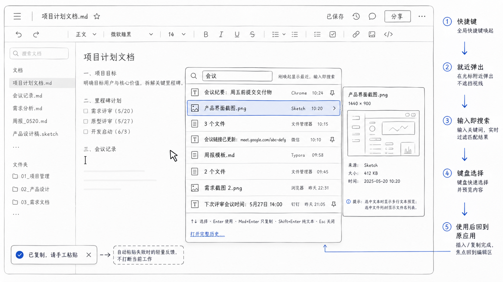
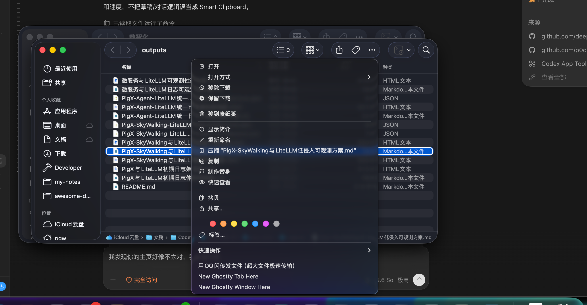
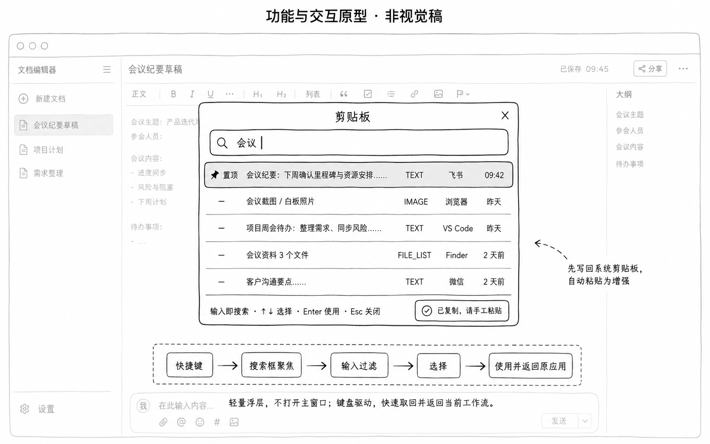
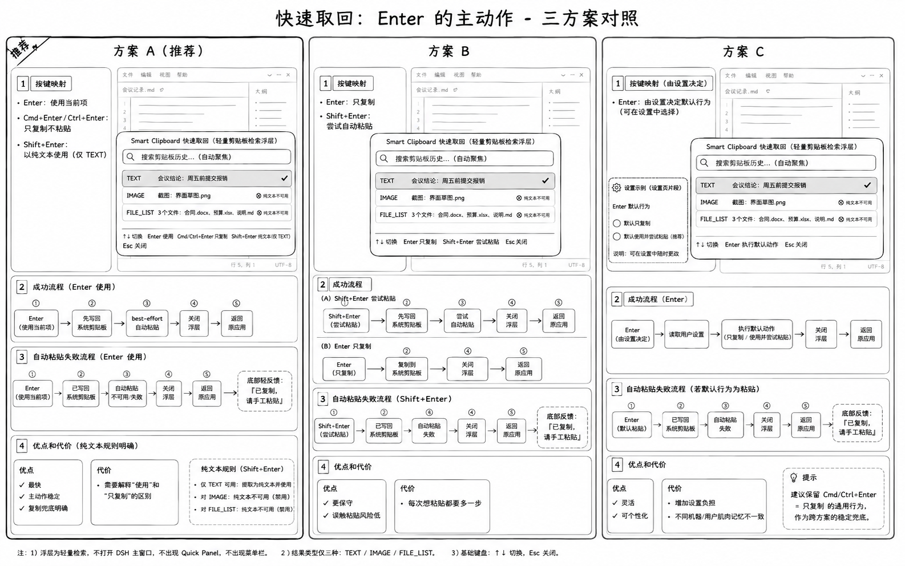
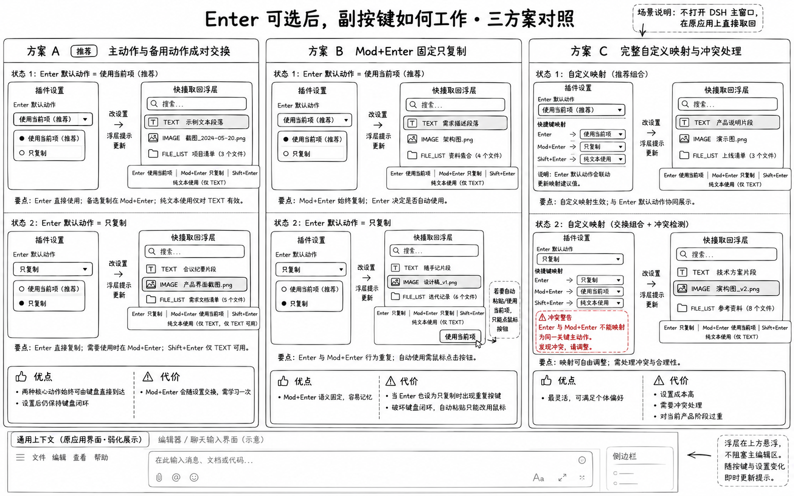
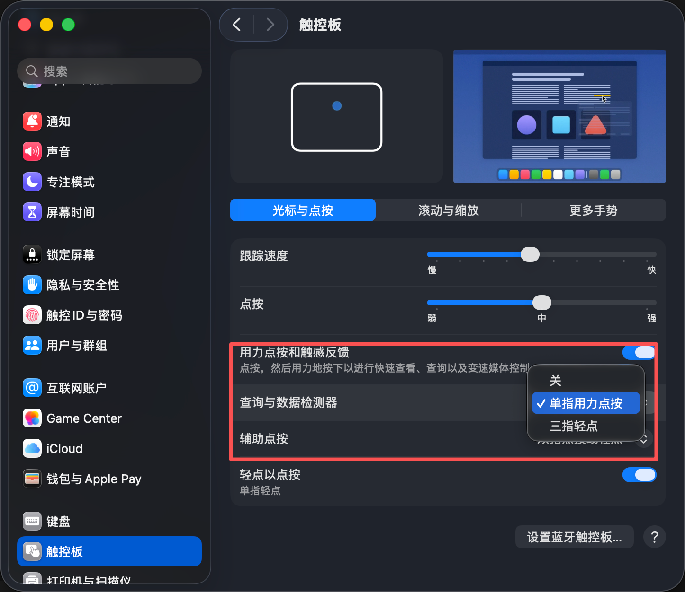
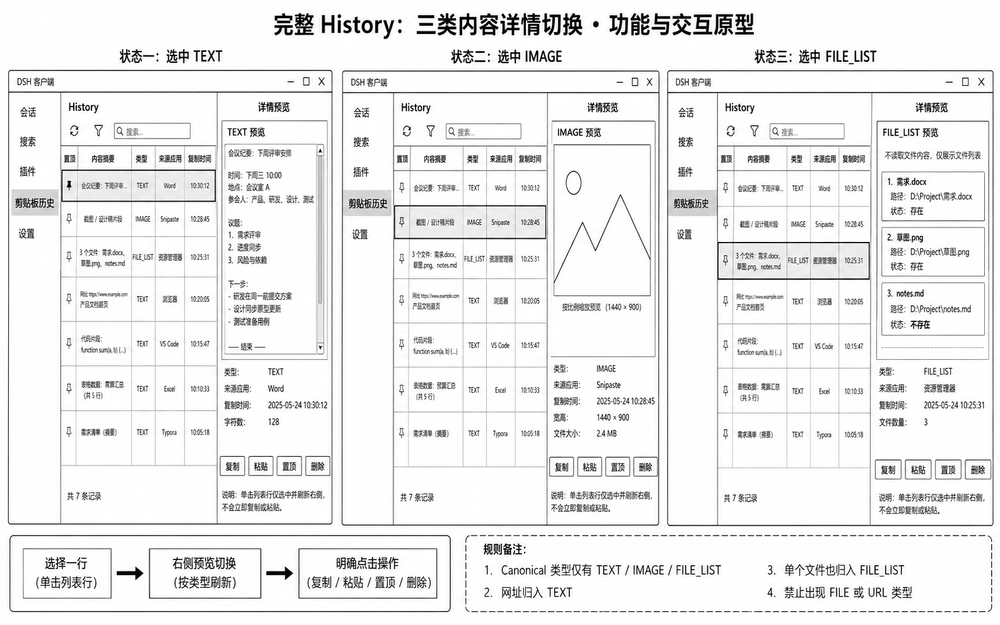
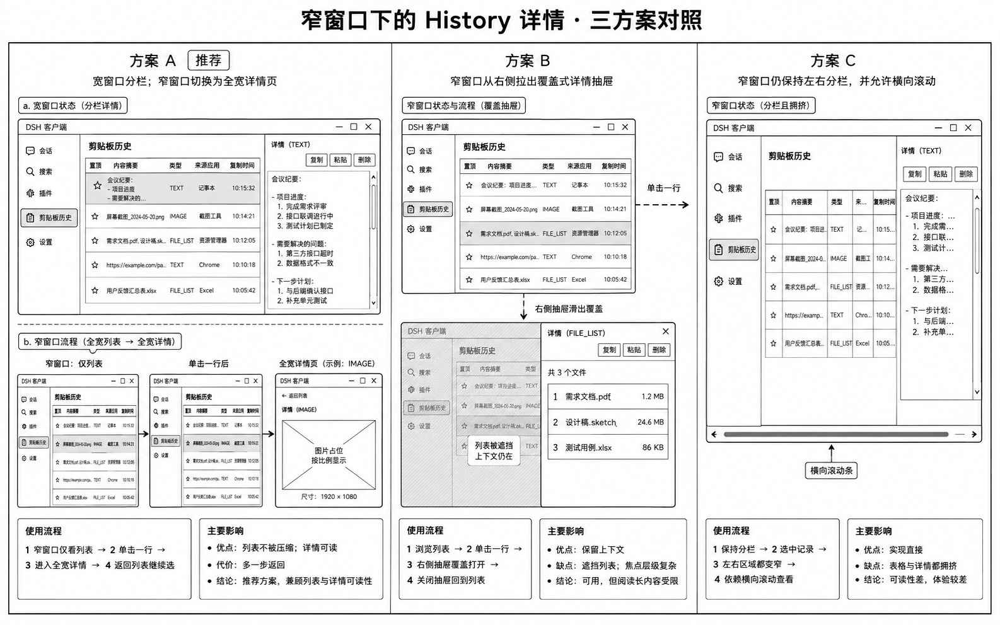

# Smart Clipboard 插件设计

状态：`FUNCTIONAL_SCOPE_FROZEN`

第一条 TEXT vertical slice：`IMPLEMENTED_PACKAGED_E2E`

M1/M2 功能实现：`IMPLEMENTED_PACKAGED_E2E`

发布状态：`UNSIGNED_MACOS_CANDIDATE`，真实 General Pasteboard/物理按键、签名发行与
Windows/Linux 仍待资格

更新时间：2026-09-02

本文是 Smart Clipboard 功能、信息架构、交互流程、用户默认值和插件内数据操作的唯一
权威来源。产品范围、跨域安全、Core 集成、技术硬上限和验收红线见
[核心需求 6.4](../../specs/2026-08-24-hermit-dsh-vnext/core-requirements.md#64-smart-clipboard)；
共同开发和 UI 规则见父级[文档入口](../README.md)。

## 开发者快速入口

- 插件共用规则：[Product Plugin 开发规范](../development-guidelines.md)。
- 桌面能力边界：[Desktop Core 开发规范](../../docs/development/desktop-core-development.md)。
- 本插件声明的桌面能力在 `package.json` 的 `hermit.desktop.capabilities` 中维护；当前包括系统剪贴板、
  全局快捷键、快速取回 Surface、焦点恢复和系统通知。快速取回窗口由 Desktop Surface Manager
  托管，插件只拥有历史数据、列表和动作语义。
- 本文只看历史、搜索、动作、保留和页面行为；Electron、native addon、IPC sender 校验和窗口生命周期
  由 Desktop Core 文档及打包契约负责。

当前实现进度：领域服务已经覆盖 TEXT、IMAGE、FILE_LIST、置顶、Trash、暂停、忽略下一次、
排除应用/类型、保留期限、容量、导出、清空全部内容、动作映射和持续状态；桌面 Core 已提供
SQLite + trigram FTS5 repository、受限 IPC、快捷键和快速取回 Surface。完整 History 直接运行在
真实 DSH Product Surface 中，复用 DSH 公开布局、菜单、输入、按钮、提示、设置行和图标，
样式使用 CSS Modules 与 DSH 语义 token；生产组件只读取 Core 注入的公开 API，不内置 mock
数据或第二套页面壳。快捷取回由 Desktop Surface Manager 加载实际 React renderer 制品，不再使用
内联 data URL 页面。macOS 使用 Electron 43 主进程专用 Objective-C++ N-API bridge 处理稳定
快照、格式化写回、来源采样、目标恢复和 generation/token 守卫的 Command+V 尝试。DSH
Host/Client 已构建为同一个可安装制品；Hermit bundled DSH 的 ADR-0003 受控 patch 提供公开
Product Surface v1，stock DSH 使用同一制品时保留 Settings fallback，并在没有 Core facade 时
明确 unavailable。当前未签名 macOS 候选已通过 Product Surface、完整 History、设置持久化、
native addon 成品加载、profile 制品升级及停用/卸载状态保留链路；未读取或改写用户 General
Pasteboard 的自动资格不能替代 disposable 真实剪贴板、物理快捷键、签名、公证和
Windows/Linux 原生资格。

## 插件理念

Smart Clipboard 是一个 Maccy-like、跨平台、本地优先的剪贴板记忆 Product Plugin：
自动记住用户真实复制过的内容，让用户随时快速搜索、取回、复制或粘贴；AI 只作为
用户显式触发的后置能力。

后续范围取舍使用一句话判断：

> 先做到“复制过的东西能够飞快拿回来”，再讨论其他能力。

核心闭环：

```text
系统剪贴板
-> 本地捕获、规范化和索引
-> 快捷键唤起快速取回工作面
-> 搜索和选择历史
-> 复制 / 明确请求后粘贴
```

当前已确认：

- Smart Clipboard 是独立 Product Plugin，不是 Quick Panel 的附属列表。
- 插件进入 ACTIVE 后立即捕获，不增加首次隐私说明或“开始记录”门槛。
- 捕获、存储、索引、搜索和历史管理没有网络能力，不主动上传剪贴板内容。
- 系统或来源应用明确声明的 transient、concealed、auto-generated 等 marker 直接
  跳过；插件不做内容敏感度启发式、`MASKED` 或 Reveal 流程。
- Maccy-like 指行为语义一致，不复制 Maccy 的 UI、数据库、菜单栏、设置、更新器或
  macOS-only 实现。
- P0 Canonical 类型为 TEXT、IMAGE、FILE_LIST；TEXT 支持格式化回放和无格式粘贴，
  但 HTML/RTF 不进入 DOM、不执行脚本、事件或远程请求。
- 普通搜索、复制、粘贴和置顶不调用 AI；用户显式选择内容后才能交给 DSH。
- Smart Clipboard 通过 Core Shortcut Registry 提交一个用户确认的专用全局快捷键；
  按下后直接呼出快速取回工作面，不打开 DSH 主窗口，也不要求切换模式。
- 快捷键被其他应用占用或被系统拒绝时，设置页明确显示冲突并允许用户重新录入；该冲突
  只使快速取回不可用，后台捕获、History 和历史管理继续工作。
- 快速取回采用自定义的上下文菜单式轻量浮层：默认就近鼠标位置弹出，无应用窗口标题栏，
  以紧凑行列表承载最近记录和搜索结果；这是跨平台产品界面，不接管或仿制操作系统原生
  右键菜单。
- 快速取回工作面打开后搜索框立即聚焦；无查询时显示置顶和最近历史，输入后本地实时
  过滤，键盘选择并执行当前项后关闭浮层、把焦点还给原应用。
- 当前行按 TEXT、IMAGE、FILE_LIST 在主浮层旁更新一个贴靠的类型预览：TEXT 显示多行
  纯文本，IMAGE 显示缩略图和尺寸，FILE_LIST 显示文件名列表；预览不能把主列表撑成
  大窗口，也不加入删除、导出或设置等管理动作。
- 快速取回默认贴合 Maccy 的动作语义：普通左键或 Enter 只复制，Option/Alt+左键或
  Mod+Enter 才明确请求“复制后粘贴”，Shift+Enter 只复制纯文本。三个固定组合仍可在
  插件设置中调整，设置改变后只改变对应动作，不改变右键预览和失败反馈规则。
- 普通历史默认保留最近 100 条，用户可以修改条数；置顶记录不占普通历史条数，但仍
  计入本地数据总容量。本地数据总容量默认上限为 1 GB，用户可以修改。默认不按时间
  过期；用户可选择 30 天、90 天或 1 年。达到期限、条数或容量上限时只处理未置顶
  记录，绝不自动删除置顶记录。
- 主窗口必须提供完整 History，不能把插件缩成一个临时弹窗。
- 完整 History 是 Smart Clipboard 唯一的持久业务入口；插件正常运行时常驻 DSH
  全局导航，停用、崩溃或卸载时由 Core 撤下。
- 完整 History 采用类似文件资源管理器的行式列表；空间充足时使用固定右侧详情窗格，
  单击一行只改变当前选中项并刷新详情，不立即复制或粘贴。
- History 行列表固定展示置顶、内容摘要、类型、来源应用和复制时间五组通用信息；
  文本长度、图片尺寸、文件数量和大小等类型特有信息进入右侧详情窗格。
- 右侧详情窗格按 TEXT、IMAGE、FILE_LIST 切换预览内容，但通用元数据和操作位置保持
  稳定；详情操作只有复制、粘贴和删除，置顶只通过列表首列图钉完成。
- DSH 内容区域变窄、无法同时保证列表和详情可读时，History 先显示全宽列表；单击一行
  切换为全宽详情，并通过“返回列表”恢复原搜索、筛选、滚动位置和选中项。
- 操作系统锁屏时立即关闭快速取回浮层且不显示 History 内容；插件保持原有 ACTIVE/
  Paused 状态，ACTIVE 时继续捕获平台实际提供的剪贴板变化。解锁后不自动重开浮层，
  Paused 也不自动恢复记录。

## 产品原则

1. **先记录，再取回。** 用户不需要先分类、建模板或整理，真实剪贴板变化直接形成历史。
2. **取回速度优先。** 最重要的体验是“唤起 -> 输入 -> 选择 -> 使用”，管理功能不能
   拖慢这条路径。
3. **复制是可靠底座。** 普通使用只写回系统剪贴板；只有用户明确请求时才尝试粘贴，且
   粘贴始终是可降级增强。
4. **一个产品、两个工作面。** 快速取回和完整 History 使用同一份 Canonical 数据和
   domain service，不能发展成两套行为。
5. **AI 永远在下游。** 捕获变化不会触发模型、远程 embedding、总结、分类或标签。
6. **跨平台统一结果。** macOS、Windows 和 Linux 使用不同平台 adapter，但对用户提供
   一致的记录、取回和 copy-only 降级语义。

## Maccy-like 能力边界

目标行为包括：

- 持续记录受支持的剪贴板历史；
- 快捷键快速唤起；
- 输入即搜索和键盘优先选择；
- 复制、显式粘贴和无格式复制；
- 置顶和取消置顶；
- 基本预览；
- 单条删除、清空未置顶和清空全部；
- 暂停/继续记录和忽略下一次复制；
- 尊重系统明确的临时、隐藏和自动生成类型；
- 对重复项和历史容量进行可解释管理。

Hermit 自己负责的适配包括：

- 入口统一使用 Desktop Surface、Tray 和 Shortcut Registry，不创建第二套桌面入口；
- 使用 macOS、Windows、X11/Wayland 的真实平台能力实现捕获和写回；
- 显式粘贴受权限、焦点、UIPI、Wayland 或远程桌面限制时，明确降级为“已复制，请
  手工粘贴”；
- 提供完整 History、Trash、导出和插件数据退出闭环；
- 所有 AI 行为进入真实 DSH Session，插件不保存模型凭据或直接调用模型。

OCR、图片文字复制、色值识别、复杂搜索模式和高级排除配置属于后续增强，不阻塞最短
取回闭环。

## 非目标

- 不是模板或 Snippet 库；Pin 只表示保留真实复制过的内容。
- 不是知识库；不做目录、集合、知识图谱和复杂标签体系。
- 不是笔记软件；ClipboardEntry 的来源是剪贴板捕获，不发展成文本创作产品。
- 不是 AI 自动加工中心；不后台总结、分类、改写、embedding 或生成标签。
- 不是第二个桌面壳；不自建 Tray、全局快捷键、菜单栏或 Surface 宿主。
- P0 不做同步、云、共享、Vault、脚本、命令、自动填表和 clipboard-trigger
  automation。

## 工作面模型

| 工作面 | 主要任务 | 当前结论 |
| --- | --- | --- |
| 快速取回工作面 | 搜索并取回历史 | 专用快捷键呼出鼠标附近的上下文菜单式浮层，使用后返回原应用 |
| Clipboard History | 行式浏览、搜索、详情、置顶、复制、删除和恢复 | 常驻 DSH 全局导航的完整管理主工作面 |
| Trash | 恢复、永久删除或清空 | History 次级视图 |
| 记录与数据 | 暂停、忽略下一次、排除规则、保留额度、导出和清空 | 插件设置 |
| DSH Conversation | 后续显式使用所选剪贴板内容 | AI 里程碑 |

完整 History 是插件唯一的持久业务入口，也必须能从插件详情和明确命令到达。快速取回
浮层底部提供“完整历史 ›”；执行后关闭浮层并打开 DSH 中的完整 History，不把管理
能力复制到快捷入口。

## 当前低保真基线

本节引用用户已经确认的功能与交互原型，作为后续原型设计的连续上下文。图片只冻结其下方
明确说明的使用场景和交互结论，不冻结视觉风格、尺寸、间距或图片中尚未写入本文的临时
文案；若图片与本文文字规则冲突，以本文文字规则为准。未确认的探索稿不进入本节。

当前原型复用规则：完整 History 不再维护独立的可运行自绘原型，真实 DSH Product Surface
中的生产组件就是后续交互验证和视觉调整的唯一页面实现；Tabbit 验收通过测试宿主从组件
外部注入固定数据，生产包没有 preview mode、mock fallback 或私有 DSH 依赖。快捷取回同样
直接验收 Desktop Surface 加载的实际 renderer 制品。下方已确认图片只作为决策依据和
历史上下文保留，不能据此另建一套页面壳。

### 快捷键入口

```text
用户在 Core 中确认 Smart Clipboard 专用全局快捷键
-> 在任意应用中按下快捷键
-> 在鼠标附近呼出上下文菜单式快速取回浮层，不打开 DSH 主窗口
-> 搜索框自动聚焦
-> 无查询时显示置顶和最近历史
-> 输入即本地过滤
-> 键盘选择，贴靠预览按当前类型更新
-> 执行当前项，或明确打开完整 History
-> 普通动作只写回系统剪贴板；用户明确请求粘贴时才继续尝试粘贴
-> 关闭浮层并把焦点还给原应用
```

显式粘贴失败时，内容仍已写入系统剪贴板，浮层或桌面反馈显示“已复制，请手工粘贴”。
普通复制成功后直接关闭浮层；右键只打开已有类型预览，不复制、不粘贴、不打开主窗口。
Escape 关闭且不执行；唤起浮层的全局快捷键由用户在 Core 统一快捷键设置中确认，不能由
插件自行注册，浮层内部三个固定组合的动作映射由插件设置负责。

这里的“上下文菜单式”冻结以下交互形态：

- 浮层是 Core 管理的自定义跨平台窗口，不修改系统右键菜单，也不复制 Finder、Explorer
  或桌面环境的视觉实现；
- 默认锚定当前鼠标附近，并在屏幕边缘自动换向和收敛到可用区域；无法获得可靠鼠标位置
  时才使用当前屏幕内可预测的备用位置；
- 主浮层没有普通应用窗口标题栏，顶部只有紧凑搜索行；无查询显示置顶和最近记录，输入
  后同一位置实时过滤；
- 每行固定高度展示类型图标、内容摘要、来源应用和时间，置顶只使用小图钉表达；
- 选择行时，预览作为贴靠的二级浮层显示在主浮层一侧；屏幕空间不足时换到另一侧，不能
  把主列表扩展成居中的大窗口；
- 底部只保留当前动作映射提示和“完整历史 ›”，不承载 History 管理命令。

原型不冻结具体像素尺寸、颜色、阴影、圆角、字体、图标和视觉样式；本轮确认的密度区间与
sidecar 触发语义见下方“紧凑浮层实现方向（B′）”。

#### 紧凑浮层实现方向（B′）

用户已确认将当前浮层收敛为“更像右键菜单、同屏看更多记录”的 B′ 方案：

- 主浮层默认约 480px 宽、单列显示；搜索区约 42px、记录行约 42px、底部提示约 28px。
- 每次唤起按当前记录数量计算高度，通常显示 3～8 行；搜索过程中外层窗口高度保持稳定，
  不因结果条数变化而跳动。超过可见行数时在列表内滚动，少量记录不保留大块空白。
- 记录仍保留两层信息：第一层是类型和单行摘要，第二层是来源应用和短时间；长中文、英文
  和 URL 必须截断或换行到预览区，不能撑高列表行。
- 预览默认关闭，不占主列表宽度。当前选中项稳定约 400ms 后，在**同一个 Surface 实例**
  内按需展开约 256px 的贴靠 sidecar；优先向右，空间不足向左，主列表宽度和鼠标锚点
  保持不变。sidecar 打开后在本次浮层会话内保持打开，只随选中项更新。
- 不为预览创建第二个 Surface 实例、第二个 renderer 或第二套选中状态；Escape、失焦和
  执行动作仍关闭整个浮层。极窄工作区沿用现有屏幕边缘降级，不提前增加第三种预览模式。
- 底部只保留会随动作映射更新的 `Enter`、`Mod+Enter`、`Shift+Enter` 提示和“完整历史 ›”；
  `paused` 在搜索行显示小状态，`storage-full`/`unavailable`/操作错误复用底部一行反馈，
  不额外撑高窗口。显式粘贴失败保留已复制结果，并由浮层或桌面反馈“已复制，请手工粘贴”。

该方案借鉴 Maccy 2.7 的延迟 slideout 预览和 Apple/Windows 对上下文菜单“少量、高频、可
快速扫描”的原则，但不复制其 macOS-only UI、菜单栏或数据库；具体尺寸仍需在 macOS/Windows
不同缩放比例和屏幕边缘通过真实截图微调。

默认键盘语义：

| 按键 | 默认动作 |
| --- | --- |
| Enter | 复制当前项到系统剪贴板并关闭浮层 |
| Mod+Enter | 明确请求粘贴：先复制当前项，再 best-effort 粘贴；macOS 使用 Command，Windows/Linux 使用 Ctrl |
| Shift+Enter | 只复制纯文本，仅对 TEXT 可用；IMAGE、FILE_LIST 明确不可用 |
| Escape | 关闭浮层，不执行任何内容动作 |

左键执行 Enter 映射；按住 macOS Option 或 Windows/Linux Alt 的左键执行 Mod+Enter 映射。
右键只选择记录并打开同一 Surface 内已有的贴靠预览，不触发任何复制或粘贴。显式粘贴失败
不回滚系统剪贴板，反馈“已复制，请手工粘贴”；普通复制成功直接关闭浮层并返回原应用。
插件设置提供三行固定组合的动作选择器，用户可以为 Enter、Mod+Enter、Shift+Enter
分别选择复制、显式粘贴或纯文本复制。三个动作必须一一对应，重复映射不能保存并就地说明
冲突；系统不自动交换、不静默改写用户选择。纯文本复制在 IMAGE、FILE_LIST 结果上明确
不可用，不降级为普通复制。浮层底部的按键提示在设置保存后同步更新。旧配置中的 `use`
动作读取时迁移为 `paste`，不会改变用户原有组合的相对绑定。

已确认原型：



该原型确认当前浮层形态：在原应用中就近鼠标弹出紧凑主列表，输入即搜索，键盘选择时
在右侧贴靠显示类型预览，执行后回到原应用；显式粘贴失败保留 copy-only 结果，底部可以
打开 DSH 完整 History。它覆盖下方早期原型关于“居中大浮层、窗口比例和搜索布局”的
探索表达，但不覆盖早期原型已经确认的键盘流程和降级语义。

用户提供的交互参考：



这里只参考“在当前工作上下文附近弹出、纵向行式选择、无需先打开主窗口”的到达方式；
不复制 Finder 菜单项、系统材质、文件操作、平台视觉或原生右键菜单实现。



该原型确认的是“在原应用中按快捷键 -> 浮层搜索 -> 键盘选择 -> 使用并返回原应用”的
高频路径，以及显式粘贴不可用时保留 copy-only 结果；图片中的具体搜索词、行内容、窗口
比例和控件样式仅用于帮助理解，浮层形态以后续确认的上下文菜单式原型为准。



该原型确认方案 A 是开箱默认映射，以及复制优先、显式粘贴降级和纯文本动作的边界；
后续确认的自定义映射建立在该默认值之上。



该原型确认方案 C：用户可以调整三个固定组合的动作映射，设置与浮层提示同步，冲突必须
在保存前解决。图片中的任意物理按键录制、视觉样式和具体控件尺寸不属于当前范围。

交互参考：



这里只参考图中“一项设置在原位置弹出有限选项、当前值清晰打勾”的选择逻辑；不复制
macOS 的设置层级、视觉样式、文案、手势语义或平台专属实现。

### 完整 History

```text
DSH 导航 | 剪贴板历史列表                             | 详情窗格
---------|--------------------------------------------|----------------
对话     | 搜索...                         [暂停]    | 当前选中内容
搜索     | [全部] [文本] [图片] [文件]                | 完整预览
插件     |--------------------------------------------| 来源应用
剪贴板   | *  TEXT   API endpoint...       Browser  | 复制时间
历史     |    TEXT   一段复制的文本         Editor   | 内容类型/大小
设置     |    IMAGE  1280x720               Design   |
         | FILE_LIST  report.pdf +2          Files    | [复制] [粘贴]
         |                                            | [删除]
```

这是信息结构基线，不冻结具体列宽、密度、图标和视觉细节。列表保持单选语义；单击一行只
更新右侧详情，复制、粘贴、置顶和删除必须由明确命令触发。没有选中项时，详情窗格显示
中性的未选择状态，不自动预览第一条。五组通用信息的职责为：

| 信息 | 列表职责 |
| --- | --- |
| 置顶 | 表示该记录是否保持在普通历史之前且不被自动淘汰 |
| 内容摘要 | 提供当前类型最短、可扫描的识别信息 |
| 类型 | 明确区分 TEXT、IMAGE、FILE_LIST |
| 来源应用 | 显示 best-effort 的稳定应用名称，未知时明确显示未知来源 |
| 复制时间 | 显示该记录最近一次进入或命中历史的时间 |

类型特有的完整信息不增加动态列，统一进入右侧详情窗格，避免切换筛选后表格结构跳变。

| 选中类型 | 右侧详情预览 |
| --- | --- |
| TEXT | 显示完整、可选择的安全纯文本预览，保留换行，并显示字符数 |
| IMAGE | 按比例显示图片预览，并显示宽度、高度和数据大小 |
| FILE_LIST | 按原顺序显示文件名、路径和当前存在状态，并显示文件数量；不读取文件内容 |

三类详情都显示类型、来源应用和复制时间等通用元数据。右侧固定操作为复制、粘贴和删除；
置顶/取消置顶由列表首列图钉直接完成，不在详情窗格重复提供。网址按 TEXT 展示，单个文件
也按 FILE_LIST 展示，不新增 FILE 或 URL Canonical 类型。

已确认原型：



该原型确认三类预览切换、固定通用元数据、列表单选和明确操作流程。**唯一例外：图片中
详情底部的“置顶”按钮不属于已确认方案，后续原型必须删除；列表首列图钉保留。** 图片中
的示例内容、列宽、控件样式和窗口比例不构成视觉要求。

#### 窄窗口

```text
宽窗口：历史列表 | 固定右侧详情

窄窗口：全宽历史列表
       -> 单击一行
       -> 全宽详情 [返回列表]
       -> 返回后恢复搜索、筛选、滚动位置和选中项
```

窄窗口不压缩两栏、不增加横向滚动，也不使用覆盖列表的详情抽屉。切换依据是 History
内容区域能否同时保证列表扫描和详情阅读，不在功能设计阶段冻结具体像素断点。

已确认原型：



该原型确认方案 A：宽窗口保留分栏，窄窗口在列表和全宽详情之间切换。方案 B 的覆盖式
抽屉和方案 C 的横向滚动不进入当前设计。

## 内容类型语义

### TEXT

TEXT 同时保存安全纯文本表示和来源提供的受支持格式化表示。纯文本负责搜索、列表摘要和
详情预览；HTML/RTF 等格式化表示只作为惰性本地剪贴板数据保留和写回，不进入 DOM、
不执行脚本、事件或远程请求。

| 环节 | TEXT 规则 |
| --- | --- |
| 列表摘要 | 取纯文本第一段有效内容并单行截断 |
| 搜索 | 只索引纯文本内容，不索引格式标记 |
| 详情 | 显示完整、可选择的安全纯文本并保留换行 |
| 复制/显式粘贴 | 同时写回纯文本和受支持的格式化表示，由目标应用选择可接受格式；仅显式粘贴继续发送粘贴按键 |
| 纯文本复制 | 只写回纯文本，明确移除格式 |

来源没有格式化表示时，“复制/显式粘贴”和“纯文本复制”的内容结果相同；是否发送粘贴按键仍由用户动作决定。

### IMAGE

IMAGE 保存一份不降低像素尺寸、保留透明通道的跨平台无损 Canonical 图片。列表和详情
使用由完整图片生成的缩略图缓存；缩略图是可删除、可重建的派生数据，不是第二份业务
记录。完整图片和缩略图实际占用都计入 1 GB 本地数据总容量。

| 环节 | IMAGE 规则 |
| --- | --- |
| 列表摘要 | 固定行高显示图片图标和“图片 · 宽 × 高”，不由缩略图撑高列表 |
| 搜索 | 不对图片内容做 OCR、色值识别或 AI 分析 |
| 详情 | 按比例预览，不放大超过原始尺寸，并显示宽、高和数据大小 |
| 复制/显式粘贴 | 将完整 Canonical 图片写回系统剪贴板；仅显式粘贴继续发送粘贴按键 |
| 纯文本复制 | 明确不可用，不静默切换为其他动作 |
| 导出 | 导出完整图片；缩略图缓存不进入导出包 |

### FILE_LIST

FILE_LIST 只保存本机文件或文件夹的有序引用、安全显示名和必要元数据，不读取、复制、
索引或备份文件正文。单个文件同样归入 FILE_LIST；引用顺序属于记录语义。

| 环节 | FILE_LIST 规则 |
| --- | --- |
| 列表摘要 | 显示首个项目名称和剩余数量，例如“需求文档.pdf +2” |
| 搜索 | 索引安全显示名，不读取文件内容 |
| 详情 | 按原顺序显示名称、完整路径、文件/文件夹类型和当前存在状态 |
| 复制/显式粘贴 | 先检查全部引用；全部存在才按原顺序写回系统剪贴板，显式粘贴随后才发送粘贴按键 |
| 失效处理 | 任一引用失效则整组不可用，不覆盖当前剪贴板，并明确标出失效项目 |
| 纯文本复制 | 明确不可用，不静默切换为路径文本 |
| 导出 | 只导出有序路径和元数据，不复制原文件内容 |

插件不静默丢弃失效项目，也不自动把剩余项目改写成新的 FILE_LIST；否则再次取回的结果
会与用户原来复制的列表不同。

## 核心流程

### 捕获

```text
插件 ACTIVE
-> 监听受支持的剪贴板变化
-> 明确 exclusion marker 直接跳过
-> 用户排除的来源应用或 Canonical 类型直接跳过
-> 规范化、精确去重并写入本地历史
-> 暂停时停止接收新内容
-> 继续后只记录新的变化，不回补暂停期间内容
```

### 历史管理

```text
打开 Clipboard History
-> 浏览或搜索历史
-> 按类型、时间、来源和置顶状态筛选
-> 预览、复制、尝试粘贴、置顶或删除到 Trash
-> 恢复、永久删除、导出或清空
```

### 历史保留与容量

```text
默认不按时间过期
-> 普通历史最多保留最近 100 条，用户可修改
-> 本地数据总容量默认上限为 1 GB，用户可修改
-> 置顶记录不占普通历史条数
-> 普通历史条数或本地数据总容量任一达到上限
-> 从最旧的未置顶记录开始永久删除，直到重新满足上限
-> 置顶记录仍计入本地数据总容量，但永不自动淘汰
-> 如果置顶记录已经占满总容量，停止捕获并进入 Storage full
```

保留期限使用有限预设：永不过期（默认）、30 天、90 天、1 年。置顶记录不受期限影响。
FILE_LIST 只计算插件保存的列表和元数据，不把原文件内容计入插件容量。达到保留期限、
普通历史条数或本地数据总容量上限时，自动清理直接永久删除未置顶记录，不进入 Trash。
用户在 History 中主动删除单条记录时才进入 Trash，并允许恢复。

Trash 中的记录最多保留 30 天，计入 1 GB 本地数据总容量，但不占 100 条普通历史名额。
用户可以随时恢复、永久删除单条记录或清空 Trash。达到 30 天后自动永久删除；如果总容量
不足，则先永久删除最旧的 Trash 记录，再删除 History 中最旧的未置顶记录。Trash 因此
是 best-effort 恢复区，不承诺每条记录一定保存满 30 天，界面必须明确说明容量压力可能
导致提前清理。

History 的“清空”命令永久删除全部未置顶历史，不经过 Trash；执行前必须明确确认影响
数量。置顶记录和已有 Trash 不受影响。单条“删除”继续进入 Trash，因此“删除”用于处理
误操作恢复，“清空”用于立即释放当前 History 占用的空间。

插件设置提供“清空所有剪贴板内容”，不使用含义模糊的“删除全部插件数据”。该动作经
不可恢复确认后，永久删除普通历史、置顶记录、Trash、搜索索引、图片预览和缓存；保留
普通历史条数、总容量、保留期限和动作映射等插件设置，也不修改 Core 管理的全局快捷键
或插件 ACTIVE 状态。清理期间可以为一致性短暂停止捕获，完成后恢复清理前的 Recording
或 Paused 状态；Recording 状态下继续记录后续新的剪贴板变化。

### 导出

导出生成一个版本化的结构化 ZIP 数据包，默认包含当前 History 的普通记录和置顶记录；
用户可以显式选择包含 Trash，默认不包含。数据包保留 Canonical 类型、来源应用、复制
时间和置顶状态等元数据，并按类型导出：

| 类型 | 导出内容 |
| --- | --- |
| TEXT | UTF-8 安全纯文本和记录元数据 |
| IMAGE | 插件实际保存的图片数据和记录元数据 |
| FILE_LIST | 文件路径和列表元数据，不复制或读取原文件内容 |

搜索索引、预览缓存、插件设置和快捷键不进入导出包。导出只写入用户明确选择的本地位置，
不触发网络请求。该数据包是本地可携带的数据快照；当前里程碑只承诺导出，不因其结构
预先承诺导入、同步或迁移能力。

### 在 DSH 中使用

AI 接入后置到本地捕获和取回闭环稳定之后：

```text
用户显式选择内容并发起 AI 动作
-> 把明确选择的范围交给 DSH
-> 不自动发送
-> 用户提交后由 DSH 按正式 Session/Tool 契约读取
```

后台没有 Clipboard AI feed，也不能把整份 History 自动交给模型。M3.1 和 M3.2 都只
支持用户明确选择的单条记录，明确多选继续后置。

## 关键状态

- Recording：插件正常记录新的剪贴板变化。
- Paused：持续可见，不记录暂停期间内容，继续后不回补。
- Locked：操作系统锁屏时关闭快速取回浮层并禁止查看 History；ACTIVE 捕获继续在本地
  运行，解锁后不自动重开浮层，Paused 状态保持不变。
- Capture unavailable：当前平台不支持完整后台捕获，说明实际可用范围。
- Empty history：当前没有记录；用户后续复制受支持内容后自然进入列表。
- Explicit paste unavailable：用户明确请求粘贴但平台不可用；内容已复制，提示用户手工粘贴。
- Storage full：置顶记录已经占满本地数据总容量时停止接收新记录，不静默删除；持续提供
  “管理置顶”和“调整容量”入口。
- Plugin unavailable：快速入口和后台捕获一起撤销，Core 继续运行。
- Quick retrieval unavailable：快捷键与系统或其他应用冲突时，只有快速取回入口不可用；
  后台捕获和完整 History 不受影响。

### 当前 macOS 平台语义

- 主进程以 250 ms 间隔读取 `NSPasteboard.changeCount`；第一次只建立 baseline，只有 generation
  变化后才读取多格式内容，读取前后 generation 不一致时丢弃整次快照。
- 写回先生成随机 operation token，以一次 `writeObjects` 写入 Canonical 表示和 token；最终
  generation 或 token 不一致就拒绝继续显式粘贴。
- 显式粘贴分为“请求恢复原目标应用”和“确认目标仍在前台后发送 Command+V”两步；发送前
  再检查目标 PID/bundle/launch date、Accessibility、generation 和 token。
- “已尝试粘贴”只表示系统按键事件已经在守卫通过后发出，不能承诺目标应用一定接收、接受
  或插入内容；系统没有跨应用 clipboard + focus + key event 原子事务。
- 任何终态、仅复制或不可用结果都会清掉旧目标应用，完整 History 不能误用上一次快捷取回
  留下的目标。停用、卸载或 DSH crash 时，Core 撤销捕获、IPC、浮层和快捷键，保留数据库。
- native 单元测试只使用唯一命名 pasteboard；成品无人值守资格只验证 addon 加载，不碰用户
  General Pasteboard。真实写回、显式粘贴、权限提示和物理快捷键仍属于 disposable 人工资格。

## 里程碑方向

1. **M1 Maccy 核心闭环**：本地捕获、历史、快捷键入口、搜索取回、复制/显式粘贴、置顶、
   删除、暂停和基础三类内容。
2. **M2 完整 History**：完整浏览管理、Trash、导出、丰富预览和真实需求驱动的高级设置。
3. **M3.1 单条显式 AI**：在 History 对单条记录执行“在对话中使用”，打开 DSH
   Conversation、插入单条 `@ClipboardItem` 且不自动发送；不接入后台捕获 pipeline。
4. **M3.2 `@clipboard` 单条选择器**：在 Conversation 中搜索本地 History 并明确选择
   一条，复用 M3.1 的同一单条引用和读取契约，不获得 list、批量读取或后台访问能力。

第一条 vertical slice 的精确范围已经在下节冻结；复杂筛选、预览、OCR、模板、知识库
或 AI 自动处理不进入第一条实现。

明确多选不属于 M3.1 或 M3.2 的当前承诺，只有单条路径稳定且出现真实多选需求后才重新
评估。M1、M2 均不显示未实现的 AI 动作占位，避免用户误以为普通复制或搜索会调用模型。

## 第一条 vertical slice

第一条技术切片只证明 `TEXT` 快速取回业务脊柱，不代表 M1 的完整发布范围。开始前必须
满足两个外部 start gate：

1. Organizer 首条切片达到项目定义的稳定门槛。
2. DSH 公共 Product Surface 已在 stock DSH 或经过 source patch 的 Hermit bundled DSH 中
   证明可通过公开契约挂载、停用撤销和卸载；同一 artifact 在另一宿主缺少能力时必须确定性
   unavailable。若 stock DSH 缺少该入口，允许使用经过 ADR、许可证/notice、构建摘要和双宿主
   资格审计的 Hermit bundled DSH source patch。插件仍不得依赖私有 DOM、CSS、Router、store
   或 loader hack。

这两个 gate 只决定何时开工，不改变 Smart Clipboard 的产品设计状态。

```text
插件 ACTIVE
-> 当前 macOS Hermit 原生捕获实现已进入打包候选，等待 disposable General Pasteboard 资格
-> 精确去重、本地持久化，重启后记录仍存在
-> DSH 全局导航显示最小 Clipboard History
-> 行式列表选择 TEXT，右侧显示安全纯文本详情
-> 专用快捷键呼出快速取回浮层
-> 输入搜索、键盘选择
-> Enter 复制到系统剪贴板；Mod+Enter 才 best-effort 尝试粘贴
-> 失败明确降级为“已复制，请手工粘贴”
-> 停用插件时停止捕获并撤下入口，已有数据保留
```

切片使用默认动作映射，并执行已经确认的普通历史 100 条、总容量 1 GB 和 Core 单条文本
硬上限；平台 bridge contract 保持跨平台，真实功能先在当前 macOS 环境闭环，不能把领域
模型或插件 UI 写成 macOS-only。Windows/Linux adapter 属于后续平台切片。

切片验收同时覆盖以下已有全局规则，不为它们增加独立页面：

- 系统锁屏时关闭快速浮层并禁止查看 History；ACTIVE 捕获继续，解锁不自动重开。
- transient、concealed、auto-generated 等明确 marker 从第一条记录开始就必须跳过。
- 超过 2 MiB 的 TEXT 不创建 Entry、不截断、不改写内容，也不影响当前系统剪贴板；只留
  可诊断的结构化状态，不记录正文。
- 精确重复 TEXT 不创建第二条记录；保留原 ID、created 和 pinned，更新 last_used 与最近
  来源，并作为最近复制重新排到顶部。不做近似、Unicode 猜测或语义去重。
- 普通历史 100 条使用真实端到端数据验证淘汰；纯 TEXT 在 100 条与单条 2 MiB 限制下
  自然无法达到 1 GB，因此 1 GB 额度算法用 domain/storage 层受控数据验证，不放宽文本
  上限，也不为测试提前加入 IMAGE。
- 同一 artifact 在 Hermit 获得 ClipboardBridge/Shortcut Registry 后完整激活；宿主缺少
  所需公开能力时可预测地拒绝业务激活，不留下入口、快捷键或后台活动。
- macOS 真实链路覆盖捕获、去重、持久化、重启恢复、搜索、写回、显式粘贴和 copy-only
  降级；停用/卸载覆盖 activation lease 与快捷键撤销、停止新增捕获、不回补和数据保留。

切片明确不包含 IMAGE、FILE_LIST、置顶、删除、Trash、导出、暂停、排除应用、完整设置、
格式化 HTML/RTF 回放、AI、`@clipboard`、模板、知识库、OCR 或自动加工，也不为这些能力
预建空页面、空状态、抽象层或兼容分支。

## 待确认问题

当前没有新增产品决策阻塞。完整插件不因第一条切片 READY 而冒充所有后续能力均已实现
就绪；IMAGE、FILE_LIST、置顶、Trash、导出、设置、格式回放和 AI 等后续切片只在各自
开工前做局部 readiness review，不重新把整个插件退回 `DISCOVERY`。
